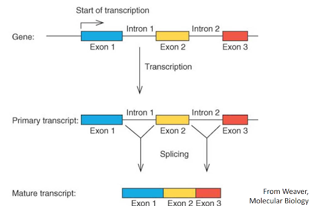
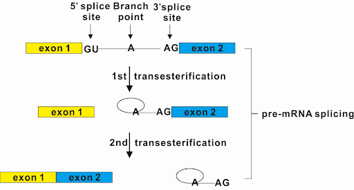

# Alternative Splicing

### Background

Alternative splicing results from the dynamic nature of the splicing process in the pre-mRNA. However, to be able to understand alternative living, we need to understand how to get to the splicing of pre-mRNA. This occurs from transcribing DNA to mRNA and then understanding what splicing is post transcription. Therefore, to understand alternative splicing, we must understand transcription and splicing as these are the steps and concepts that lead up to alternative splicing. 

Transcription is the process in which DNA is transcribed into mRNA. The goal of transcription is to make RNA that is complementary to the template strand used for transcription. The product of transcription includes the coding and non-coding regions or introns and exons, which is what makes splicing necessary post-transcription. The mechanism of transcription follows three steps: initiation, elongation, and termination, which correlate to the steps in order to create the mRNA product. 

Initiation is the step in transcription that starts the process of transcribing DNA into RNA. Initiation occurs when transcription facilitates RNA Polymerase to bind to the promoter region. The promoter indicates where the start site of transcription is. When transcription factors bind to the promoter region and RNA Polymerase is there for transcription, the preinitiation complex is formed to execute transcription. RNA Polymerase gets in position to begin transcription,and the next step, elongation occurs. There are key differences between Prokaryotes and Eukaryotes, which are important; however, it is sufficient to know this with alternative splicing being the main purpose of this discussion.

Elongation is the step in transcription in which encoding the RNA actually occurs. In elongation, RNA Polymerase goes down the template DNA strand in a 3’ to 5’ direction adding a complementary RNA nucleotide for each DNA nucleotide to the RNA strand. This step occurs across each nucleotide in the DNA strand in the downstream region or region after the start site, which is known as the +1 site. A distinction is made in this step as when a particular base comes up, its nucleotide complement is added to the RNA strand in the same way as DNA with G complementing with C; however, since this is an RNA strand, A complements with U not T. This step is completed when the RNA Polymerase gets a signal to stop, which causes the last step of transcription. This last step is termination.  

Termination is the step where transcription is complete. We have created an RNA strand in which the DNA compliments have been made in the RNA strand and we have gotten a signal to end. Therefore, we have a complete RNA strand. In termination, we end transcription, which is signaled by the transcription of the terminator, which is a particular DNA sequence which indicates the end of transcription. Once this occurs, transcription stops and we have the mRNA product. The mRNA product includes exons and introns. Introns benign the non-coding regions of DNA, which are not meant to be used to make proteins in translation, and exons, which are the coding region, which are meant to be used to encode proteins. Removing the introns, then becomes a problem, which is solved through splicing.

Splicing is the process in which the introns are removed and the exons are joined together to form the final mRNA product. The mRNA prior to splicing is known as pre-mRNA as it is not ready for translation. The process of splicing out the introns leads to the forming of mature mRNA, which is ready for translation to make proteins. Now, the mRNA product only has coding regions; however, now that we understand the foundation of alternative splicing, what is alternative splicing? 

### What is alternative Splicing?

Alternative splicing refers to the dynamic nature of the splicing process. There is a wide variety of possible ways to splice a premature mRNA molecule, it’s far from just 1 potential outcome. The key feature that allows alternative splicing to occur is the flexibility of the exons within DNA. Exons can be excluded or included into the final mRNA product during the splicing process. The different combinations of exons that are included or excluded make up the final mRNA product. This process results in the production of distinct protein isoforms that may have different functions, cellular locations, or activities. Alternative splicing contributes to the complexity of the proteome, allowing a higher level of diversity in the functions and regulation of gene products. 

While exon selection is the most common form of alternative splicing, Other alternative splicing mechanisms occur as well, such as intron retention. In intron retention an intron is never removed due to inhibition of the spliceosome, leading to a final mRNA product with an extra portion. 

An important thing to note is that in every cell where alternative splicing occurs, the DNA is always the same. DNA is not changing between cells. Alternative splicing occurs as a result of environmental factors affecting the transcription process. Different transcription events can occur, but in the same controlled environment and cell type you would expect similar transcription.

A great example of different environments leading to differentially expressed genes is the transcription factor gene TAHSFA6e. In response to heat shock in wheat,  two major transcripts, TaHSFA6e-II and TaHSFA6e-III, are produced by the gene. These transcripts in turn lead to the production of critical heat shock proteins that allow wheat to adapt to it’s environment more effectively (Wen).The DNA was never altered, but the sudden heat led to alternative splicing, leading to proteins designed to combat heat shock.	

### Mechanism

To delve into the world of splicing, we must look into the cellular machinery that unfolds this phenomenon. As said earlier there are different types of alternate splicing, but there are also different mechanisms that make alternate splicing happen. One of the most important and common mechanism for splicing as well as alternate splicing is the Spliceosome mediated splicing (Ren). Spliceosome is a large complex in eukaryotes that carry out the splicing of pre-mRNA, this process where a splicosome carry out splicing is called splicosome mediated splicing. 

Splicing is a delicate process where the pre-mRNA that contain the untranslated regions(UTRs), introns and exons are carefully edited where the introns are selectively removed. In order to understand the splicosome mediated splicing we must first understand the regions on the RNA that helps in the process. These regions are the 5’ Splice site usually a GU after the first exon, 3’Splice site where an AG is before the exon, the branch point A followed by some pyrimidines close to the branch point A downstream. The spliceosome consists of small nucelolar Ribonucleoproteins (snRNPs) and some associated factors. The snRNPs are named as U1, U2, U4, U5 and U6. 

Splicing starts with the recruitment of U1 to the 5’ splice site, this later initiate the splicing factors to bind to the 3’ site, the pyrimidine tract which later makes the U2 recognize the branch point A. "Consequently, intronic recognition prompts the engagement of U4/U6/U5 tri-snRNP with the complex, and subsequent formation of a catalytically inactive complex" (Jordan). This recruitment makes a conformational change in the pre-mRNA where the intronic regions between brainchpoint A and the exon before that sequence is bent to make the 5’ site to be closer to the branchpoint A. When this conformation is achieved, the U1 and U4 snRNPs are dropped this creates a reaction. In this reaction the 2’OH group from branchpoint is transferred to the 5’end of upstream exon which was proximal to the branchpoint. This reaction is called the transesterification reaction. This causes the 5’ splice site to bind to the branchpoint A and the this makes the exon upstream to be free. This forms a lariat shape for the intron. The free exon will now bind to the 3’ splice site of the exon attached to the intron. This will make the 2nd transesterification reaction where the 2’OH will now transfer to the intron and this will make the intron in its lariat shape to leave the exon. Now the exons will be joined by phosphodiester bonds. This makes the final shape with exons joined together and intron spliced out. The introns are then degraded and recycled through enzymes. Alternate splicing happens when we miss this step in any sites or by including including nay other exon complex between two exons that will be spliced out, thus creating multiple isoforms from one RNA.

### Significance of Alternative Splicing

So why is it important to understand alternative splicing? Alternative splicing is a critical molecular mechanism that contributes significantly to the diversity of gene products. You go from just 1 possible transcript to an exponential number of transcripts from just one gene.

Alternative Splicing also raises interesting questions, such as What environmental factors contribute to different isoforms? or Can we encourage certain isoforms by introducing splicing factors? You might want to do this if there’s some beneficial isoform you want to promote, for health reasons or otherwise, understanding the mechanism by which it’s produced gives you greater flexibility to replicate it.

Understanding how alternative splicing works also lets you investigate the different expression levels between different types of cells or tissues. It may be found that 2 cells have similar expression levels of a gene but wildly different isotopes being produced, creating proteins adapted to their specific tissues.

It’s also useful for detection of diseases. If we suspect a disease is caused by production of the incorrect or unstable isotopes, we can investigate the mRNA variants being produced to see what proteins may be being amplified or missing.

### Software Tools and Identification of Alternative Splicing

Identifying alternative splicing is a key area where Bioinformatics plates a role. Firstly, we must be able to analyze a particular type of data, which in this case is RNA sequencing data. Before doing an analysis it is important to always quality control, which we can use FASTQC for to access the quality of the reads. Once we have ensured that we have good quality reads, then we can align the RNA-seq to the a reference genome using STAR. Once the reads are aligned, we can use DEXseq in order ot identify splicing events. Dexseq can identify different types of alternative splivng events suc as alternative 5’ or 3’ splice sites, exon skipping, or intron retention. 

Another interesting area we can get into is comparing splicing events between different samples such as a normal versus a disease sample. To do this, we can use the smae analysis pipeline mentioned, but perfrom differential splicing analysis with DEXseq in order to identify the differences in the slicing patterns of the samples.

## Citations

Anders S, Reyes A, Huber W. Detecting differential usage of exons from RNA-seq data. Genome Res. 2012 Oct;22(10):2008-17. doi: 10.1101/gr.133744.111. Epub 2012 Jun 21. PMID: 22722343; PMCID: PMC3460195

Britannica, The Editors of Encyclopaedia. "transcription". Encyclopedia Britannica, 2 Nov. 2023, https://www.britannica.com/science/transcription-genetics. Accessed 11 December 2023.

Jordan, Peter. "Alternative Splicing." Encyclopedia. Web. 08 January, 2021.

Matlin, A., Clark, F. & Smith, C. Understanding alternative splicing: towards a cellular code. Nat Rev Mol Cell Biol 6, 386–398 (2005). https://doi.org/10.1038/nrm1645

“Mechanism Of Transcription - Transcription - MCAT Content.” Jack Westin, https://jackwestin.com/resources/mcat-content/transcription/mechanism-of-transcription. Accessed 11 December 2023.

Ren, Pingping et al. "Alternative Splicing: A New Cause and Potential Therapeutic Target in Autoimmune Disease." Frontiers in Immunology, vol. 12, 2021, https://www.frontiersin.org/articles/10.3389/fimmu.2021.713540.

Wen J, Qin Z, Sun L, Zhang Y, Wang D, Peng H, Yao Y, Hu Z, Ni Z, Sun Q, Xin M. Alternative splicing of TaHSFA6e modulates heat shock protein-mediated translational regulation in response to heat stress in wheat. New Phytol. 2023 Sep;239(6):2235-2247. doi: 10.1111/nph.19100. Epub 2023 Jul 4. PMID: 37403528..

Image 1: Rehman, S.U., Husain, M.A., Sarwar, T., Ishqi, H.M. and Tabish, M. (2015), Modulation of alternative splicing by anticancer drugs. WIREs RNA, 6: 369-379. https://doi.org/10.1002/wrna.1283

Image 2:  Mehta Z, Touma M. Post-Transcriptional Modification by Alternative Splicing and Pathogenic Splicing Variants in Cardiovascular Development and Congenital Heart Defects. International Journal of Molecular Sciences. 2023; 24(2):1555. https://doi.org/10.3390/ijms24021555

Image 3: Pan, K.; Lee, J.T.H.; Huang, Z.; Wong, C.-M. Coupling and Coordination in Gene Expression Processes with Pre-mRNA Splicing. Int. J. Mol. Sci. 2015, 16, 5682-5696. https://doi.org/10.3390/ijms16035682

