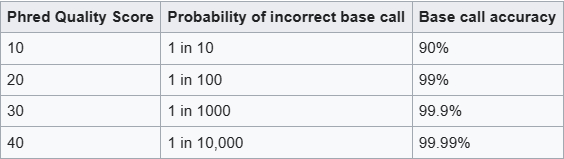
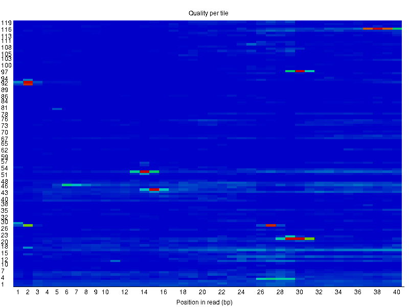
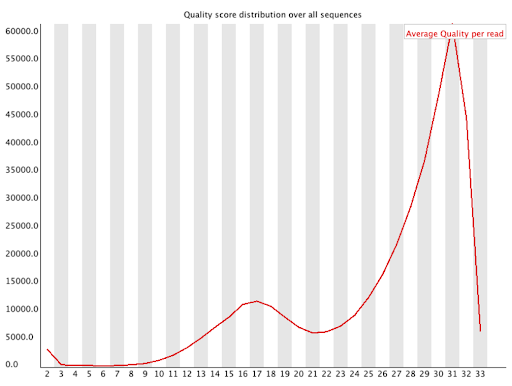
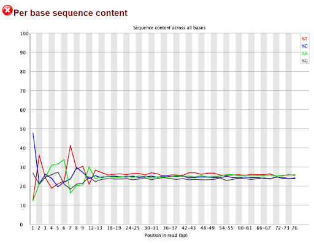
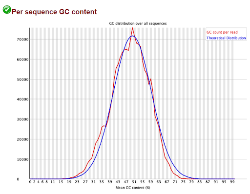
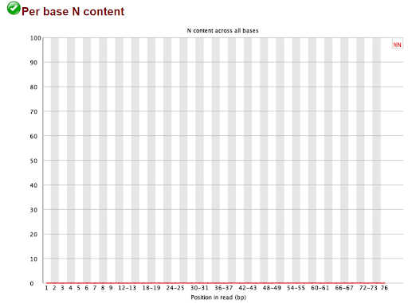
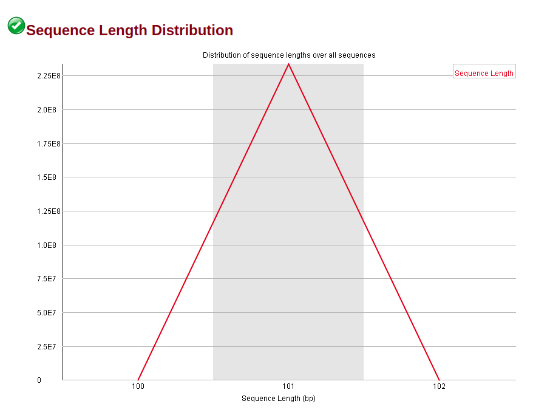
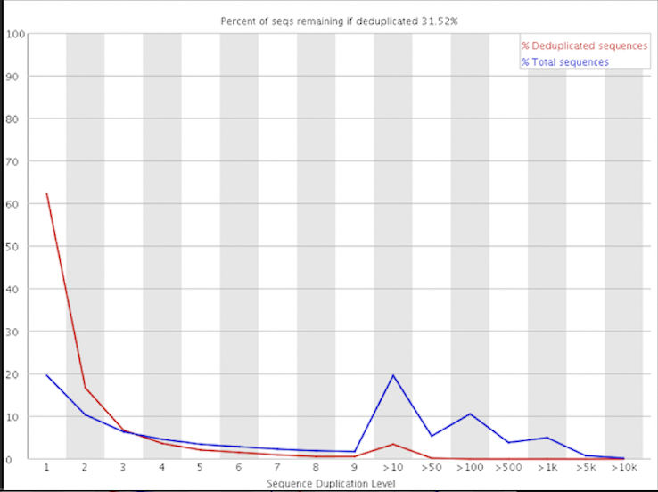
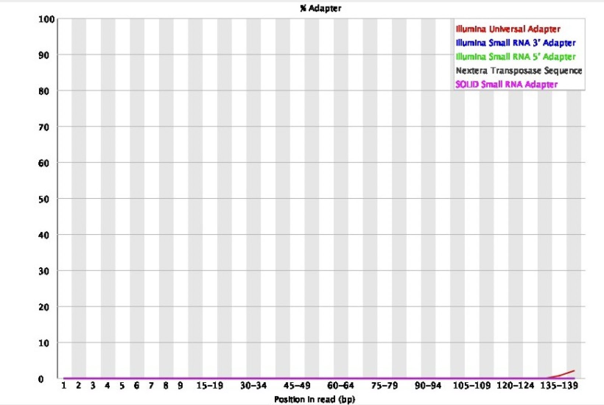

# Analysing a FASTQC html File
Tanvi Jain, Richard Gross, Riani Shah

The FastQC Format is a Quality Control tool for visualizing any problems that your raw sequencing data may have before you move on to sequence analysis. If your raw data is bad, then you won’t be able to make useful conclusions about it. For input, FASTQC takes files containing sequence data and metadata such as BAM, SAM, and the FASTQ file formats. FastQC creates an HTML report allowing you to quickly see the automatic evaluation of each analysis module from green to red, with green being normal, yellow being abnormal, and red being unusual. However, these evaluations are not to be taken at face value, as FASTQC has no idea under what context your sequence data came from, and a green tick may just mean that the data seems to be random and diverse with no obvious biases, while a yellow or red evaluation may be entirely expected depending on how your sequence data is created.

[[1]](https://www.bioinformatics.babraham.ac.uk/projects/fastqc/)

## Relevance

FastQC is important because it helps visualize exactly what aspects of your data may have errors, allowing you to know exactly how many bases you may need to trim, or if you need to apply other processing to clean your data. Without FastQC, you would have to gauge the quality of your data by looking at the raw text file or code your own quality control tools that are not guaranteed to be as encompassing as FastQC.

## Format of FastQ file

FastQC requires input to analyze in the first place, and this is usually in the FastQ format, not to be confused with Fast'QC'. A FastQ file consists of text, with every 4 lines referring to one biological sequence.

- Line 1: Sequence ID
- Line 2: Raw Sequence
- Line 3: Any extra and optional descriptors for the sequence
- Line 4: Quality scores per base


The last line is important to FastQC as it contains the quality scores for the file and is used by FastQC in some of its analysis modules to determine quality of the overall file.
[[6]](https://knowledge.illumina.com/software/general/software-general-reference_material-list/000002211)


## How to run FASTQC
```2.2 Running FastQC on Raw Sequencing Data
mkdir fastqc

fastqc -o fastqc/ -t 16 ./FASTQC_file_.fastq
```
fastqc: Calls the FastQC program.

-o fastqc/: Specifies the output file path address

-t 16: number of threads FastQC would use

FASTQC_file_.fastq: Specifies the input file, which is a FASTQ file containing the raw sequencing reads.
[[4]](https://github.com/Gaoyuan-Li/BENG183_HW3_2023Fall/)

## How to Trim Segment 

To trim sequences based on the information provided by FastQC, you would use a different tool that is designed for read trimming, such as Trimmomatic, Cutadapt, or FASTX-Toolkit. These tools allow you to remove adapter sequences, trim low-quality ends, and filter out reads below a certain quality threshold.

For example, with Trimmomatic, you might use the following command line to trim a FASTQ file:
```
java -jar trimmomatic PE input_forward.fq input_reverse.fq \
     output_forward_paired.fq output_forward_unpaired.fq \
     output_reverse_paired.fq output_reverse_unpaired.fq \
     ILLUMINACLIP:adapter.fa:2:30:10 LEADING:3 TRAILING:3 \
     SLIDINGWINDOW:4:15 MINLEN:36
```
This command would perform the following actions:

- Remove adapters (specified in adapter.fa) with 2 seed mismatches allowed, a palindrome clip threshold of 30, and a simple clip threshold of 10.

- Trim the start of each read if the quality drops below 3.

- Trim the end of each read if the quality drops below 3.

- Scan the read with a 4-base wide sliding window and cut when the average quality per base drops below 15.

- Drop any reads that fall below 36 bases long after the above steps.


The PE flag indicates paired-end data; use SE for single-end data. The input_forward.fq and input_reverse.fq are your input files, and the output_*.fq files are where you want to save the processed output.

You would adjust the parameters based on the results from FastQC and your specific needs. The adapter sequences and quality thresholds depend on the sequencing platform and the specific experiment.

[[4]](https://github.com/Gaoyuan-Li/BENG183_HW3_2023Fall/)


## Per Base Sequence Quality
Bad example | Good example
--- | ---
 | 



The Per Base Sequence Quality module graphs out the Phred Quality Score of each base in the sequence. During sequencing, the same position in a read is sequenced many times, so we are more confident in the accuracy of a base if it shows up as the same base every time. The X axis is position in sequence, and y axis is the Phred quality score. A score of 30 and above is generally considered good as it means the base has a 99 point 9 percent chance or higher to be accurate. The yellow bars show the 25 to 75 percent range of quality scores for the base, with the red line being the median value quality score and the blue line being the mean value quality score. It is common to see quality scores drop the longer a sequence goes, as sequencing platforms can only degrade in quality as the length of the sequence gets longer. FASTQC will give off a warning if scores drop to the orange region an orange warning if any of the quality scores for a base drops down to 25, and a red cross if it drops to 20, so your FASTQC report may not show a green tick for this module if the very last base has a low score just from the sequence being very long, but your sequence quality will still be considered good if all the previous bases have high quality scores. SAM and BAM files do not have quality scores like FASTQ does, so only expect to see this module in your FASTQC report when using a FASTQ file format. [[1]](https://www.bioinformatics.babraham.ac.uk/projects/fastqc/)

## Per Tile Sequence Quality
Bad example | Good example
--- | ---
 | 


The Per Tile Sequence Quality looks directly at the original flowcell results of Illumina Sequencing to see if there are any issues. This module will not show up if you did not use Illumina sequencing. The X axis shows the base position in the read, and Y axis is the tile for that base position. A blue color means a good quality score, while the redders it gets, the worse the quality is compared to other tiles. A streak of red might imply that the flow cell used for sequencing was smudged or the liquid solution in the flow cell was contaminated, which means you will need to get your sample resequenced for better results.The module will give off warnings if any single tile has a Phred Score that is less than the average phred score for that position, which could be a single green or red speck in the blue that you may judge to be worth ignoring. [[1]](https://www.bioinformatics.babraham.ac.uk/projects/fastqc/)

## Per Sequence Quality Scores
Bad Example | Good Example 
---|---
 |


The per sequence quality score report is an important tool for assessing the quality of individual sequences within a dataset. It detects the existence of persistently low-quality values within a group of sequences, with isolated cases of uniformly bad quality being attributable to concerns such as poor image quality. Importantly, these occurrences of low quality should form only a minor portion of the total sequences. However, if a significant number of the sequences in a run are of poor overall quality, this may indicate a systemic problem, maybe restricted to a single piece of the run, such as one end of a flowcell.

The report employs a warning system based on mean quality scores:

- A WARNING is raised when the most observed mean quality is less than 27 which equates to a 0.2% error rate.

- A FAIL is raised when the most observed mean quality is less than 20 which equates to a 1% error rate.
  
[[1]](https://www.bioinformatics.babraham.ac.uk/projects/fastqc/)
[[2]](https://dnacore.missouri.edu/PDF/FastQC_Manual.pdf)


## Per Base Sequence Content
Bad Example | Good Example 
---|---
 | 

The per base sequence content graph is a comprehensive analysis that examines the distribution of nucleotide bases (A, T, G, C) at each location along high-throughput sequencing-derived DNA or RNA sequences. This analysis is critical for determining the consistency or fluctuation in base composition across the sequence. Lines in the graph should ideally have little volatility and run roughly parallel; departures from this pattern may indicate the existence of an overrepresented contaminating sequence, especially in a random library with low variance between distinct bases.

The proportional proportions of each base in a random library scenario should fit with the overall genetic makeup, preserving parallelism. Severe biases that vary between bases may indicate contamination, but biases that are uniform across all bases may indicate an initial library bias or systemic difficulties during sequencing. The per-base sequence content graph's non-linear distribution denotes non-uniform base percentages along the sequence.

- A WARNING is raised when the difference between A and T or G and C is more than 10%.

- A FAIL is raised when the difference between A and T or G and C is more than 20%.

[[1]](https://www.bioinformatics.babraham.ac.uk/projects/fastqc/)
[[2]](https://dnacore.missouri.edu/PDF/FastQC_Manual.pdf)

## Per Sequence GC Content
Bad Example | Good Example 
---|---
 | 

Per Sequence GC content indicates the proportion of guanine (G) and cytosine (C) bases in DNA or RNA sequences obtained from high-throughput sequencing. Analyzing GC content per-sequence looks into the complexities of individual sequences within a dataset, yielding critical insights.

The GC content in a well-formed random library should have a roughly normal distribution, with the center peak corresponding with the total GC content of the underlying genome. Given an unknown genome GC content, the modal GC content is derived using observed data to create a reference distribution, allowing for a better understanding of predicted values.

The detection of an uneven distribution shape indicates the presence of possible problems, such as library contamination or biased subsets. A shifted normal distribution suggests that the bias is persistent regardless of base position. Notably, the module refrains from identifying difficulties for a consistently skewed distribution, despite the fact that the genome's GC content is unknown.

When reviewing per-sequence GC content with an abnormal standard deviation, which indicates probable contamination, additional inspection is necessary. This in-depth examination ensures a nuanced understanding of sequence properties and aids in the discovery of factors impacting GC content, supporting the quality control procedures required for credible genomics analyses.

- A WARNING is raised when the sum of deviations from the normal distribution exceeds 15% of the reads.

- A FAIL is raised when the sum of deviations from the normal distribution exceeds 30% of the reads.

[[1]](https://www.bioinformatics.babraham.ac.uk/projects/fastqc/)
[[2]](https://dnacore.missouri.edu/PDF/FastQC_Manual.pdf) 

## Per Base N Content
Bad Example | Good Example 
---|---
 | 

The symbol 'N' denotes a bin that has no base calls within a sequence, which is a basic concept in genomic research. The occurrence of 'N's in a sequence is predicted to be exceedingly low, especially near the end of the series. If the fraction of 'N's exceeds a few percentage points, it indicates probable deficiencies in the analysis pipeline, indicating a difficulty in properly processing the data to generate significant base calls.

- A WARNING is raised when any position of N content is greater than 5%.

- A FAIL is raised when any position of N content is greater than 20%.

[[1]](https://www.bioinformatics.babraham.ac.uk/projects/fastqc/)
[[2]](https://dnacore.missouri.edu/PDF/FastQC_Manual.pdf)

## Sequence Length Distribution 
Before trimming example | Post-trimming example
--- | ---
 | 


The Sequence Length Distribution shows the distribution of fragment sizes (where the x axis is the size of reads and the y axis is the number of reads). Depending on the sequencer, some produce reads of uniform length, but other produce varying lengths (skewed distributions). It should produce a peak at a certain base pair position. Trimming pipelines will remove poor quality base calls from the beginning and end, which might lead to a warning (which can be ignored as it improves the quality of the dataset by removing poor base calls). 

- A WARNING is raised if all sequences are not the same length.

- A FAIL is raised if any of the sequences have zero length.

[[1]](https://www.bioinformatics.babraham.ac.uk/projects/fastqc/)
[[2]](https://dnacore.missouri.edu/PDF/FastQC_Manual.pdf) 

## Overrepresented Sequences
 


The table created by the overrepresented Sequences module aggregates all the sequences accounting for more than 0.1% of all reads (to conserve memory). The sequences that comprise more than 100,000 and account for 0.1% of the total reads will not be displayed on the table due to memory conservation. Additionally, the application will search for matches (adapter and mononulceotide sequences) for typical contaminants. A high rate of duplication combined with the absence of identified contaminants could indicate enrichment bias (PCR over amplification). It should be mentioned that the identical sequence could exist naturally in small RNA libraries, therefore in this situation warnings might be disregarded. After trimming, if the alert is still generated in a DNA-seq, the library prep protocol might need reviewing.

- A WARNING is raised if any sequence is found to represent more than 0.1% of the total

- A FAIL is raised if any sequence is found to represent more than 1% of the total.

[[1]](https://www.bioinformatics.babraham.ac.uk/projects/fastqc/)
[[2]](https://dnacore.missouri.edu/PDF/FastQC_Manual.pdf) 

## Sequence Duplication Levels
Good example | Bad example
--- | ---
 | 


The percentage of repeated reads is displayed in the Sequence Duplication Levels module, which is a helpful indicator of library complexity. The module calculates each sequence's degree of duplication within a library and plots the proportion of sequences with varying levels of duplication. The percentage of the library that consists of sequences in each of the several duplication level bins is displayed in the plot. The plot consists of two lines. The distribution of the sequence set's duplication levels is depicted by the blue line. The sequences in the red plot have been de-duplicated, and the proportions displayed correspond to the deduplicated set's various levels of duplication in the original data.

The majority of sequences in diverse libraries will only appear once in the final collection. This can be inferred from low duplication levels, which demonstrate good target sample coverage and complexity. The majority of sequences in a suitably diverse library should be in the extreme left corner of the plot, shown by both the red and blue lines. Broad oversequencing in the library, or a general amount of enrichment, tends to flatten the lines, lowering the low end and generally elevating other categories. On the other hand, a significant degree of duplication would suggest low complexity and inadequate coverage, maybe as a result of PCR over-amplification or enrichment bias. Plot spikes to the right are typically caused by more focused enrichments of subgroups or by low complexity contaminants.

- A WARNING is raised if non-unique sequences make up more than 20% of the total.

- A FAIL is raised if non-unique sequences make up more than 50% of the total.
[[1]](https://www.bioinformatics.babraham.ac.uk/projects/fastqc/)
[[5]](https://nf-co.re/eager/2.1.0/docs/output)

## Adapter Content
Good example | Bad example
--- | ---
 | 


The graph itself displays the percentage of your library that has seen each adaptor sequence at each point over time. It is common to see adaptor sequences on the end of your reads or beginning. Overrepresented sequences are a clear class of sequences that you may wish to examine for further clarification upon weird adaptor sequence graphs. You can judge whether the adapter needs to trimmed or not based on the graph. In the event of artificially fragmented reads, it may indicate over-sonification (as shorter reads will show adapter sequences earlier in the graph frame).


[[2]](https://dnacore.missouri.edu/PDF/FastQC_Manual.pdf)
[[3]](https://worg.ics.uci.edu/projects/genomics/wood_cocaine/FastQC/Help/3%20Analysis%20Modules/10%20Adapter%20Content.html)
[[5]](https://nf-co.re/eager/2.1.0/docs/output)
## References

[1] https://www.bioinformatics.babraham.ac.uk/projects/fastqc/

[2] https://dnacore.missouri.edu/PDF/FastQC_Manual.pdf

[3] https://worg.ics.uci.edu/projects/genomics/wood_cocaine/FastQC/Help/3%20Analysis%20Modules/10%20Adapter%20Content.html

[4]https://github.com/Gaoyuan-Li/BENG183_HW3_2023Fall/

[5]https://nf-co.re/eager/2.1.0/docs/output

[6]https://knowledge.illumina.com/software/general/software-general-reference_material-list/000002211


