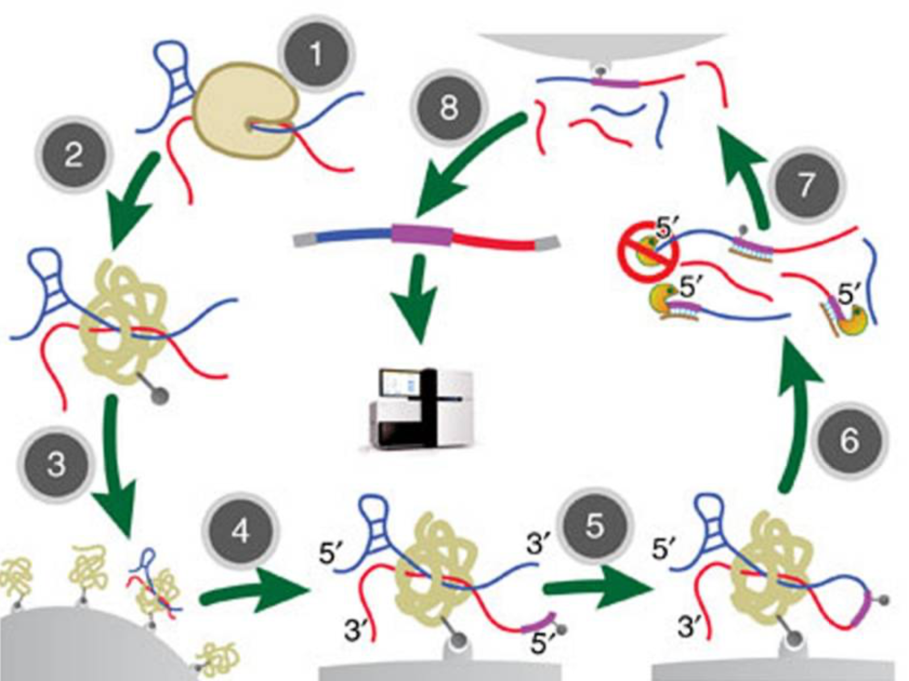
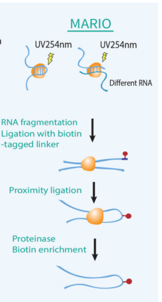
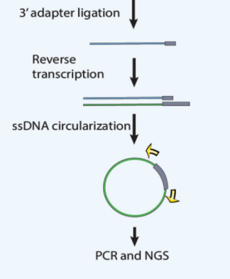
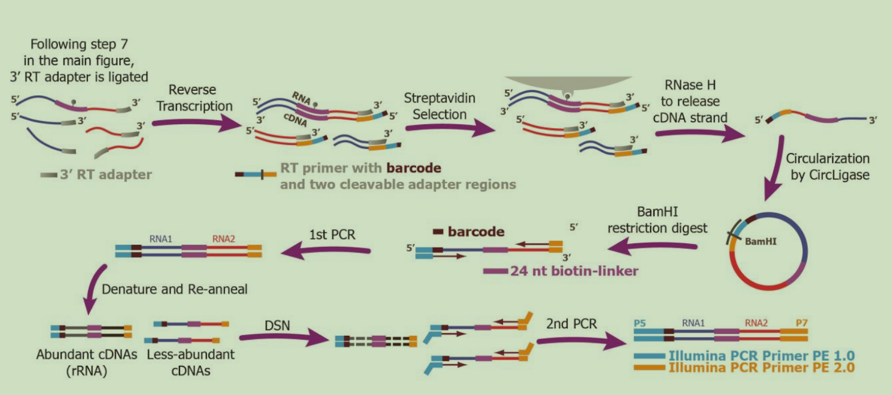
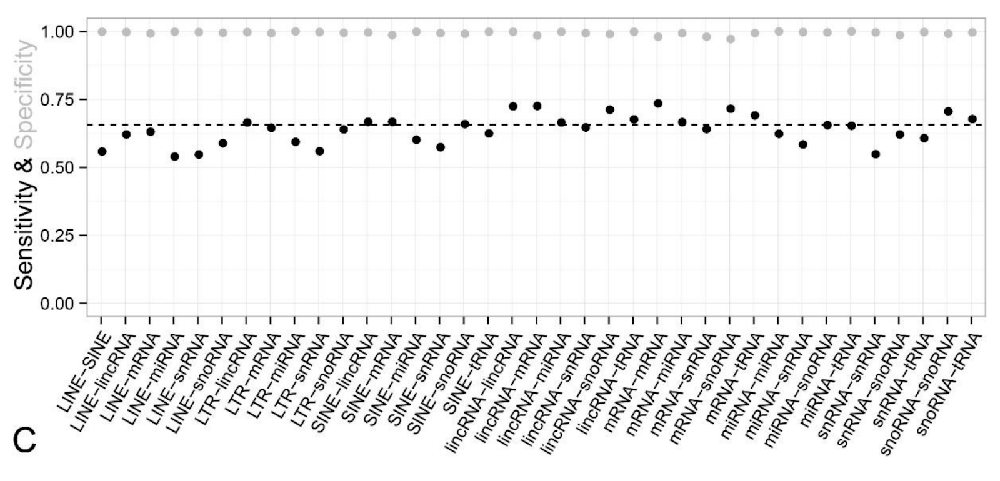

# MAPPING RNA INTERACTOME IN VIVO (MARIO)

## 1.1 RNA-RNA INTERACTOME

### Background
The RNA-RNA interactome, as uncovered by Mapping RNA Interactome In Vivo (MARIO), plays a crucial role in unveiling the mysteries of non-coding sequences within the human genome. To this day, despite constituting the majority of our genetic material, non-coding sequences are still largely unexplored while certain elements like promoters and enhancers are contrastingly better understood.

### Different Types of RNA
To fully grasp the significance of the RNA-RNA interactome, it's essential to first understand ourselves the diverse landscape of RNA molecules.

One crucial RNA is tRNA. It holds a pivotal role in the process of translation. tRNA ensures the conversion of genetic information encoded in mRNA into functional proteins. By recognizing specific codons on mRNA, it can ferry the corresponding amino acids to the ribosome allowing protein synthesis to occur. The precision of tRNA-mRNA interactions is fundamental for the accurate translation of the genetic code.

Another crucial RNA is mRNA. It serves as the messenger that carries the genetic instructions that guide the synthesis of proteins during translation from the DNA in the nucleus to the ribosomes in the cytoplasm. Understanding the interactions involving mRNA, especially when tRNA is also involved, is important as it can unveil the mechanisms governing protein synthesis, a fundamental process for cellular function.

MicroRNAs, or miRNAs, constitute another class of small non-coding RNAs that play a crucial role in the post-transcriptional regulation of gene expression. Unlike the previous two RNAs, miRNAs do not code for proteins themselves but rather function as molecular regulators in the sense that they bind to specific mRNA targets and influence their stability and translation efficiency. The miRNA-mRNA interactions are crucial regulatory steps that impact cellular functions and responses.

### Significance of RNA-RNA interactome
This tool provides a systematic approach to decoding the functions embedded in non-coding sequences with a primary focus on two key interactions. These interactions are tRNA-mRNA and miRNA-mRNA. The former interaction (tRNA-mRNA) ensures the accurate translation of genetic instructions into proteins. This interaction is a fundamental process in protein synthesis. The latter interaction (miRNA-mRNA) involves microRNAs regulating gene expression by essentially acting as molecular regulators in the intricate dance of genetic processes and expression.

The RNA-RNA interactome essentially serves as a valuable means to understand the functional significance of often overlooked non-coding sequences. MARIO is crucial in this regard in the sense that it facilitates this exploration, offering researchers insights into the roles of these genomic regions in cellular processes. This tool effectively acts as a bridge by helping connect the gaps in our knowledge and enabling researchers to gain a more comprehensive understanding of the non-coding genome.

Moreover, the RNA-RNA interactome has implications beyond basic biological understanding. With the ability to identify and characterize specific RNA interactions, it opens avenues for researchers to potentially target key players in disease pathways. This knowledge could eventually pave the way for developing RNA-based therapeutics that modulate gene expression, offering a potential avenue for precision medicine.

## 1.2 MAPPING PROCEDURE

### Mapping Strategy
Due to the difficulties of studying the complexities of the RNA-RNA interactome, a new technology is required to gain useful data. Mapping RNA Interactome in Vivo (MARIO) is an innovative strategy that aims to convert RNA-RNA interactions into cDNA, which is much easier to qualitatively and quantitatively sequence and analyze.

### Overall Procedure
While the individual steps of MARIO can become rather complex, the overall procedure of the technology can be summarized into eight steps (Nguyen et al. 2016):
1. Cross-linking RNAs to proteins
2. RNA fragmentation, protein denaturing, and biotinylation
3. Immobilization of RNA-binding proteins at low density
4. Ligation of a biotinylated RNA linker
5. Proximity ligation under a dilute condition
6. RNA purification and reverse transcription
7. Biotin pull-down
8. Construction of the sequencing library

Figure 1. MARIO technology diagram depicting the key experimental steps in the overall procedure (Nguyen et al. 2016)

### Cross-Linking RNAs To Proteins
In the first step, RNAs are cross-linked to the proteins they interact with using ultraviolet radiation. Using ultraviolet radiation helps induce the formation of covalent bonds between the nucleotides in the RNAs and the amino acids in the proteins. The cross-linked complexes are also used to generate a MARIO library to further record RNA-protein interactions.

### RNA Fragmentation, Protein Denaturing, And Biotinylation
In the second step, three processes must occur. The first step, RNA fragmentation, is the process of digesting the RNA into smaller fragments. For MARIO, researchers used a ribonuclease called RNase I to digest the RNA. The second step, protein denaturing, is the process of using chemical agents like to remove the unbound proteins. The third step, biotinylation, is the process of adding biotin to the cysteine residues in the cross-linked RNAs, which aids in the purification process later on in the procedure.

### Immobilization Of RNA-Binding Proteins At Low Density
In the third step, the cross-linked protein-RNA complexes are immobilized on streptavidin-coated beads at a low bead surface density. Streptavidin is used to immobilize the complexes that have been successfully tagged via biotinylation of cysteine residues. The remaining mobile complexes can then be flushed out using a washing buffer to result in a product of isolated, biotinylated protein-RNA complexes.

### Ligation Of A Biotinylated RNA Linker
In the fourth step, a biotin-tagged RNA linker is attached to the 5’ end of the RNA. This linker (with sequence 5′- rCrUrArG/iBiodT/rArGrCrCrCrArUrGrCrArArUrG rCrGrArGrGrA -3′) serves as a selection marker to help purify the ligated RNAs. Similar to the process of biotinylation, the unmarked RNA-protein complexes can then be flushed using washing buffers to isolate the remaining complexes with successful RNA linker ligation.

### Proximity Ligation Under A Dilute Condition
In the fifth step, the biotinylated RNA linker helps guide interacting RNA molecules towards one another. This process (known as proximity ligation) helps bind and stabilize proximity-based RNA interactions, which are essential for studying the RNA-RNA interactome.

### RNA Purification And Reverse Transcription
In the sixth step, the process of purifying the RNA and converting the interactions to DNA can occur. To purify the protein-RNA complexes, an elution buffer is used to remove the complexes from the low density streptavidin beads. The RNA is then extracted using centrifugation and precipitation, resulting in an RNA pellet containing a mixture of RNA molecules with and without linkers. The RNA is then treated with a variety of agents to remove biotin, genomic DNA, rRNAs, and other contaminants to finish the purification process. From the purified RNA, reverse transcription is used to synthesize cDNA, which stores information from the RNA-RNA interactome.

### Biotin Pull-Down
In the seventh step, a process called streptavidin-biotin affinity purification is used to select for the target RNA-DNA hybrids. This pull-down ensures that a majority of the sequencing read pairs contain the RNA-linker targets for analysis.

### Construction Of The Sequencing Library
In the eighth step, the sequencing library is generated from the cDNA representing the RNA-RNA interactions. First, the cDNA is circularized to avoid dealing with reverse transcription stalls, a common strategy for constructing sequencing libraries from cDNA. Next, the cDNA is relinearized and amplified using PCR. The now single-stranded cDNA is selected based on size using gel electrophoresis. After this step, the cDNA has been purified and can be amplified again using PCR to generate the final sequencing library.

### Computational Pipeline
After the sequencing library has been generated, the data can be analyzed using the MARIO tools package, which can be used with Python or R (full documentation available at https://mariotools.ucsd.edu/). The computational pipeline uses sequencing reads as an input, and outputs the cDNA library, genomic locations of the cDNA’s respective RNAs, and the inferred RNA interactions from the cDNA. The various tools in the package help provide a variety of computational functions to analyze the MARIO data:
* RNA interaction site binding energy calculation
* RNA interaction site conservation level calculation
* Read pair detection
* RNA folding and secondary structure prediction

## 1.3. SIGNIFICANCE, ADVANTAGES, AND LIMITATIONS OF MARIO

### Significant Innovation
Before the development of MARIO and its cohort, researchers could only study one RNA interaction at a time. MARIO restructures the problem of studying the complex nature of RNA interactions by converting the interactions into chimeric DNA, and utilizes DNA sequencing to generate a high-throughput readout of the underlying interactions. (Nguyen et al. 2018)

 

Figure 2. Figure from Nguyen et al. review of RNA, Action through Interactions

### Advantages of using MARIO (Nguyen et al. 2016)
* Unbiased selection: The biotin-labeled RNA linker works as an unbiased selection marker for interacting RNAs. A globally mapped RNA-RNA interactome becomes possible.  
* Easier than some methods: Comparatively, the biotin-labeled linker avoids the need of a protein-specific antibody or the required expression a tagged protein to investigate RNA interactions. It also gets rid of the previous limit of coping with one RNA-binding protein at one time.
* Suitable for tissue samples: No synthetic nucleotides or exogenous genes are added before cross-linking, therefore avoiding the risk of spurious interactions that can be offered by a change of RNA. Thus MARIO is made applicable to assay human tissues. 
* Removal of potential PCR amplification biases: MARIO removes potential PCR biases by  “attaching a random four-nucleotide or six-nucleotide barcode to each chimeric RNA before PCR amplification” and then counting fully overlapping sequencing data with identical barcodes only one time.

Figure 3. Supplementary figure from the Nguyen et al. study on MARIO
* Minimization of false positive from Ligation: False positives that usually come from “RNAs ligating randomly to other nearby RNAs” are controlled to minimum by doing the fifth step, RNA ligation on streptavidin beads in extremely dilute conditions.
* Avoided ambiguities in mapping the ligated chimeric RNA : the RNA linker offers a clear borderline “delineating the position of ligation site in the sequencing reads”.

### Limitations
If the RNA interactions being studied are not protein-mediated, then MARIO can miss them. In other words, given the design of MARIO, it can identify protein-assisted between-molecule and within-molecule RNA interactions, but will miss interactions that are not mediated by proteins (Kudla, Grzegorz et al. 2011).

### Simulation Analysis

Figure 4. Supplementary data from the Nguyen et al. study on MARIO

According to a simulation analysis of MARIO done by its author to estimate its specificity and sensitivity. (Nguyen et al. 2016) “The simulated dataset contained 200,200 chimeric RNA pairs, among which 131,571 pairs of RNAs were detected.” No matter what types of chosen RNAs are in the analysis, MARIO on average has a high specificity(92.57%), showing few false positives. [A highly sensitivity means that there are few false negative results and A highly specificity means that there are few false positive results] However, interactions that carry transposon RNA or snRNA showed more false negatives than those that did. And the worst scenarios happen with LINE RNAs, where sensitivities dropped to 52%. The authors of MARIO thus “conservatively estimate about half of the interactions involving transposon RNAs could have been missed by this procedure”. 

## 1.4 FURTHER STUDY

### Disease Research
One main avenue for potential further study regarding this technology lies in understanding the regulatory networks behind diseases. The RNA-RNA interactome provides a unique opportunity to dissect the molecular underpinnings of various diseases. Recent studies have made use of such technology in order to unravel disease-specific RNA networks. One such example is those implicated in cancer progression(Lee, J.H. et al. 2020). Identifying key RNA interactions associated with disease can allow researchers to pinpoint potential therapeutic targets for drug developments. 

### Personalized Medicine
Another potential avenue that technologies like MARIO can open up for us is in personalized medicine, where treatments can be tailored based on an individual's unique RNA makeup. There has already been promising research and results within this domain while utilizing this technology. For instance, a study exploring the miRNA-mRNA interactome in cancer patients revealed personalized miRNA signatures associated with treatment response(Vlachos, I.S. et al 2015). This not only reveals the potential of RNA interactome mapping in personalizing treatments but it also shows the ability for this technology to be able to predict individual responses to treatment.

### Developmental Biology
One more avenue the RNA-RNA interactome can help explore is the intricate processes of developmental biology. Research has revealed that RNA interactions play a pivotal role in shaping the growth and functioning of cells during development(Mercer, T.R. et al 2011). Mapping these interactions can allow researchers to uncover the regulatory networks that orchestrate cellular differentiation, tissue formation, and organ development. Not only does this provide us with insights into fundamental biological processes but it also lays the groundwork for potential interventions in developmental disorders.

### Summary
In essence, this technology can extend far beyond its initial purpose. It serves as a key to unlock personalized treatments, offer deeper insights into diseases, and enhance our overall understanding of life at the molecular level. These potential applications underscore the transformative impact it can have on healthcare and biological research. As we continue to refine and expand these technologies, we move closer to a future where RNA-based insights shape the landscape of medicine and biology.

## References/Citations

Kudla, Grzegorz et al. “Cross-linking, ligation, and sequencing of hybrids reveals RNA-RNA interactions in yeast.” Proceedings of the National Academy of Sciences of the United States of America vol. 108,24 (2011): 10010-5. doi:10.1073/pnas.1017386108

Lee, J.H. et al. "Global mapping of translation initiation sites in mammalian cells at single-nucleotide resolution." Proc Natl Acad Sci U S A, vol. 117, no. 26, 2020, pp. 1453-1463.
doi:10.1073/pnas.1207846109

Mercer, T.R. et al. "Long noncoding RNAs in neuronal-glial fate specification and oligodendrocyte lineage maturation." BMC Neurosci, vol. 12, 2011, p. 14.
doi: 10.1186/1471-2202-11-14

Nguyen, Tri C et al. “Mapping RNA-RNA interactome and RNA structure in vivo by MARIO.” Nature communications vol. 7 12023. 24 Jun. 2016, doi:10.1038/ncomms12023

Nguyen, Tri C., et al. “RNA, action through interactions.” Trends in Genetics, vol. 34, no. 11, Nov. 2018, pp. 867–882, doi.org/10.1016/j.tig.2018.08.001.

Vlachos, I.S. et al. "DIANA-TarBase v7.0: indexing more than half a million experimentally supported miRNA:mRNA interactions." Nucleic Acids Res, vol. 43, no. Database issue, 2015, pp. D153-159.
doi:10.1093/nar/gku1215
