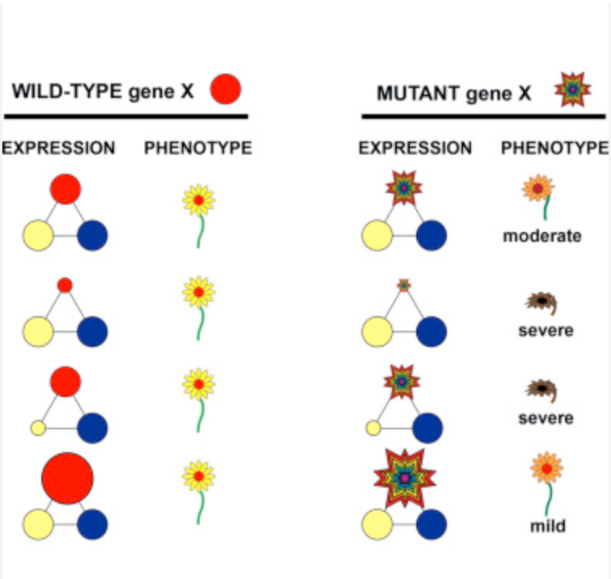
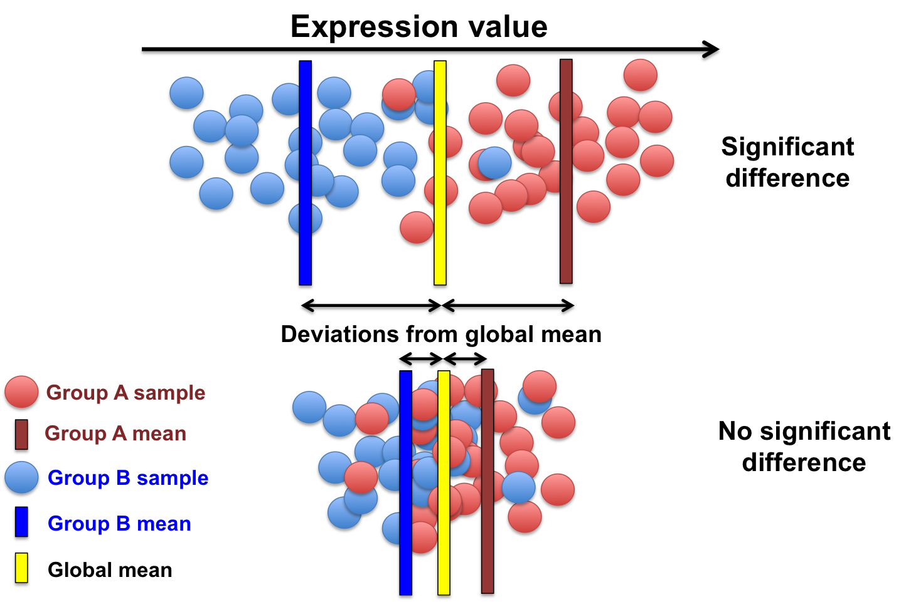
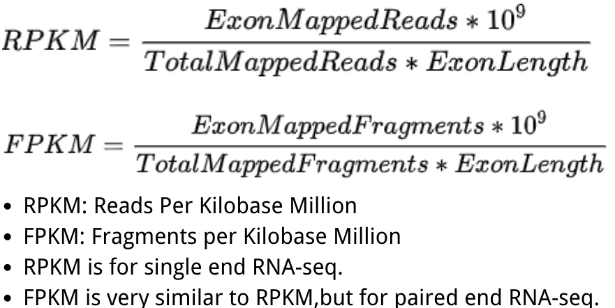
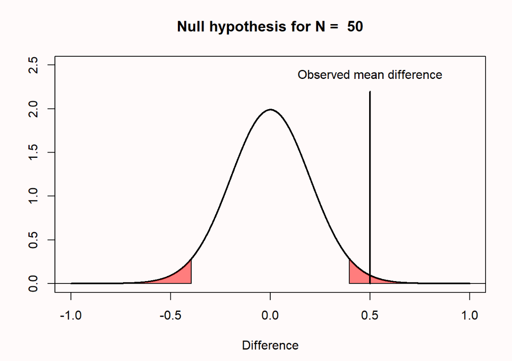
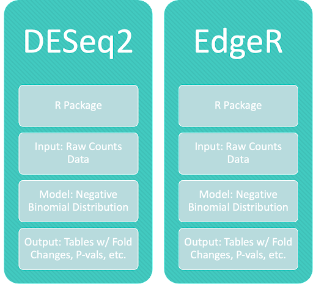
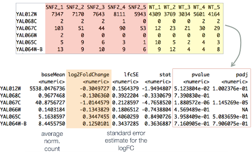
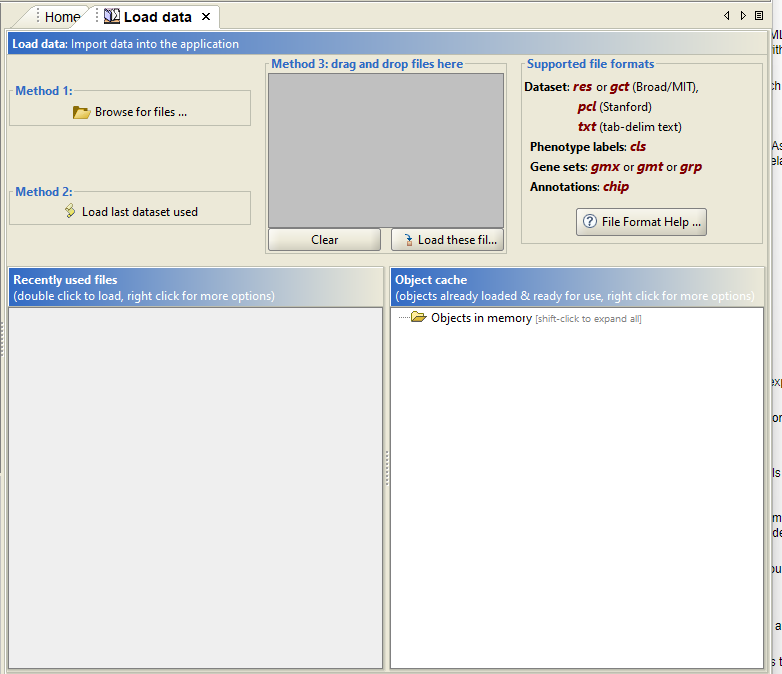
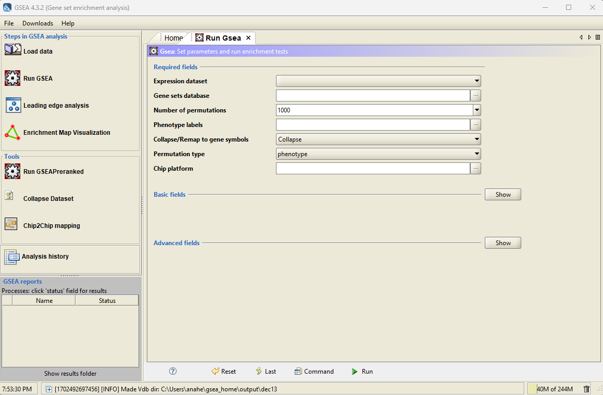
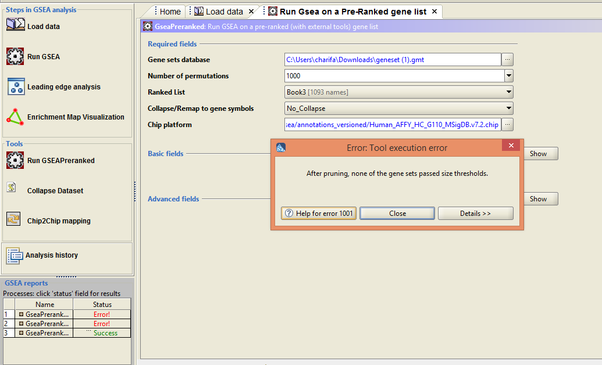
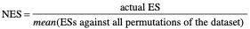

# Differential and Enrichment Analysis with GSEA (Gene Set Enrichment Analysis)
1. [Introduction: Why?](#231) 
    1.1. [Differential Expression and Differential Analysis of Genes](#2311) 
    1.2. [Gene Set Enrichment Analysis](#2312)
2. [Differential Gene Expression Analysis: How?](#232) 
    2.1. [General Workflow](#2122) 
    2.2. [RNA-Seq Workflow - Preparing for DGE](#2222) 
    2.3. [Methods and Methods comparison](#2322)

3. [Gene Set Enrichment Analysis: How?](#233) 
    3.1. [Preparing and Loading Data](#2331) 
    3.2. [Set Analysis Parameters and Run Program](#2332) 
    3.3. [View/Analyze Results](#2333)

## 1. Introduction
Have you wondered about how different kinds of cells in our body are developed despite their similar DNA composition? Have you considered why some patients die from a particular disease, while some do not?
    Differential Development of cell  |  Different phenotypes 
:-------------------------:|:-------------------------:
 |  

A fundamental concept underlying those phenomena is the Differential Expression of genes. Genes are expressed differentially under different conditions to allow for different combinations of proteins and activation of certain biological pathways [4]. Analyzing differential expression of a set of genes under different conditions can uncover the mystery behind development of stem cells and the cause of diseases [4].

Tools like **GSEA** can help us achieve this goal. However, before we dive deeper, let's start with some *basic concept review*. 

#### 1) Differential Expression and Differential Analysis of Genes

- **Differential Expression of genes** is *a evident change in read counts or expression level of genes under different conditions* [1]. 

Let's make an analogy here to help to understand this concept better. Let's consider different kinds of genes as different kinds of the lego building block.

It's intuitive that you need many white lego blocks to build a cloud lego while some white lego blocks to build the black cat for its eyes. 
Lego cloud           |  Lego Cat
:-------------------------:|:-------------------------:
 |  

In different biological conditions, the same gene will be expressed in different amounts based on needs. This phenomenon is the differential expression of the gene. 

- **Differential analysis** is to *analyze significant change in gene expression level of **a gene** under different biological conditions*.[5]

 [5]

As its name implies, differential analysis is a computational method used to detect **evident change of gene expression of *a gene* under different conditions**, **or between two phenotypes**[2]. It will require inputs like raw counts of gene expression in different conditions and conduct statistical analysis (like t-test) to check if the difference is statistically significant. 
 
#### 2) Gene Set Enrichment Analysis

- **Gene Set Enrichment Analysis** is to *analyze evident change in expression level of **a priori sets of gene** in different conditions* [3]. 

 [3]

Going back to our lego analogy, we know that different kinds of lego products consist of different combinations of lego building blocks. Knowing how many blocks we have for a certain product can help us foresee the look of it to some degree. 

On a similar note, differential expression of a set of genes can correlate with certain phenotypes of organisms. That's why we want to use gene set enrichment analysis, which we use statistical method to check if there is **evident change in expression of *a sets of gene* under different biological conditions**. 

## 2. Differential Gene Expression Analysis: How?
From the concept review, you probably can see how differential gene expression analysis is a necessary previous step of GSEA. 

To check if a set of genes is expressed differentially, we need to determine if a gene is expressed differentially first. Because we want to focus on GSEA in this chapter, let's take some time to go through the general workflow of DGE (differential gene expression analysis). 

#### 1) General Workflow 
The procedure of DGE can be generally concluded as follow: 
- 1. Normalization 
- 2. Statistical Test
- 3. P value check (P < 0.05, change is statistically significant; otherwise, it is not)

Let's dive into details one by one. 
1. **Normalization**</a>
   
   In RNA-seq downstream analysis, we will know how many reads are mapped to particular genes (that can be roughly taken as a measure of expression level sometimes). 
   

 
   
   *However, count of reads does not necessarily reflect the actual expression level of a gene.*

   To be specific, it's much easier for a gene that is *longer* and located in *DNA has higher counts of reads mapping* to have more reads mapped to it. Therefore, we need to take **gene length** and **library size** into consideration. That's why we need to first conduct normalization to make sure we get a valid expression level from input counts data. Common strategy and equations used for normalization are presented below. [BENG183 Lecture]

   

 

3. **Statistical Test**</a>

   We only care about **evident** change in expression level under different conditions. Thus, to make sure the difference in value is not caused by chance, we need to conduct a statistical test, usually a t-test, to compare and make sure the change in expression level under different conditions is significant.

   

 [5]

4. **P Value Check**</a>

   To check significance, we will use p value generated from t-test and 0.05 as threshold to determine its significance
   
   **If P < 0.05, change is statistically significant; otherwise, it is not significant.**

   

 

> Based on these general ideas, we'll walk through one of the most popular techniques for Differential Analysis and then briefly introduce other methods, as well as how to choose tools that work best for GSEA.

#### 2) RNA-Seq Workflow - Preparing for DGE

Before we can use GSEA, we first need to perform our differential gene expression analysis separately. Luckily, DGE is a well established protocol with a plethora of tools available to help us unlock the potential of differential analysis. While we’ll dive deeper into some of these tools later as well as how you can make the seemingly difficult decision on which one to pick, let’s first discuss some vital steps leading up to DGE analysis.

 

From previous chapters, we should already be familiar with the general RNA sequencing analysis pipeline outlined above, but just for the sake of review let’s discuss some of the key steps. We’ll begin with our RNA-seq data as sequence reads and run these through FASTQC for quality control. Next, we’ll map our reads to the reference genome, and often this step will be conducted using STAR. Lastly, before DGE we will do expression quantification, which can be performed in featureCounts. [BENG183 Lecture] If any of these steps are unclear, feel free to take a minute and revisit these earlier topics. At this stage, you’re ready to take the next step with differential gene expression analysis - so let’s dive into the methods that make it all work.

#### 3) Methods and Methods Comparison

As touched on earlier, there’s a wide range of tools that can be used for DGE analysis. Some of the more common and well-known tools include DESeq2, EdgeR, and limma-voom, but there’s others as well, each with its own functionality. 

 

 

While these methods do have some differences in their exact procedure, they all follow a general workflow and can be successfully applied for DGE. Additionally, most DGE tools can be compatible with GSEA, so there’s not really any major restrictions on which one you can select. For now, we’re going to narrow down our focus to just DESeq2 and EdgeR - both are well established tools that are a part of the R programming language.

 

As for that general workflow, we’re going to begin with count data which tells us the number of sequence reads originating from each gene. Higher counts will mean more expression, and lower counts the opposite. Normalization is next. DESeq2 uses median of ratios for normalization, whereas EdgeR takes trimmed mean of M values (TMM) [6]. These aren’t extremely different, but this does demonstrate some of the minor differences that keep the two tools unique. 

Both DESeq2 and EdgeR will model read counts as a negative binomial distribution, and with our filtered, normalized, and high quality counts will run statistical tests to calculate fold changes, p-values, and other measures to represent the level of significance of expression differences. An example table output from DESeq2 is shown below. As we can see, we have p-values for each gene which will allow us to judge significance. 

 

Once we’ve arrived here, actually understanding the output of our DGE analysis can be a daunting task in itself. Don’t worry! GSEA is an easy to use software that can help you analyze, annotate, and interpret enrichment results.

## 3. Gene Set Enrichment Analysis: How?

Now that we've reviewed DGE, 
let's take a better look at the procedure for running the GSEA program. 
 
#### 1) Preparing and Loading Data

In order to use GSEA, 4 data files must be prepared to be uploaded:
- 1. Expression Dataset
- 2. Phenotype Labels
- 3. Gene Sets
- 4. CHiP Annotations

1. Expression Dataset

    Expression Datasets contain features(genes or probes), samples, and an expression value for each feature in each sample. This dataset is accepted in the following formats: res, gcl, pcl, or txt. [3]

2. Phenotype Labels
    
    Phenotype Label datasets contain phenotype labels and associates each sample with a phenotype. This dataset is accepted in the following format: cls. [3]

3. Gene Sets

    Gene Sets contain one or more gene sets. Each gene set contains the given gene sets name and a list of features(genes or probes) This dataset is accepted in the following format: gmx, gmt, or grp. [3]

4. CHiP Annotations(Optional)

    CHiP Annotations are the only optional dataset not required by GSEA to run. CHiP Annotations list each identifier on a platform along with its matching HGNC CHiP symbol. This dataset is accepted in the following format: CHiP. [3]

#### 2) Set Analysis Parameters and Run Program
Running GSEA is an easy and simple process. Once the datasets have been loaded into the program, a few required parameters need to be set:

1. Expression Dataset
2. Gene sets database
3. Number of Permutations
4. Phenotype labels
5. Permutation type
6. CHiP platform(optional)

A majority of these required fields(1,2,4,6) are done by selecting the datasets from the previous preparing and loading step. For the remaining fields, the number of permutations and permutation type will have the biggest effect on the results which will be explained in further detail in the next section.  

Once parameters are set, the program can be run where the user will then be presented with a GSEA report, which tracks the progress and result of the analysis. There are 2 potential outcomes once the analysis is finished: 
1. Error
2. Success

If given an error, the user can click on the Error message in order to be prompted to an error log which will provide further in-depth information regarding why the analysis failed.

If given a success, the user can click on the Success message in order to be prompted to an output folder which contains the analysis report(index.html) and a matching .rpt file.

#### 3) View/Analyze Results
When viewing the analysis report for GSEA, 4 key statistics are found that best help to interpret the results.
- 1. Enrichment Score (ES)
- 2. Normalized Enrichment Score (NES)
- 3. False Discovery Rate (FDR)
- 4. Nominal P Value

1. Enrichment Score (ES)

    

    The **Enrichment Score** is the primary result that reflects the degree to which a gene set is over-represented. This is calculated by walking down the ranked list of genes and increasing a running-sum statistic when a gene is in the gene set and decreasing when it isn't. The ES is the maximum deviation from 0 encountered from walking the list. A positive ES indicates that a certain gene set enrichment is at the top of the list while a negative ES is at the bottom of the list. [3]

2. Normalized Enrichment Score (NES)   

    The **Normalized Enrichment Score** is the primary statistic for examining gene set results. Normalizing the enrichment score accounts for differences in gene set size and correlations between gene sets and expression data. GSEA calculates NES using the following formula:

    

 

    [3]

    NES is based on gene set enrichment scores for all dataset permutations. This indicates that changing either the permutation method, the number of permutations, or the size of the expression dataset will affect the resulting NES. [3]

3. False Discovery Rate (FDR)  

    The **False Discovery Rate** is the estimated probability that a gene set with a given NES is a false positive finding. [3] For example, an FDR of 20% indicates that resulting NES has an 80% chance of being valid. Usually, the larger the absolute NES the smaller the FDR.

    FDR uses 2 ratio distributions:
   (1)the actual ES vs the ES for all gene sets against all permutations of the data set and
   (2)the actual ES vs the ES of all gene sets against the actual dataset. [3]
   For example, if 6 gene sets were analyzed with 1000 permutations, the 2 resulting distributions would contain one with 6000 data points with second distribution containing 6. 

5. Nominal P Value   

    The **Nominal P Value** estimates the statistical significance of the enrichment score for a single set where if p < 0.05, the gene set is considered significant. [3] 
    
    Within the GSEA report, a p value of 0 indicates a p values of less that 1/number of permutations. [3] For example, an analysis with 100 permutations would return a p value of 0, but would indicate an actual p value of less than 0.01. This indicates that a larger number of permutations will result in a more accurate p-value.(1000 permutations are usually recommended) 

# Reference
[1] Anjum A, Jaggi S, Varghese E, Lall S, Bhowmik A, Rai A. Identification of Differentially Expressed Genes in RNA-seq Data of Arabidopsis thaliana: A Compound Distribution Approach. J Comput Biol. 2016 Apr;23(4):239-47. doi: 10.1089/cmb.2015.0205. Epub 2016 Mar 7. PMID: 26949988; PMCID: PMC4827276.  

[2] Abbas, M., EL-Manzalawy, Y. Machine learning based refined differential gene expression analysis of pediatric sepsis. BMC Med Genomics 13, 122 (2020). https://doi.org/10.1186/s12920-020-00771-4 

[3] Gene Set Enrichment Analysis Website. https://www.gsea-msigdb.org/gsea/doc/GSEAUserGuideFrame.html 

[4] Differential Gene Expression | Definition & Analysis. https://study.com/academy/lesson/differential-gene-expression-definition-examples.html#:~:text=Differential%20gene%20expression%20defines%20the,of%20liver%20and%20skin%20cells  

[5] Comparing experimental conditions: differential expression analysis. https://biocorecrg.github.io/CRG_Bioinformatics_for_Biologists/differential_gene_expression.html. 

[6] Differential gene expression (DGE) analysis. https://hbctraining.github.io/Training-modules/planning_successful_rnaseq/lessons/sample_level_QC.html
