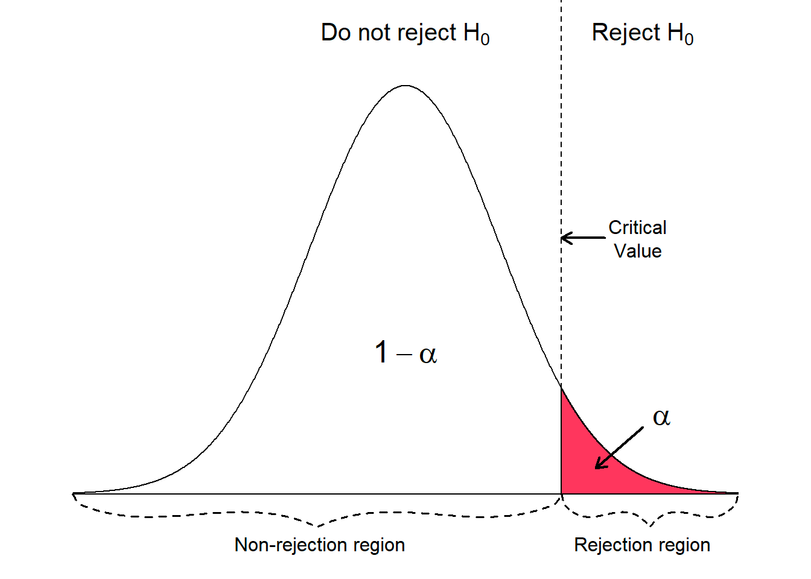
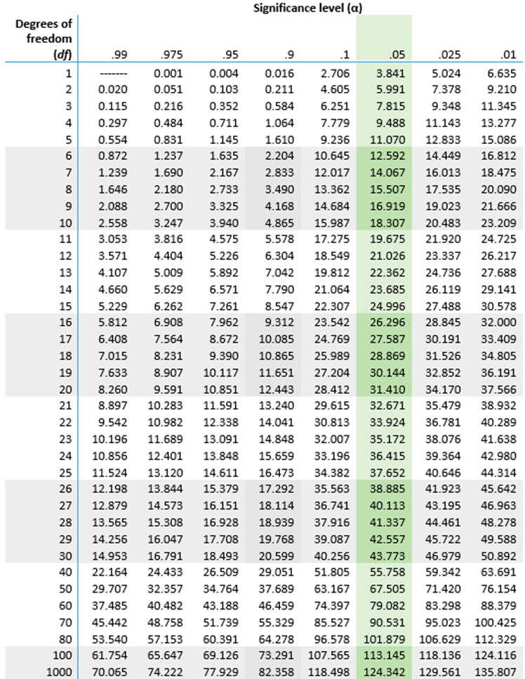

# Introduction to Hypothesis Testing
---
## Table of Contents
---
1. [What is Hypothesis Testing?](#1)  
    1.1 [Creating a Null and Alternative Hypothesis](#2)  
    1.2 [Gathering data](#3)  
    1.3 [Test Statistic](#4)  
    1.4 [P-value](#5)  
    1.5 [Making a decision based off of the P-value](#6)  
2. [Considerations when chosing the significance threshold](#7)
3. [Applications of Hypothesis Testing to DESeq2](#8)
4. [Conclusion](#9)
---
## What is Hypothesis Testing? Why is it important? 

Hypothesis Testing is the use of statistical analysis on data to evaluate the validity of a hypothesis. It allows researchers to make evidence-based conclusions. 

The 5 steps of Hypothesis Testing:  
      Form a Null and Alternative Hypothesis  
      Gathering Data  
      Generate a Test Statistic  
      Generate P-value  
      Interpret P-value and Make a Decision  

To illustrate the steps of hypothesis testing, we will be looking at a hypothetical case study. Our example case study will look at whether or not smoking causes lung cancer. 

---

## Creating a Null and Alternative Hypothesis 

A hypothesis is a proposed statement that makes a prediction on the outcome of a study, based on past evidence. It must be testable, measurable, falsifiable, and be written in a clear, understandable way. When hypothesis testing, we need two hypotheses that compete against each other: null hypothesis and alternative hypothesis. These two cannot be both true or false at the same time. 

A null hypothesis is typically the simpler of the two statements, and would hypothesize that there is no significant difference between the measured variables. It hypothesizes that any observed change is due to experimental or testing error. The null hypothesis is usually assumed true. 

An alternative hypothesis hypothesizes that there is a significant difference between the different measurements, and that there is a low possibility that the difference is due to chance. The alternative hypothesis needs to be proven true at the end of the hypothesis testing. 

---

## Gathering data 

---

## Test Statistic 
---

## P-value 
Once we have generated a test statistic, we need to generate a p-value from that statistic. The p-value is the chance of seeing a test statistic equal or more extreme than the generated test statistic given that the null hypothesis is true. The p-value ranges from 0 to 1, the lower the value the more likely the difference is real and not caused by random sampling. The p-value is calculated by finding the CDF of the null distribution. 
The CDF of the null distribution can be found through 2 ways.
1. The mathematical form of the CDF can be determined using assumptions on the distribution itself.
2. Computer simulations can be used to produce random data points using the null hypothesis. The data points can be aggregated to approximate the CDF of the null distribution. 

**Case Study:**
We can use our chi-squared value along with the degrees of freedom to find our p-value. Degrees of freedom can be found by multiplying the (number of sample columns - 1) by the (number of sample rows - 1) [3]. For chi-squared tests, the p-value can be found by using a calculator or by looking up a table. From a calculator, the p-value is equal to 2.184e-52. Note that it is unlikely you would find a p-value this extreme even when the null hypothesis is false.  

**Knowledge Check**

How many degrees of freedom are we using? How did we find that? 

    
Answer: 

    We are using 1 degree of freedom. We did (number of sample columns - 1) * (number of sample rows - 1). There are two sample columns (smoker and non-smoker) as well as two sample rows (lung cancer and no lung cancer). Doing the math, we get $(2-1) * (2-1) = 1$. 

What does our low p-value mean $(2.184 e-52)$?

    
Answer:

    It means that it is very likely that the difference is real and not caused by random sampling. 
    

---

## Making a decision based off the P-value 

After we generate the p-value, we must make a decision to reject the null hypothesis or not reject the null hypothesis. 
We use a cut-off value 𝛂 to make this decision. This value must be decided ahead of time.
Most of the times, 0.05 is chosen as the arbitrary value  
For any p-value lower than or equal to 𝛂, the null hypothesis will be rejected
For any p-value higher than 𝛂, the null hypothesis will not be rejected

**Knowledge Check**

If our 𝛂 is 0.05, what decision would we make based off of the p-value of our chi-squared test?

    
Answer:

    Because our p-value of 2.184e-52 is less than 0.05, we would reject our null hypothesis. 

**Case Study**
Case study: for a chi-squared test, you can look directly at a table such as the one (below,above, depends on formatting). The table tells us the chi-squared value that corresponds to a significance threshold for a certain degree of freedom. This value is known as a critical value. If the chi-squared test value is higher than the table’s critical value, then that means the null hypothesis should be rejected. Otherwise, the null hypothesis cannot be rejected. 

**Knowledge Check**

What chi-squared value from the table would correspond to our case study?

    
Answer:

    The chi-squared critical value would be 3.841 This is because we have 1 degree of freedom, and 𝛂 is 0.05, so we would look for the critical value in the 1 degree of freedom row and the .05 column.

---

### Considerations when choosing the significance threshold 

The decision to reject the null hypothesis given that the null hypothesis is true (Reject H0 | H0) is known as a type I error.

The decision to not the null hypothesis given that the null hypothesis is not true (Not Reject H0 | H1) is known as a type II error. 

P(Reject H0|H0) = P(pδ|H0), P(Do not reject H0|H1) = P(p>δ|H1)

When the significance threshold increases, the chance of a type I error increases while the chance of a type II error decreases. 

Conversely, when the significance threshold decreases, the chance of a type I error decreases while the chance of a type II error increases.

Therefore, it is important to consider both types of errors when choosing a significance threshold. 

---

### Applications of Hypothesis Testing in DESeq2 
Hypothesis testing is an important step in all experiments. 

For example, this is how DEseq2 applies the steps of hypothesis testing to find differentially expressed genes.

**Creating a Null and Alternative Hypothesis**  
   Deseq2’s null hypothesis for each gene is that the gene is not differentially expressed  
Deseq2’s alternative hypothesis for each gene is that the gene is differentially expressed

**Gather Data**  
	Deseq2 takes in FeatureCount data from an RNA-seq experiment
 
**Test statistic**  
Deseq2 uses the wald test to generate the test statistic from feature count data

**P-value**  
	Deseq2 also uses the wald test to generate the p-value based on the test statistic values
 
**Make a decision based on the hypothesis**  
Based on a predetermined p-value threshold, genes will be classified as either differentially expressed or not differentially expressed. 

---

## Conclusions 

