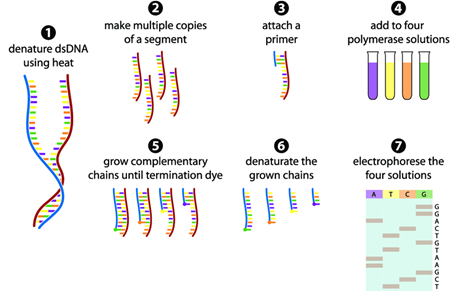
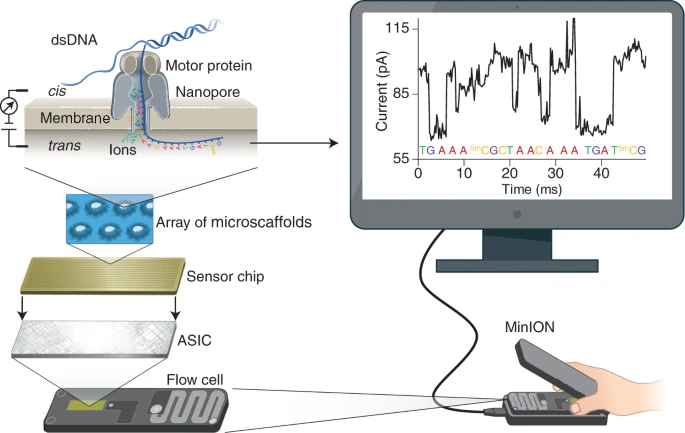

# Long Read Sequencing: How is it Different?

## Preface
This handout is meant to give a brief overview of different DNA sequencing technologies with a focus on Long Read Sequencing technologies and how they differ from previous technologies.

# Learning Objectives
- Describe the structure and function of DNA.
- Describe what DNA Sequencing is and why it is important.
- Describe what Short Read Sequencing(SRS) is.
- Describe what Long Read Sequencing(LRS) is.
- Explain the differences between SRS and LRS technology.

## DNA Structure and Function
[**D**eoxyribose **N**ucleic **A**cid] (DNA) is a [macromolecule] composed of nucleotides. Each nucleotide is formed from a sugar, phosphate, and a nitrogenous base. The nitrogenous base differs between nucleotides giving them one of four chemical identities. In DNA, nitrogenous bases can be **g**uanine(G), **c**ytosine(C\), **a**denine(A), or **t**hymine(T). DNA naturally forms double helix structures in which nitrogenous bases pair with complementary nitrogenous bases by hydrogen bonds. In DNA, guanine always pairs with cytosine and adenine always pairs with thymine. In [**R**ibo**n**ucleic **A**cid] (RNA), the thymine nitrogenous base is replaced with **u**racil(U).

[Genomic DNA] stores the genetic information for an organism as a sequence of nucleotides. This genetic information can be inherited by progeny of the organism and contains the instructions for the molecular machinery of the organism. This includes sequences of nucleotides that encode for functional machinery and regulatory instructions. Functional machinery can be proteins or enzymatic RNA called [ribozymes]. DNA encodes for proteins through [**m**essenger **RNA**] (mRNA) that provides the information to create the proteins. 
 
## DNA Sequencing
[DNA sequencing] is the general term to encompass many different genomic technologies that elucidate the linear nucleotide sequence of a DNA molecule; it is a sophisticated process that is used to understand more about the specific order of nucleotides in DNA molecules. Sequencing involves a meticulous examination of each sequence, offering many insights on the structural intricacies of the DNA molecule/molecules in question such as an entire genome! By analyzing the specific structures, scientists are able to better understand more about [mutations], [disorders], [regulatory regions], [variations within sequences], and [much more]. 

Furthermore, sequencing is a part of the basis of many applications spanning research, medicine, forensic analysis, and beyond. Understanding the structure of DNA allows scientists to better understand how biological processes work. We also know that DNA is inherited and as a result DNA sequencing can illuminate how some diseases are inherited. Sequencing can be used to understand how disease can be inherited but can also be used to determine and track how diseases evolve such as the [SARS-CoV-2 virus].

The two primary sequencing types, long read sequencing and short read sequencing, contribute unique advantages in various contexts. Although the specific processes they use differ, both approaches ultimately provide information about the sequence of nucleotides that help form many conclusions in genomics. 

## Short Read Sequencing
Unlike long read, **S**hort **R**ead **S**equencing (SRS) contains well-established nucleotide sequencing methods. Short read sequencing has highly established support tools and methods. The main difference between long and short read sequencing lies in the number of contiguous base pairs they read from at a time. Usually, SRS reads roughly 50 to a couple of hundred base pairs at a time, making it drastically different from its counterpart which reads over a thousand contiguous base pairs. This difference leads to a lot of other analysis techniques that differ between the two; all of which will be discussed later.

Examples of SRS include [Sanger Sequencing], Illumina [Sequencing by Synthesis], and PacBio [Sequencing by Binding] and [many more]. In this handout, we will only explain Sanger Sequencing and Illumina’s Sequencing by Synthesis but we encourage you to look at other SRS technologies if you are interested.

# Sanger Sequencing
Sequencing was first introduced in 1977 when Frederick Sanger developed a method in which he used **d**i**d**eoxy**n**ucleotide **t**ri**p**hosphates, also known as [ddNTPs], as chain terminators to sequence nucleotides in DNA molecules [\[1\]]. This method was the first form and eventually established to be **F**irst-**G**eneration **S**equencing (FGS). 

A sample of DNA is first heated to denature the DNA into two strands in order to provide single strands for the sequencing reaction. A primer, which acts as the starting point for DNA synthesis, is added to each strand. [DNA polymerase], a molecular machine found in living organisms, is then used to essentially extend the primer along the given template strand. DNA polymerase adds free nucleotides in solution called [dNTPs] until the entire strand has been replicated with a complementary strand. The sample is then heated to create single strands and the process is repeated. This cyclic process, called **P**olymerase **C**hain **R**eaction ([PCR]), replicates a DNA sample exponentially and is used in many DNA sequencing technologies[\[2\]].

Sanger Sequencing uses this process with chain terminators to sequence DNA. In four separate tubes, ddNTPS of the different bases (ddATP, ddTTP, ddCTP, and ddGTP) are labeled with different colors of fluorescent dye to help create individual reactions with the strands; the dye is added to specifically show where termination occurs and with what nucleotide. ddNTPs differ from dNTPs in that they do not have a hydroxyl group on the 3’, so that DNA polymerase cannot attach additional nucleotides to the DNA, thus terminating the chain. Since there is a mix of dNTPs and the selected ddNTP, there will be a mix of different size fragments all ending with the same ddNTP. This means, for example, in the ddTTP tube, there will be contiguous stretches of DNA of different lengths composed of all 4 dNTPs but all ending with a labeled ddTTP.

These fragments are then sorted by size using gel electrophoresis. This method utilizes DNA’s natural negative charge to move DNA through an agarose gel. The DNA fragments are placed in the agarose gel and slowly move from the negative to the positive side of the gel while an electrical charge is applied. Smaller fragments are faster and move easily through the gel while larger fragments are a lot slower. This helps to separate the fragments by size so that scientists are able to better visualize them. This way, we can reconstruct the sequence of the DNA based on the sizes of the fragments since we know what nucleotide each fragment ends with.

Analysis then occurs to determine the final sequence. A picture is included below to provide a visual representation of the process of first gen sequencing.

First Gen Sequencing (picture provided by [Front Line Genomics])

# Illumina 
Another well known short read sequencing method is [Illumina] sequencing, also known as **S**econd-**G**eneration **S**equencing (SGS) or **N**ext-**G**eneration **S**equencing (NGS). This is because the DNA is sequenced massively in parallel as opposed to the single sequence at a time with First-Generation Sequencing. There are three main steps to Illumina: preparation, cluster formation, and sequencing.

The DNA sample is first fragmented into short sequences and are then ligated with adapters that act as primers for sequencing. These pieces are then amplified through bridge amplification, a process that uses a flow cell as a surface. The fragmented pieces are hybridized with the flow cell and clusters are formed. These clusters are denatured for sequencing. Fluorescently labeled A, T, C, G nucleotides are added to the flow cell and illuminated when they are added to the growing sequence. After the fluorescently labeled nucleotide is identified, the tag is removed and another fluorescently labeled nucleotide is added to the sequence. Clusters that represent identical DNA sequences glow with the same fluorescent color when the DNA nucleotide is added. Images are taken to look at the color of each cluster and analysis occurs later [\[3\]]. 

A picture is included below, to better visualize the process.

Second Gen Sequencing (picture provided by [ScienceDirect])

There are many advantages and disadvantages to short read sequencing that make it better for varying situations. 

Short read sequencing is known for its high throughput, meaning that it is able to generate a large number of reads in a single run, making it suitable for long projects. The short reads also aid in SRS being effective for high-depth sequencing. In this case, depth refers to the number of times the same nucleotide in the sequence is read [\[4\]].  Furthermore, SRS is often more cost-effective per base, making it more suitable for routine projects. Lastly, SRS has been around for a while, making its processes familiar to many and easy to integrate into projects [\[5\]].

While there are many advantages, there are also disadvantages that can make it less effective for certain situations. SRS is unable to resolve many complexities including pointing out repetitive sequences and identifying modifications and structural variations; all of which tend to require more base pairs to be read each run [\[5\]]. 

## Long Read Sequencing 
**L**ong **r**ead **s**equencing (LRS) is a sequencing approach that sequences long stretches of DNA. LRS is able to produce reads that span over tens of thousands of base pairs long [\[6\]](https://urldefense.com/v3/__https://www.pacb.com/blog/long-read-sequencing/__;!!Mih3wA!HV1ji0Gpn09pmsKY818nyYTp9lFxfyPGYyBwUZdK03UaXb5P8mhKbbx7jpsQsNVEZk5ZQW5kUulfQPFEZo0$ ). 

# Pac Bio
One of the exemplars of LRS technology is [PacBio]’s [HiFi Long Read Sequencing](https://urldefense.com/v3/__https://www.pacb.com/technology/hifi-sequencing/__;!!Mih3wA!HV1ji0Gpn09pmsKY818nyYTp9lFxfyPGYyBwUZdK03UaXb5P8mhKbbx7jpsQsNVEZk5ZQW5kUulfMsEfimM$ ) . In PacBio’s long-read sequencing technology, the foundational technique employed is **S**ingle-**M**olecule **R**eal-**T**ime (SMRT) sequencing. The initial step involves the preparation of DNA samples into SMRTbell templates[\[7\]]. These templates are positioned onto a PacBio SMRT Cell, which is then integrated into the sequencing instrument. Within this setup, a DNA polymerase enzyme initiates the synthesis of a complementary DNA strand, taking cues from the DNA template as it threads through the DNA polymerase situated in the SMRT Cell [\[7\]]. The SMRTbell templates are bound to DNA polymerase and loaded onto a SMRT chip[\[7\]]. The chip is placed into the PacBio sequencing instrument and the DNA polymerase begins synthesizing a complementary DNA strand using fluorescently labeled nucleotides[\[7\]]. Each time a nucleotide is incorporated, a fluorescent pulse is emitted[\[7\]]. The instrument detects these pulses in real time [\[7\]]. The unique color of the fluorescence identifies which of the four bases (A, T, C, or G) is incorporated [\[7\]]. To ensure the accuracy of the sequence data, the process includes multiple readings of the same DNA template. This iterative approach ensures a high fidelity in the sequencing results obtained from the PacBio system [\[7\]]. This technology can also detect modifications such as methylation to the DNA through the patterns in the light [\[7\]]. Picture provided below.

Pac Bio (Picture provided by [BMKGENE])

# Oxford Nanopore Technologies (ONT)
Another Long-Read Sequencing technology is [Oxford Nanopore]. Oxford Nanopore sequencing represents a different approach to reading DNA sequences. Rather than reading as the DNA is synthesized, Oxford Nanopore reads the DNA sequence without replicating the DNA. The process begins with the preparation of DNA samples, to which specialized adapters are attached[\[8\]]. These adapters facilitate the introduction of the DNA into the sequencing device. The device is equipped with a synthetic membrane containing nanopores. The nanopore has an attached motor protein that “ratchets” the DNA molecule through the pore [\[8\]]. As each DNA molecule passes through the nanopore, it disturbs the electrical current flowing through the membrane resulting in distinctive disruptions that are measured as electrical signals[\[8\]]. These signals are then carefully analyzed, a step referred to as base calling, to deduce the sequence of DNA bases[\[8\]]. The technology's ability to process long strands of DNA makes it particularly valuable for complex sequencing tasks [\[8\]].

ONT can also sequence RNA directly! After ligating adapters just like you would for DNA, you can sequence native RNA [\[8\]]. 

ONT also has a small sequencer. There is no need for large equipment so the sequencing could be more accessible. A picture is provided below.

Oxford Nanopore Nanopore (picture provided by [Wang et al.])

# Uses of LRS
As stated above there are many uses for LRS. Some of the advantages of it include its ability to resolve complex regions, including repetitive parts and structural variations, including deletions, insertions, translocations, and [more](https://urldefense.com/v3/__https://www.nature.com/articles/s41592-022-01730-w__;!!Mih3wA!HV1ji0Gpn09pmsKY818nyYTp9lFxfyPGYyBwUZdK03UaXb5P8mhKbbx7jpsQsNVEZk5ZQW5kUulf5duSKxc$ ) [\[9\]]. Furthermore, LRS is helpful in distinguishing between alleles on chromosomes, which helps in understanding genetic variation[\[9\]]. Lastly, there are many LRS technologies that allow scientists to directly sequence RNA molecules, which help in studying splicing [\[9\]](https://urldefense.com/v3/__https://www.genomicseducation.hee.nhs.uk/genotes/knowledge-hub/long-read-sequencing/__;!!Mih3wA!HV1ji0Gpn09pmsKY818nyYTp9lFxfyPGYyBwUZdK03UaXb5P8mhKbbx7jpsQsNVEZk5ZQW5kUulfyNfmSeU$ ). 

As many advantages as there are to long read sequencing, there are as many disadvantages that make it less useful than SRS in certain situations. First, it has a higher per-base error rate [\[9\]]. PacBio’s HiFi long reads are accurate only because they reread the same base many times [\[7\]]. Second, long read sequencing is known to have lower throughput and it also costs more per-base sequencing, which can make it less useful for researchers [\[9\]](https://urldefense.com/v3/__https://www.genomicseducation.hee.nhs.uk/genotes/knowledge-hub/long-read-sequencing/__;!!Mih3wA!HV1ji0Gpn09pmsKY818nyYTp9lFxfyPGYyBwUZdK03UaXb5P8mhKbbx7jpsQsNVEZk5ZQW5kUulfyNfmSeU$ ). As the technology matures, we expect to see these disadvantages disappear or atleast become more comparable to SRS .

Some of the situations in which long read sequencing would be more preferential include when a reference genome is not accessible, when studying structural variants and complex arrangements, when distinguishing haplotypes is required, and just in general, when long regions need to be sequenced such as repeated regions. 

# Comparison between Long and Short Read Technologies
Long Read Sequencing and Short Read Sequencing technologies have different applications. Some situations would benefit from LRS while others would benefit from SRS. This section goes into a comparison between specific LRS and SRS technologies and when they are most applicable. This table is simplified to make the technologies more comparable.
| Technology                              | PacBio HiFi Long Reads - [Revio](https://urldefense.com/v3/__https://www.pacb.com/revio/__;!!Mih3wA!HV1ji0Gpn09pmsKY818nyYTp9lFxfyPGYyBwUZdK03UaXb5P8mhKbbx7jpsQsNVEZk5ZQW5kUulfPF85hMQ$ )                | Oxford Nanopore Technologies - [MinION](https://urldefense.com/v3/__https://nanoporetech.com/products/sequence/minion__;!!Mih3wA!HV1ji0Gpn09pmsKY818nyYTp9lFxfyPGYyBwUZdK03UaXb5P8mhKbbx7jpsQsNVEZk5ZQW5kUulfOlsaRvg$ ) | Oxford Nanopore Technologies - [PromethION 48](https://urldefense.com/v3/__https://nanoporetech.com/products/sequence/promethion-24-48__;!!Mih3wA!HV1ji0Gpn09pmsKY818nyYTp9lFxfyPGYyBwUZdK03UaXb5P8mhKbbx7jpsQsNVEZk5ZQW5kUulfyU23Z3o$ )                     | Illumina NGS - [NovaSeqX 25B](https://urldefense.com/v3/__https://www.illumina.com/systems/sequencing-platforms/novaseq-x-plus/specifications.html__;!!Mih3wA!HV1ji0Gpn09pmsKY818nyYTp9lFxfyPGYyBwUZdK03UaXb5P8mhKbbx7jpsQsNVEZk5ZQW5kUulf3Q3e-nM$ )                         | PacBio Sequencing by Binding - [Onso](https://urldefense.com/v3/__https://www.pacb.com/wp-content/uploads/Onso-specification-sheet.pdf__;!!Mih3wA!HV1ji0Gpn09pmsKY818nyYTp9lFxfyPGYyBwUZdK03UaXb5P8mhKbbx7jpsQsNVEZk5ZQW5kUulfZk5FOyQ$ )                                                                                                                                                                      |
| --------------------------------------- | ---------------------------------------------------------------------------- | ------------------------------------------------------------------------------------------ | ------------------------------------------------------------------------------------------------------------------------------- | ------------------------------------------------------------------------------------------------------------------------------------------------ | --------------------------------------------------------------------------------------------------------------------------------------------------------------------------------------------------------------------------------------------------------------------------------- |
| Read Length (in base pairs)             | 15,000-20,000 bp                                                             | Limited by length of input DNA                                                             | Limited by length of input DNA (recorded longer than 4,000,000 bp)                                                              | 150 bp                                                                                                                                           | 100-200 bp                                                                                                                                                                                                                                                                        |
| Throughput (in gigabases of data)       | 3.75 gb /hr / SMRT cell                                                      | ~0.66 gb / hr                                                                              | ~3.85 gb /hr / flow cell                                                                                                        | ~166.67 gb / hr                                                                                                                                  | 2.5gb/hr                                                                                                                                                                                                                                                                          |
| Cost for gb (gigabase) of data (in USD) | ~$11 per Gb                                                                  | [$25 per Gb](https://urldefense.com/v3/__https://jitc.bmj.com/content/8/1/e000299__;!!Mih3wA!HV1ji0Gpn09pmsKY818nyYTp9lFxfyPGYyBwUZdK03UaXb5P8mhKbbx7jpsQsNVEZk5ZQW5kUulfjZDhvRU$ )                                     | [$20 per Gb](https://urldefense.com/v3/__https://jitc.bmj.com/content/8/1/e000299__;!!Mih3wA!HV1ji0Gpn09pmsKY818nyYTp9lFxfyPGYyBwUZdK03UaXb5P8mhKbbx7jpsQsNVEZk5ZQW5kUulfjZDhvRU$ )                                                                          | [$2 per Gb](https://urldefense.com/v3/__https://www.genengnews.com/news/illumina-reveals-new-high-throughput-instrument-novaseq-x/__;!!Mih3wA!HV1ji0Gpn09pmsKY818nyYTp9lFxfyPGYyBwUZdK03UaXb5P8mhKbbx7jpsQsNVEZk5ZQW5kUulfsFfSHE8$ )                                          | unpublished                                                                                                                                                                                                                                                                       |
| Read Accuracy                           | 99.95%                                                                       | [99.0%](https://urldefense.com/v3/__https://nanoporetech.com/accuracy__;!!Mih3wA!HV1ji0Gpn09pmsKY818nyYTp9lFxfyPGYyBwUZdK03UaXb5P8mhKbbx7jpsQsNVEZk5ZQW5kUulf0dVYREs$ )                                                 | [99.1%](https://urldefense.com/v3/__https://nanoporetech.com/about-us/news/ncm-announcements-include-single-read-accuracy-991-new-chemistry-and-sequencing__;!!Mih3wA!HV1ji0Gpn09pmsKY818nyYTp9lFxfyPGYyBwUZdK03UaXb5P8mhKbbx7jpsQsNVEZk5ZQW5kUulf2QvAdUA$ ) | 99.95%                                                                                                                                           | 99.99%                                                                                                                                                                                                                                                                            |
| Applications                            | Sequencing large repeat regions, De Novo Genome Assembly, Methylation status | Very portable and low cost. Starter pack is only~$1000                                     | Sequencing large repeat regions, Whole native RNA reads, De Novo Genome Assembly                                                | Projects requiring high depth, SNP identification, cheap reading with good accuracy, and utilizing existing/published techniques for sequencing. | “liquid biopsy testing for minimal residual disease (MRD), antibiotic resistance monitoring in microbial communities, off-target analysis in gene editing experiments, and many other “needle-in-a-haystack” applications where the highest level of sensitivity is desired” |

Some of the situations in which SRS would be better suited over LRS include targeted sequencing, projects in which the goal is to identify SNPs in reference genomes, and [RNA sequencing] for [differential expression]. Due to the significant difference in price per gigabase of sequencing data, SRS is currently more accessible for many experiments.

References
[\[1\]]: Heather JM, Chain B. The Sequence of sequencers: the History of Sequencing DNA. Genomics. 2016;107(1):1-8. doi:https://urldefense.com/v3/__https://doi.org/10.1016/j.ygeno.2015.11.003__;!!Mih3wA!HV1ji0Gpn09pmsKY818nyYTp9lFxfyPGYyBwUZdK03UaXb5P8mhKbbx7jpsQsNVEZk5ZQW5kUulft3DNY4w$ 

[\[2\]]: Garibyan L, Avashia N. Polymerase Chain Reaction. Journal of Investigative Dermatology. 2013;133(3):1-4. doi:https://urldefense.com/v3/__https://doi.org/10.1038/jid.2013.1__;!!Mih3wA!HV1ji0Gpn09pmsKY818nyYTp9lFxfyPGYyBwUZdK03UaXb5P8mhKbbx7jpsQsNVEZk5ZQW5kUulfPzFaQJQ$ 

[\[3\]]: Illumina. NGS Workflow Steps | Illumina sequencing workflow. https://urldefense.com/v3/__http://www.illumina.com__;!!Mih3wA!HV1ji0Gpn09pmsKY818nyYTp9lFxfyPGYyBwUZdK03UaXb5P8mhKbbx7jpsQsNVEZk5ZQW5kUulfTbOUP-o$ . Published 2023. Accessed December 13, 2023. https://urldefense.com/v3/__https://www.illumina.com/science/technology/next-generation-sequencing/beginners/ngs-workflow.html__;!!Mih3wA!HV1ji0Gpn09pmsKY818nyYTp9lFxfyPGYyBwUZdK03UaXb5P8mhKbbx7jpsQsNVEZk5ZQW5kUulf5fffB2w$ 

[\[4\]]: Genetic testing for rare diseases company | 3billion. 3billion.io. Accessed December 13, 2023. https://urldefense.com/v3/__https://3billion.io/blog/sequencing-depth-vs-coverage__;!!Mih3wA!HV1ji0Gpn09pmsKY818nyYTp9lFxfyPGYyBwUZdK03UaXb5P8mhKbbx7jpsQsNVEZk5ZQW5kUulfM2aHV8Y$ 

[\[5\]]: Short-read sequencing — Knowledge Hub. GeNotes. Accessed December 13, 2023. https://urldefense.com/v3/__https://www.genomicseducation.hee.nhs.uk/genotes/knowledge-hub/short-read-sequencing/__;!!Mih3wA!HV1ji0Gpn09pmsKY818nyYTp9lFxfyPGYyBwUZdK03UaXb5P8mhKbbx7jpsQsNVEZk5ZQW5kUulfrp-vwzc$ 

[\[6\]]: Sullivan M. Sequencing 101: long-read sequencing. PacBio. Published March 2, 2023. Accessed December 13, 2023. https://urldefense.com/v3/__https://www.pacb.com/blog/long-read-sequencing/__;!!Mih3wA!HV1ji0Gpn09pmsKY818nyYTp9lFxfyPGYyBwUZdK03UaXb5P8mhKbbx7jpsQsNVEZk5ZQW5kUulfQPFEZo0$ 

[\[7\]]: Rhoads A, Au KF. PacBio Sequencing and Its Applications. Genomics, Proteomics & Bioinformatics. 2015;13(5):278-289. doi:https://urldefense.com/v3/__https://doi.org/10.1016/j.gpb.2015.08.002__;!!Mih3wA!HV1ji0Gpn09pmsKY818nyYTp9lFxfyPGYyBwUZdK03UaXb5P8mhKbbx7jpsQsNVEZk5ZQW5kUulfH_kwKf8$ 

[\[8\]]: Wang Y, Zhao Y, Bollas A, Wang Y, Au KF. Nanopore sequencing technology, bioinformatics and applications. Nature Biotechnology. 2021;39(11):1348-1365. doi:https://urldefense.com/v3/__https://doi.org/10.1038/s41587-021-01108-x__;
!!Mih3wA!HV1ji0Gpn09pmsKY818nyYTp9lFxfyPGYyBwUZdK03UaXb5P8mhKbbx7jpsQsNVEZk5ZQW5kUulfbDE_VPg$ 

[\[9\]]: Long-read sequencing — Knowledge Hub. GeNotes. Accessed December 13, 2023. https://urldefense.com/v3/__https://www.genomicseducation.hee.nhs.uk/genotes/knowledge-hub/long-read-sequencing/__;!!Mih3wA!HV1ji0Gpn09pmsKY818nyYTp9lFxfyPGYyBwUZdK03UaXb5P8mhKbbx7jpsQsNVEZk5ZQW5kUulfyNfmSeU$ 

Image Sources:
Sanger Sequencing: https://urldefense.com/v3/__https://frontlinegenomics.com/a-history-of-sequencing/__;!!Mih3wA!HV1ji0Gpn09pmsKY818nyYTp9lFxfyPGYyBwUZdK03UaXb5P8mhKbbx7jpsQsNVEZk5ZQW5kUulfE6iDch0$ 

Illumina Sequencing (SBS): https://urldefense.com/v3/__https://www.sciencedirect.com/topics/immunology-and-microbiology/illumina-dye-sequencing__;!!Mih3wA!HV1ji0Gpn09pmsKY818nyYTp9lFxfyPGYyBwUZdK03UaXb5P8mhKbbx7jpsQsNVEZk5ZQW5kUulfWxMzPOw$ 

Oxford Nanopore Technologies: https://urldefense.com/v3/__https://www.nature.com/articles/s41587-021-01108-x__;!!Mih3wA!HV1ji0Gpn09pmsKY818nyYTp9lFxfyPGYyBwUZdK03UaXb5P8mhKbbx7jpsQsNVEZk5ZQW5kUulfOdGYPPA$ 

PacBio HiFi Long Reads: https://urldefense.com/v3/__https://www.bmkgene.com/dna-sequencing-pacbio-sequencer-product/__;!!Mih3wA!HV1ji0Gpn09pmsKY818nyYTp9lFxfyPGYyBwUZdK03UaXb5P8mhKbbx7jpsQsNVEZk5ZQW5kUulfps3_BSs$ 

[//]: # (You can put the links here)
[**D**eoxyribose **N**ucleic **A**cid]: https://urldefense.com/v3/__https://en.wikipedia.org/wiki/DNA__;!!Mih3wA!HV1ji0Gpn09pmsKY818nyYTp9lFxfyPGYyBwUZdK03UaXb5P8mhKbbx7jpsQsNVEZk5ZQW5kUulfpeRp0RY$ 
[**R**ibo**n**ucleic **A**cid]: https://urldefense.com/v3/__https://en.wikipedia.org/wiki/RNA__;!!Mih3wA!HV1ji0Gpn09pmsKY818nyYTp9lFxfyPGYyBwUZdK03UaXb5P8mhKbbx7jpsQsNVEZk5ZQW5kUulf2_CQILY$ 
[macromolecule]: https://urldefense.com/v3/__https://en.wikipedia.org/wiki/Macromolecule__;!!Mih3wA!HV1ji0Gpn09pmsKY818nyYTp9lFxfyPGYyBwUZdK03UaXb5P8mhKbbx7jpsQsNVEZk5ZQW5kUulfNeidumY$ 
[Genomic DNA]: https://urldefense.com/v3/__https://www.qiagen.com/us/knowledge-and-support/knowledge-hub/bench-guide/dna/introduction/what-is-genomic-dna__;!!Mih3wA!HV1ji0Gpn09pmsKY818nyYTp9lFxfyPGYyBwUZdK03UaXb5P8mhKbbx7jpsQsNVEZk5ZQW5kUulfQ4y7jKw$ 
[ribozymes]: https://urldefense.com/v3/__https://www.sciencedirect.com/topics/biochemistry-genetics-and-molecular-biology/ribozyme__;!!Mih3wA!HV1ji0Gpn09pmsKY818nyYTp9lFxfyPGYyBwUZdK03UaXb5P8mhKbbx7jpsQsNVEZk5ZQW5kUulf5RfXyjg$ 
[**m**essenger **RNA**]: https://urldefense.com/v3/__https://www.genome.gov/genetics-glossary/messenger-rna__;!!Mih3wA!HV1ji0Gpn09pmsKY818nyYTp9lFxfyPGYyBwUZdK03UaXb5P8mhKbbx7jpsQsNVEZk5ZQW5kUulfWQ3qWDQ$ 

[DNA sequencing]: https://urldefense.com/v3/__https://www.genome.gov/genetics-glossary/DNA-Sequencing/__;!!Mih3wA!HV1ji0Gpn09pmsKY818nyYTp9lFxfyPGYyBwUZdK03UaXb5P8mhKbbx7jpsQsNVEZk5ZQW5kUulfEHcM3i0$ 
[mutations]: https://urldefense.com/v3/__https://www.genome.gov/genetics-glossary/Mutation__;!!Mih3wA!HV1ji0Gpn09pmsKY818nyYTp9lFxfyPGYyBwUZdK03UaXb5P8mhKbbx7jpsQsNVEZk5ZQW5kUulfzzh5YhU$ 
[disorders]: https://urldefense.com/v3/__https://www.genome.gov/For-Patients-and-Families/Genetic-Disorders__;!!Mih3wA!HV1ji0Gpn09pmsKY818nyYTp9lFxfyPGYyBwUZdK03UaXb5P8mhKbbx7jpsQsNVEZk5ZQW5kUulf1x2-i1E$ 
[regulatory regions]: https://urldefense.com/v3/__https://doi.org/10.1007/978-1-60761-854-6_3__;!!Mih3wA!HV1ji0Gpn09pmsKY818nyYTp9lFxfyPGYyBwUZdK03UaXb5P8mhKbbx7jpsQsNVEZk5ZQW5kUulfiBCkias$ 
[variations within sequences]: https://urldefense.com/v3/__https://www.ncbi.nlm.nih.gov/books/NBK20363/__;!!Mih3wA!HV1ji0Gpn09pmsKY818nyYTp9lFxfyPGYyBwUZdK03UaXb5P8mhKbbx7jpsQsNVEZk5ZQW5kUulf4rQYghg$ 
[much more]:https://urldefense.com/v3/__https://www.genome.gov/about-genomics/fact-sheets/DNA-Sequencing-Fact-Sheet__;!!Mih3wA!HV1ji0Gpn09pmsKY818nyYTp9lFxfyPGYyBwUZdK03UaXb5P8mhKbbx7jpsQsNVEZk5ZQW5kUulfksOLWzw$ 
[SARS-CoV-2 virus]: https://urldefense.com/v3/__https://www.cdc.gov/coronavirus/2019-ncov/variants/genomic-surveillance.html__;!!Mih3wA!HV1ji0Gpn09pmsKY818nyYTp9lFxfyPGYyBwUZdK03UaXb5P8mhKbbx7jpsQsNVEZk5ZQW5kUulfoEmxCMo$ 

[Sanger Sequencing]: https://urldefense.com/v3/__https://en.wikipedia.org/wiki/Sanger_sequencing__;!!Mih3wA!HV1ji0Gpn09pmsKY818nyYTp9lFxfyPGYyBwUZdK03UaXb5P8mhKbbx7jpsQsNVEZk5ZQW5kUulfO7RoY1o$ 
[Sequencing by Synthesis]: https://urldefense.com/v3/__https://www.illumina.com/science/technology/next-generation-sequencing/sequencing-technology.html__;!!Mih3wA!HV1ji0Gpn09pmsKY818nyYTp9lFxfyPGYyBwUZdK03UaXb5P8mhKbbx7jpsQsNVEZk5ZQW5kUulfYHB-SL8$ 
[Sequencing by Binding]: https://urldefense.com/v3/__https://www.pacb.com/blog/sbb-sequencing__;!!Mih3wA!HV1ji0Gpn09pmsKY818nyYTp9lFxfyPGYyBwUZdK03UaXb5P8mhKbbx7jpsQsNVEZk5ZQW5kUulfpMVirJE$ 
[many more]: https://urldefense.com/v3/__https://www.genomicseducation.hee.nhs.uk/genotes/knowledge-hub/short-read-sequencing/__;!!Mih3wA!HV1ji0Gpn09pmsKY818nyYTp9lFxfyPGYyBwUZdK03UaXb5P8mhKbbx7jpsQsNVEZk5ZQW5kUulfrp-vwzc$ 

[\[1\]]: https://urldefense.com/v3/__https://www.ncbi.nlm.nih.gov/pmc/articles/PMC4727787/__;!!Mih3wA!HV1ji0Gpn09pmsKY818nyYTp9lFxfyPGYyBwUZdK03UaXb5P8mhKbbx7jpsQsNVEZk5ZQW5kUulfZZouurE$ 
[ddNTPs]: https://urldefense.com/v3/__https://en.wikipedia.org/wiki/Dideoxynucleotide__;!!Mih3wA!HV1ji0Gpn09pmsKY818nyYTp9lFxfyPGYyBwUZdK03UaXb5P8mhKbbx7jpsQsNVEZk5ZQW5kUulf4U1Ykmg$ 
[DNA polymerase]: https://urldefense.com/v3/__https://en.wikipedia.org/wiki/DNA_polymerase__;!!Mih3wA!HV1ji0Gpn09pmsKY818nyYTp9lFxfyPGYyBwUZdK03UaXb5P8mhKbbx7jpsQsNVEZk5ZQW5kUulfjMHQfL8$ 
[dNTPs]: https://urldefense.com/v3/__https://en.wikipedia.org/wiki/Nucleoside_triphosphate__;!!Mih3wA!HV1ji0Gpn09pmsKY818nyYTp9lFxfyPGYyBwUZdK03UaXb5P8mhKbbx7jpsQsNVEZk5ZQW5kUulfbuSKvqI$ 
[PCR]: https://urldefense.com/v3/__https://www.genome.gov/genetics-glossary/Polymerase-Chain-Reaction__;!!Mih3wA!HV1ji0Gpn09pmsKY818nyYTp9lFxfyPGYyBwUZdK03UaXb5P8mhKbbx7jpsQsNVEZk5ZQW5kUulfYwxdwv0$ 
[\[2\]]: https://urldefense.com/v3/__https://www.ncbi.nlm.nih.gov/pmc/articles/PMC4102308/__;!!Mih3wA!HV1ji0Gpn09pmsKY818nyYTp9lFxfyPGYyBwUZdK03UaXb5P8mhKbbx7jpsQsNVEZk5ZQW5kUulfJQ2chb8$ 

[Illumina]: https://urldefense.com/v3/__https://www.illumina.com/__;!!Mih3wA!HV1ji0Gpn09pmsKY818nyYTp9lFxfyPGYyBwUZdK03UaXb5P8mhKbbx7jpsQsNVEZk5ZQW5kUulffP0leUI$ 
[\[3\]]: https://urldefense.com/v3/__https://www.illumina.com/science/technology/next-generation-sequencing/beginners/ngs-workflow.html__;!!Mih3wA!HV1ji0Gpn09pmsKY818nyYTp9lFxfyPGYyBwUZdK03UaXb5P8mhKbbx7jpsQsNVEZk5ZQW5kUulf5fffB2w$ 
[\[4\]]: https://urldefense.com/v3/__https://3billion.io/blog/sequencing-depth-vs-coverage__;!!Mih3wA!HV1ji0Gpn09pmsKY818nyYTp9lFxfyPGYyBwUZdK03UaXb5P8mhKbbx7jpsQsNVEZk5ZQW5kUulfM2aHV8Y$ 
[\[5\]]: https://urldefense.com/v3/__https://www.genomicseducation.hee.nhs.uk/genotes/knowledge-hub/short-read-sequencing/__;!!Mih3wA!HV1ji0Gpn09pmsKY818nyYTp9lFxfyPGYyBwUZdK03UaXb5P8mhKbbx7jpsQsNVEZk5ZQW5kUulfrp-vwzc$ 

[\[6\]]: https://urldefense.com/v3/__https://www.pacb.com/blog/long-read-sequencing/__;!!Mih3wA!HV1ji0Gpn09pmsKY818nyYTp9lFxfyPGYyBwUZdK03UaXb5P8mhKbbx7jpsQsNVEZk5ZQW5kUulfQPFEZo0$ 
[PacBio]: https://urldefense.com/v3/__https://www.pacb.com/__;!!Mih3wA!HV1ji0Gpn09pmsKY818nyYTp9lFxfyPGYyBwUZdK03UaXb5P8mhKbbx7jpsQsNVEZk5ZQW5kUulfwHj0Nls$ 
[HiFi Long Read Sequencing]: https://urldefense.com/v3/__https://www.pacb.com/technology/hifi-sequencing/__;!!Mih3wA!HV1ji0Gpn09pmsKY818nyYTp9lFxfyPGYyBwUZdK03UaXb5P8mhKbbx7jpsQsNVEZk5ZQW5kUulfMsEfimM$ 
[\[7\]]: https://urldefense.com/v3/__https://www.sciencedirect.com/science/article/pii/S1672022915001345?via*3Dihub__;JQ!!Mih3wA!HV1ji0Gpn09pmsKY818nyYTp9lFxfyPGYyBwUZdK03UaXb5P8mhKbbx7jpsQsNVEZk5ZQW5kUulfVTo-FX0$  

[Oxford Nanopore]: https://urldefense.com/v3/__https://nanoporetech.com/__;!!Mih3wA!HV1ji0Gpn09pmsKY818nyYTp9lFxfyPGYyBwUZdK03UaXb5P8mhKbbx7jpsQsNVEZk5ZQW5kUulfWkNXXQM$  
[\[8\]]: https://urldefense.com/v3/__https://www.nature.com/articles/s41587-021-01108-x__;!!Mih3wA!HV1ji0Gpn09pmsKY818nyYTp9lFxfyPGYyBwUZdK03UaXb5P8mhKbbx7jpsQsNVEZk5ZQW5kUulfOdGYPPA$ 

[\[9\]]: https://urldefense.com/v3/__https://www.genomicseducation.hee.nhs.uk/genotes/knowledge-hub/long-read-sequencing/__;!!Mih3wA!HV1ji0Gpn09pmsKY818nyYTp9lFxfyPGYyBwUZdK03UaXb5P8mhKbbx7jpsQsNVEZk5ZQW5kUulfyNfmSeU$  

[Front Line Genomics]: https://urldefense.com/v3/__https://frontlinegenomics.com/a-history-of-sequencing/__;!!Mih3wA!HV1ji0Gpn09pmsKY818nyYTp9lFxfyPGYyBwUZdK03UaXb5P8mhKbbx7jpsQsNVEZk5ZQW5kUulfE6iDch0$ 
[ScienceDirect]: https://urldefense.com/v3/__https://www.sciencedirect.com/topics/immunology-and-microbiology/illumina-dye-sequencing__;!!Mih3wA!HV1ji0Gpn09pmsKY818nyYTp9lFxfyPGYyBwUZdK03UaXb5P8mhKbbx7jpsQsNVEZk5ZQW5kUulfWxMzPOw$ 
[Wang et al.]: https://urldefense.com/v3/__https://www.nature.com/articles/s41587-021-01108-x__;!!Mih3wA!HV1ji0Gpn09pmsKY818nyYTp9lFxfyPGYyBwUZdK03UaXb5P8mhKbbx7jpsQsNVEZk5ZQW5kUulfOdGYPPA$ 
[BMKGENE]: https://urldefense.com/v3/__https://www.bmkgene.com/dna-sequencing-pacbio-sequencer-product/__;!!Mih3wA!HV1ji0Gpn09pmsKY818nyYTp9lFxfyPGYyBwUZdK03UaXb5P8mhKbbx7jpsQsNVEZk5ZQW5kUulfps3_BSs$ 

[RNA sequencing]: https://urldefense.com/v3/__https://en.wikipedia.org/wiki/RNA-Seq__;!!Mih3wA!HV1ji0Gpn09pmsKY818nyYTp9lFxfyPGYyBwUZdK03UaXb5P8mhKbbx7jpsQsNVEZk5ZQW5kUulfQ7HQNXk$ 
[differential expression]: https://urldefense.com/v3/__https://www.ncbi.nlm.nih.gov/books/NBK10061/__;!!Mih3wA!HV1ji0Gpn09pmsKY818nyYTp9lFxfyPGYyBwUZdK03UaXb5P8mhKbbx7jpsQsNVEZk5ZQW5kUulfbZWWFM0$ 
>
