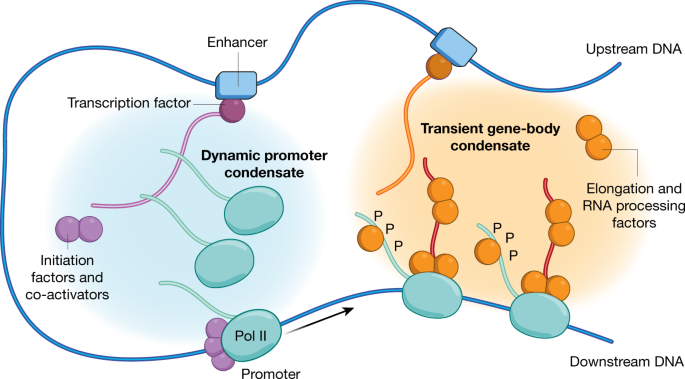
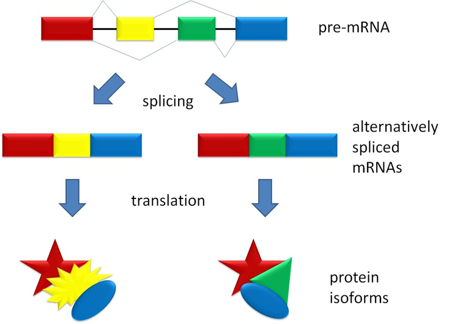
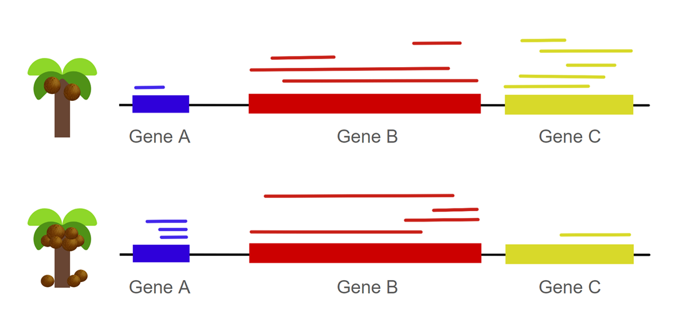
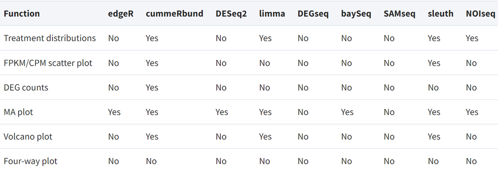

# Detection and Analysis of Differentially Expressed Genes #  
#### Group 18 Jenelle Truong, Jiachen Xi, Zhuoling Huang  
*BENG183 2023FALL*   

---
### Contents  
1. Introduction to Differentially Expressed Genes
2. Differentially Expressed Genes at Biological Level
3. DEG Analysis Workflow
4. Result Interpretation
5. DEG Analysis Application
---
 

## Introduction to Differentially Expressed Genes
While biological organisms of the same species may share a substantial portion of their genetic material, the manifestation of this shared genome can exhibit notable differences in terms of gene expression levels among individuals. For instance, one human being’s DNA blueprints can be 99.9% identical to another, but the expression of their shared genes are not necessarily identical. 

According to the central dogma of molecular biology, genes within DNA are transcribed into RNA, which can then form polypeptides or functional protein products through translation. Gene transcription and translation processes encompass intricate networks of molecular signals, transcription factors, and epigenetic modifications that collectively influence how genes are activated or suppressed [[1]](https://www.khanacademy.org/science/ap-biology/gene-expression-and-regulation/translation/a/intro-to-gene-expression-central-dogma). 

Therefore, gene differential expression study is important to determine the underlying biological mechanisms that lead to certain phenotypes.   
 

## Differentially Expressed Genes at Biological Level
* __Transcription:__  regulatory elements interact with DNA and affect overall gene expression.  For instance, certain non-coding RNAs, such as large intergenic non-coding RNAs (lincRNAs), have been found to direct chromatin-modifying complexes to specific genomic loci, thus affecting epigenetic state. Incorporation of nucleotide sequences, like promoters and enhancers, work respectively to initiate transcription and increase transcription rate.   
  
    
> *[Figure 1](https://www.nature.com/articles/s41586-019-1517-4/figures/5)* Hypothetical model of an active Pol II gene (blue) with dynamic promoter condensate (turquoise) and transient gene-body condensate (orange). Figure by Cramer, P, 2019, Nature 573, 43, p. 45-54.
* __Translation:__ alternative splicing transforms pre-mRNA into various isoforms of mRNA and protein products following translation. The figure below shows the coding exons as colored blocks and non-coding introns as black sections in the pre-mRNA. The different exon block combinations then highlights the results of alternative splicing through the skipping of certain exons and selection of different splice sites.   
  
> *[Figure 2](https://simple.wikipedia.org/wiki/Alternative_splicing#/media/File:Splicing_overview.jpg)* Hypothetical demonstration of alternative splicing produces two isoforms. Figure by Agathman [[2]](https://simple.wikipedia.org/wiki/Alternative_splicing).
 

## DEG Analysis Workflow  
1. Sample Collection and RNA Extraction:
   - Biological samples, such as tissues or cells, are collected from different conditions.  
   - RNA is extracted from these samples, capturing the genetic information in the form of messenger RNA (mRNA).  
2. RNA Sequencing:
   - Sequencing technologies such as NGS are applied to the collected samples to generate RNA sequencing data.
   - RNA-seq provides a comprehensive snapshot of the transcriptome by revealing the abundance of different RNA isoforms and the raw sequencing data obtained.
3. Data Preprocessing:
   - Raw sequencing data undergoes preprocessing steps, including quality control, read alignment to a reference genome, and quantification of gene expression levels.
4. Genome Alignment:
   - Map the cleaned reads to a reference genome using alignment tools such as HISAT2, STAR, or Bowtie.
   - By aligning the RNA-seq reads to the genomic coordinates, we're able to identify where the transcripts originate.
5. Normalization:
   - To account for variations in sequencing depth and other technical biases, the expression values are normalized. 
   - The figure below shows what mapped gene reads may look like for a hypothetical example of two coconut trees, one low-yielding and the other high-yielding [[3]](https://www.researchgate.net/figure/Basic-workflow-for-the-differential-gene-expression-analysis-for-nut-yield-The-figure_fig1_336363814).
   
> *Figure 3* Hypothetical demonstration of gene reads in need of normalization. Illustrated by Zhuoling Huang.   

> At first glance, it appears that there is an increased count of gene A, roughly the same counts of gene B, and decreased counts of gene C when we compare the high-yielding to the low-yielding coconut tree. However, normalization of these counts is necessary, because metrics should positively correlate with number of reads and negatively correlate with library size and gene length. Thus, transcripts per million (TPM) is an ideal metric for normalization that also allows for comparison across samples.
6. Statistical Analysis:  
   - Statistical methods, such as edgeR, DESeq2, or limma, are commonly used to identify genes that are differentially expressed between conditions. 
   - These methods take into account the variability within samples and provide statistical measures.
   - Different methods have different functions implemented as the table below shows. Selecting an appropriate methodology is crucial depending on the specific objectives of the study.
   
> *[Figure 4](https://academic.oup.com/view-large/191590960)* Nine functions for DGE results analysis and their implementation in existed tools. Figure by A McDermaid, B Monier, J Zhao, B Liu and Q Ma, 2019, Briefings in Bioinformatics, Volume 20, Issue 6,p. 2044–2054.

7. Fold Change and p-value:    
   - Genes are often characterized by fold change, representing the magnitude of expression change, and p-value, indicating the statistical significance of the change.
   - A threshold is set for both fold change and p-value to select genes that are significantly differentially expressed.
8. Biological Interpretation:  
   - Once DEGs are identified, they can be further analyzed to understand their biological significance. We will discuss interpretation in more detail later.
9. Post-Analysis Visualization (optional):  
   - Visualize results with tools like volcano plots, heatmaps, or MA plots to identify patterns and trends in gene expression changes.

> *[Figure 5](https://www.ebi.ac.uk/training/online/courses/functional-genomics-ii-common-technologies-and-data-analysis-methods/rna-sequencing/performing-a-rna-seq-experiment/data-analysis/differential-gene-expression-analysis/)* Comprehensive RNA-seq processing pipeline used to generate gene expression data in Expression Atlas with methods specified. Figure by EMBL-EBI, Functional Genomics II, Copyright © EMBL 2023.
 

## Result Interpretation  
It is important to interpret the results from differential gene expression analysis, because the results may confer information about potential disease biomarkers. The discovery of new biomarkers then can be applied in the clinical setting for disease screening purposes and the measurement of disease progression. 
> It does not indicate causation.

Although the workflow results may reveal which genes are differentially expressed, these identified genes don’t necessarily indicate causation between genotype and phenotype. While these genes can be disease-causing or disease-induced and thus affect gene expression, confounding factors, such as differences in age and environment between the samples, may also influence differential gene expression [[4](https://www.nature.com/articles/s41467-021-25805-y#Sec11)].   
> Further analysis can help understand how identified genes correlate with traits.

In addition to bidirectional analysis, gene ontology (GO) enrichment analysis and pathway analysis help identify the functional categories and pathways associated with the DEGs [[5](https://geneontology.org/docs/go-enrichment-analysis/)]:  
* __Enrichment Analysis:__ GO enrichment analysis involves assessing whether the identified DEGs are overrepresented in specific GO terms compared to what would be expected by chance.
* __Annotation:__ We can gain a deeper understanding of the functional roles these genes play by associating DEGs with specific biological processes, molecular functions, and cellular components.
* __Identification of Key Pathways__  By analyzing the pathways enriched with DEGs, we might be able to identify key cellular processes and signaling cascades that are perturbed under the conditions being studied.
 

## DEG Analysis Application  
#### Biological and Medical Research:
   - DEG analysis is crucial for understanding the molecular mechanisms underlying various biological processes, including development, differentiation, and response to stimuli.
   - In medical research, DEG analysis is used to identify genes associated with diseases, discover potential drug targets, and characterize molecular signatures of different conditions.  
#### Precision Medicine: Development:
   - DEG analysis plays a vital role in the field of precision medicine by identifying gene expression profiles that can be used for patient stratification and personalized treatment strategies.
#### Agricultural and Environmental Research:  
   - In agriculture, DEG analysis is used to study plant responses to environmental stress, such as the coconut tree example we had earlier, identify genes associated with desirable traits, and improve crop yields.
   - Environmental genomics utilizes DEG analysis to understand how organisms respond to changes in their environment.
#### Pharmaceutical Development:  
   - DEG analysis is employed in drug discovery and development to identify potential biomarkers, evaluate drug efficacy, and understand the molecular mechanisms of drug action.
#### Diagnostic and Prognostic Tools:
   - DEG signatures are often used as diagnostic and prognostic markers for various diseases, helping clinicians make informed decisions about patient care.
 

## References  
[1] “Intro to Gene Expression (Central Dogma) (Article).” Khan Academy, Khan Academy, www.khanacademy.org/science/ap-biology/gene-expression-and-regulation/translation/a/intro-to-gene-expression-central-dogma.    
[2] “Alternative Splicing.” Wikipedia, Wikimedia Foundation, 14 Nov. 2023, simple.wikipedia.org/wiki/Alternative_splicing.  
[3] Punzalan, Ma. Regina & Cabria, Gamaliel Lysander & Bautista, Ma & Emmanuel, Ernesto & Rivera, Ramon & Rivera, Susan & Saloma, Cynthia. (2019). Differential Expression Analysis in High-yielding and Low-yielding Philippine Coconut through Transcriptome Sequencing. Philippine Journal of Science. 148. 83-95.  
[4] Porcu, E., Sadler, M.C., Lepik, K. et al. Differentially expressed genes reflect disease-induced rather than disease-causing changes in the transcriptome. Nat Commun 12, 5647 (2021). https://doi.org/10.1038/s41467-021-25805-y  
[5] “Go Enrichment Analysis.” Gene Ontology Resource, geneontology.org/docs/go-enrichment-analysis/.   
[6] McDermaid, Adam et al. “Interpretation of differential gene expression results of RNA-seq data: review and integration.” Briefings in bioinformatics vol. 20,6 (2019): 2044-2054. doi:10.1093/bib/bby067  
[7] Cramer, P. Organization and regulation of gene transcription. Nature 573, 45–54 (2019). https://doi.org/10.1038/s41586-019-1517-4  
[8] Embl-Ebi. “Differential Gene Expression Analysis.” Differential Gene Expression Analysis | Functional Genomics II, www.ebi.ac.uk/training/online/courses/functional-genomics-ii-common-technologies-and-data-analysis-methods/rna-sequencing/performing-a-rna-seq-experiment/data-analysis/differential-gene-expression-analysis/. 
