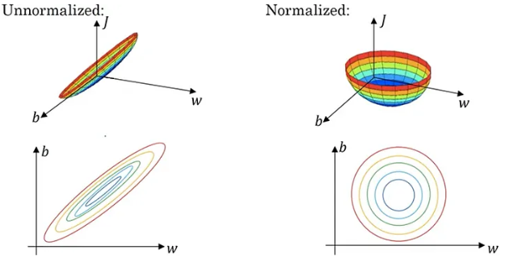
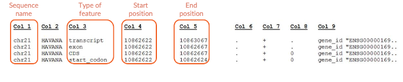
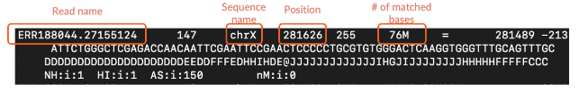
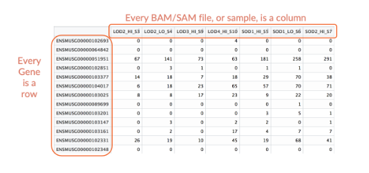
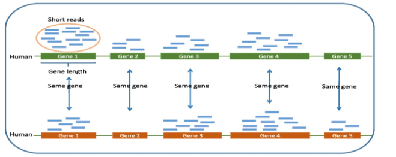
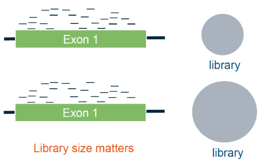
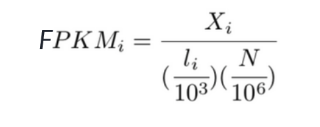
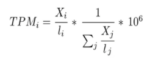
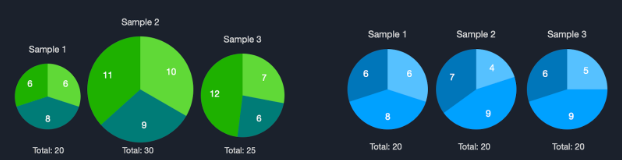
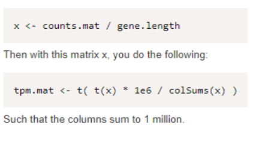

# Normalization of RNA-seq Read Counts

## By Group 1: Longmei Zhang, Jacob Ketchum, and Chris Lingunis

## What is Normalization?

* Normalization by definition is the process of fitting data points to a distribution such that they can be easily compared without losing too much information from the original data.
    * Any data set can be trivially compared if we reduce the data points to not have any information from the original data. For example, we could just set all the data points in data set A to 0 and all the data points in data set B to 1 and compare the data points by simply saying all data points in data set A are not in B and vice versa.
    * However, this is not a meaningful comparison and since we already know are samples have separate data points. It is especially not useful for RNA-seq data because we would typically like to compare our samples in RNA-seq for differentially expressed genes and gene expression patterns. This means comparing the similarities of expression values across all genes for our samples. We cannot remove this information from our comparison.

* Normalization is not a technique unique to bioinformatics. It is used almost everywhere in science and statistics. It is used to fit countless types of data to known or expected distributions. The steps for normalization depend on the original data and the distribution we are trying to fit to.

* Below is an example image of visualized normalization:

The figure on the left represents our original data and the figure on the right represents our normalized data. As you can see, the normalization still retains the overall gradient and pattern present in the original data while making are points less skewed and compressed, making it easier to compare to future samples.

* For our purposes, we are looking to normalize our RNA-seq data to fit the distribution of gene expression for each gene across all our samples. 

* Before we dive into the normalization, let’s first go over what our RNA-seq data looks like at the point of normalization and what our pipeline produces.

## Output from Feature Counts —Counts Matrix

* Normalization plays a crucial role in the quantification of gene expression within the RNA sequencing pipeline. Throughout the expression quantification process, various programs like HTSeq, Cufflinks, Feature Counts, and others are utilized to quantify the number of reads mapped to each gene. The common inputs of expression quantification programs include gene transfer format files, or GTF files, and sequence alignment map/ binary alignment map, or SAM/BAM files. The GTF file contains information about the structure of a specific gene, documenting the genomic coordinates of key features. SAM/BAM files are the outputs from the previous reads mapping process, and they store the alignments of reads to the referenced genome. 

    * GTF files typically consist of 9 columns of information, with each line representing a distinct genomic feature. Column 1 is the chromosome name; column 3 is the name of the features, such as exon, start codon, transcript, ect; column 4 and 5 are the start position and end position of the feature, which provides the specific coordinate of the feature on the gene. In terms of RNA-sequencing, our primary focus is the information regarding exons since we aim to investigate the expression level of genes. 

    

    * SAM file is a human readable file that ideally contains the read ID, the sequence, the coordinate at genome (if identified), the position, and the quality of the alignment for every read. BAM file is the binary equivalent of SAM file, and it stores information in a more compressed binary format. 

    

* The primary output of Feature Counts is the unnormalized raw counts in the form of a gene expression matrix. 

    * Every BAM/SAM file, or sample, is a column. Gene is the index. Every row is a different gene. Every value is the raw count that matches the gene.
    * This count matrix is then ready to be normalized.
    

## Why Normalize Our Count Matrix? What is the Significance?

* Now that we have our raw counts matrix, why should we normalize it? After all, raw counts are considered by many to be a valid metric of gene expression. 

* Remember, we are trying to make our samples representative of the level of gene expression in the cells as well as make our samples comparable.

* If we do not normalize our matrix, we essentially claim that raw counts directly represent the distribution of gene expression for each gene across all our samples.

* Some bioinformaticians would argue that this claim is true and would proceed with downstream analyses using the raw counts matrix. However, let’s examine some factors that would cause our raw counts to not accurately represent the levels of gene expression.

* Recall that the gene expression distribution is typically modeled by the number of mRNA transcripts present for equal mRNA transcript sampling size.
* **Factor 1: Gene Length**
    * Gene length can have a strong effect on inflating raw counts. This effect is especially strong for genes of longer length.
    * Let us examine the figure below to see why:

    

    Figure 1: Multiple Sample Example of More Reads for Longer Genes from: *A statistical normalization method and differential expression analysis for RNA-seq data between different species - BMC Bioinformatics*

    * Let us say that Gene 2 is 1 kb long and Gene 4 is 2.5 kb long. Let us also say that each blue read in the figure represents 1 read or read pair. Let us examine the top-row sample for our discussion.

    * Our raw counts would report that 10 reads map to Gene 4 and 4 reads map to Gene 2. If we were to use raw counts to measure gene expression we would say that Gene 4 is expressed at a level 2.5 times higher than Gene 2 (10/4).

    * Is this accurate? Well if we recall that Gene 4 is 2.5 kb long and Gene 2 is 1 kb long, we expect a much longer mRNA transcript for Gene 4. Let’s say for the sake of simplicity that the transcripts for Gene 2 and Gene 4 have lengths equivalent to the gene size. This means that although we have 2.5 times more reads for Gene 4, we also have a 2.5 times longer mRNA transcript.

    * When we go to fragment the 2.5 times longer mRNA transcript, it will fragment into about 2.5 times more mRNA fragments than Gene 2 and thus about 2.5 times more cDNA fragments and about 2.5 times more reads than Gene 2.

    * This means that 2.5 reads will map to a single mRNA transcript in Gene 4 for every read that maps to a single mRNA transcript in Gene 2.
    
    * Thus, we have that even though the raw read counts for Gene 4 are 2.5 times higher than that for Gene 2, the number of mRNA transcripts the reads map back to are the same. Thus, the real gene expression level of the two genes is about the same.

    * In general, longer genes yield longer mRNA transcripts which yield more cDNA fragments when sequencing and thus more reads for the same level of gene expression. 

    * Our normalization will have to account for this so that our gene expression levels can be compared with genes of different lengths

* **Factor 2: Sequencing Library Size**
    * First, what are sequencing libraries?
        * Sequencing libraries are simply the collection of all reads sequenced for each sample
    * Why might our sequencing library sizes differ?
        * There are many reasons for this but a few common ones are as follows:
            * Our cell cultures/samples had different numbers of cells
            * mRNA extraction and filtration was not identical among all samples
            * Plain data noise
        * More reasons than this exist, but these are just a few to show that they are likely to differ.

    * Sequencing library size has a strong effect on inflating raw counts for all genes as library size increases.

    * This is due to the fact that if library size increases, this means we have sequenced more reads and thus more total cDNA and mRNA in total for our sample. 
    
    * If we have sequenced more mRNA in total, especially by a large amount, we should expect that we get more reads all across the board since we simply have a larger sample size for the gene expression (mRNA transcripts) for the same sample.

    * Let us examine the figure below to visualize this:
    

        Figure 2: Example of Same Read Count for Different Library Sizes
    * In the figure above, let us say for simplicity that Exon 1 represents the total region reads can map back to in Gene 1. Let us say for simplicity that the library for the second row is twice the size of the library in the first row. 

    * The figure shows us that we have identical raw counts between the two rows. If we were to use raw counts alone to measure the level of gene expression, we would have that the two rows have equal gene expression of Gene 1.

    * Is this accurate? Well, we have that the sequencing library of row 2 is twice the size of that for row 1. We should then expect that for every mRNA transcript fragmented and sequenced in row 1, there are 2 mRNA transcripts fragmented and sequenced in row 2. Thus, we expect that if Gene 1 has about equal levels of expression in both rows, the 2 mRNA transcripts in row 2 corresponding to the 1 transcript in row 1 fragments into about twice as many reads. But we do not observe twice as many reads in row 2. This is a contradiction. In actuality, the second row has half the gene expression of row 1 because we expected twice as many reads with double library size.

    * Our normalization must account for sequencing library size so we can compare gene expression levels across samples of different library sizes.

## Normalization Metrics for RNA-Sequencing

1. **RPKM**

    RPKM, or Reads per Kilobase of Transcript per Million Mapped Reads, is a popular normalization metric used in single-read sequencing. Using RPKM, we are able to normalize for both gene length and library size. The equation for RPKM is given below:
    

    RPKMi : the RPKM value for a given gene region i in our data.

    Xi  :  number of reads mapping to a gene region i 

    li : length of gene region i in base pairs

    N : total number of mapped reads across all gene regions

    Notice how we normalize for gene length and library size by dividing our number of mapped reads Xi by the gene’s length li in kilo bp (divided by 10^3), and by the library size N in millions of reads. 

2. **FPKM**

    FPKM, or Fragments per Kilobase of Transcript per Million Mapped Reads, utilizes a similar equation to RPKM, except for one major difference: FPKM counts over the fragments in the data, not the reads, as seen in RPKM. When using single-read sequencing, in which one DNA fragment has one read mapped to it, the results for RPKM and FPKM will be the same. However, when using paired read sequencing, in which each fragment has two reads mapped to it, FPKM is preferable since there will not be an artificial overcount in regards to the number of reads. So, FPKM is used when performing paired-read sequencing. The equation for FPKM is given below:

    

    FPKMi : the FPKM value for a given gene region i in our data. 

    Xi  :  number of read pairs mapping to a gene region i 

    li : length of gene region i in base pairs

    N : total number of mapped reads across all gene regions 

    As with RPKM, we normalize for gene length and library size by dividing our number of read pairs Xi by li in kilo base pairs and N in millions of reads.

3. **TPM**

    TPM, or Transcripts per Million, uses a distinct formula to RPKM/FPKM. This is due to the fact that TPM calculates the relative abundance of a given gene region i in relation to the other gene regions in the sample. The TPM values for all gene regions in a sample will always sum to the same value as any other sample, facilitating comparison of each gene region’s abundance relative to other regions. The formula for TPM is given below: 

    

    TPMi : the TPM value for a given gene region i in our data.

    Xi  :  number of reads mapping to a gene region i

    li : length of gene region i in base pairs

    Xj  :  number of reads mapping to a gene region j

    lj : length of gene region j in base pairs
    
    When using the formula for TPM, a normalized read count is first calculated for a gene region i by evaluating Xi / li . Once we have this normalized read count, we divide it by the sum of the normalized read count summed over all gene regions in our sample. Since our summation term will sum together the Xj  values for all gene regions, the value in the numerator, Xj , after summation, will be proportional to our total library size. By dividing our normalized read count Xi / li by this summation which we now know is proportional to our total library size N, we can normalize for gene length. Normalization for gene length is clearly done by dividing each read count value by the length of the corresponding gene region. 

    ## RPKM vs. TPM

    * For RPKM/FPKM, each sample has a different total RPKM/FPKM size (the sum of each column is different). It is difficult to compare the expression level of two genes in two samples when the total RPKM size is different since we have to consider the expression of those genes relative to the total RPKM size of their sample. 

    * On the other hand, for TPM, each sample has the same total size. During the calculation for TPM, the number of counts matched to each gene is divided by the sum of the normalized number of counts across all genes, making the total TPM for every sample the same. In this case, TPM condensed the information from RPKM since it incorporated the normalization of library size and gene length, and we can also compare the expression level of genes between two samples. 

        * The counts in each sample are represented in a pie diagram. Each slice of pie represents the counts in a specific gene. The pies on the left model the result of RPKM/FPKM normalization, and the pies on the right represent the result of TPM normalization.
        

        * It is difficult to compare the size of slices when the total pie sizes are different. 

## Normalizing Raw Counts in the Pipeline 

* By this point, it should be evident that for most cases, we will want to use TPM for our analyses if not a stronger normalization.

* It should also be evident that if we want to normalize the whole count matrix, manually calculating all the normalized metrics by hand will be extremely inefficient.

* We want to use more automated or streamlined tools/methods to perform our normalization in our pipeline.

* 3 main methods have emerged for this:
    1. Normalizing Count Matrix Directly in R

        * We can automate the manual calculation of TPM for each of our count matrix cells using some fairly simple R code.

        * There are many ways to do this and many programmers have their own preferred method of formatting their code for a task like this.

        * Below is an example of the format the code could have in R (written by Michael Love of Bioconductor Staff):
        

        * The field gene.length can be easily found from the .gtf file used earlier in the pipeline. Just take the genome coordinates and find the absolute value of the difference for each gene.

    2. Abundance Quantification Tools

        * There exist many abundance quantification tools that are designed to take in a count matrix just like we have in our RNA-seq pipeline and output a normalized matrix as well as histograms modeling the normalized data.

        * We could simply use one of these tools on our count matrix.

        * A few examples of tools such as these are Salmon, Sailfish, and kallisto.

        * Below are links to the official websites for each of these tools
            * Salmon: [https://combine-lab.github.io/salmon/](https://combine-lab.github.io/salmon/)
            * Sailfish: [https://www.cs.cmu.edu/~ckingsf/software/sailfish/](https://www.cs.cmu.edu/~ckingsf/software/sailfish/)
            * kallisto: [https://pachterlab.github.io/kallisto/about](https://pachterlab.github.io/kallisto/about)
    3. Automatic Normalization via Other Pipeline Tools

        * This is by far the most popular method of normalizing count matrices in RNA-seq analyses. After all, why normalize the matrix yourself if another tool is just going to automatically do it for you later? Of course, this requires that your pipeline uses tools that perform this automatic normalization. However, this is fairly common.

        * The biggest example of a tool that automatically normalizes the count matrix of RNA-seq data is DESeq2. DESeq2 takes in an RNA-seq count matrix and outputs differentially expressed genes.

        * However, before calculating the differentially expressed genes, it performs its own normalization of the count matrix. This normalization does not use the metrics we have discussed prior but still does normalize for gene length and library size.

        * The full process of performing this normalization is quite lengthy but in short, it involves using a median of ratios size inference method in combination with generating its own negative binomial approximation of the count matrix data to calculate the normalized values. 

            * The full documentation of this process and DESeq2 can be found on this website: [https://bioconductor.org/packages/devel/bioc/vignettes/DESeq2/inst/doc/DESeq2.html](https://bioconductor.org/packages/devel/bioc/vignettes/DESeq2/inst/doc/DESeq2.html)

        * This is the most popular tool that performs this automatic normalization but other tools perform their own normalization as well.

---

### Now you should know the what, why, where, when, and how of normalizing your RNA-seq data!

---
## References

Anders, S., Love, M. I., & Huber, W. (2023, November 14). Analyzing RNA-seq data with deseq2. https://bioconductor.org/packages/devel/bioc/vignettes/DESeq2/inst/doc/DESeq2.html 

Freeman, B., Piper, M., Mistry, M., & Khetani, R. (2017, August 22). *RNA-Seq workflow*. Introduction to RNA-Seq Using High Performance Computing (Orchestra) - ARCHIVED. https://hbctraining.github.io/Intro-to-rnaseq-hpc-orchestra/lessons/07_rnaseq_workflow.html

*GFF/GTF File Format*. (2023, July 1). Useast.ensembl.org; Ensembl. https://useast.ensembl.org/info/website/upload/gff.html

*GTF File Example*. (2023). Wikimedia.org; Wikimedia. https://upload.wikimedia.org/wikipedia/commons/2/22/GTF_file_example.jpg

Kumar, Adith Narasimhan. “Mean Normalization and Feature Scaling - a Simple Explanation.” *Medium*, Analytics Vidhya, 11 Feb. 2021, https://medium.com/analytics-vidhya/mean-normalization-and-feature-scaling-a-simple-explanation-3b9be7bfd3e8 .

Love, Michael. *DESeq2: Is it possible to convert read counts to expression values via TPM and return these values?* (n.d.). https://support.bioconductor.org/p/91218/#91256 

RNA-Seq Blog. (2015, July 22). *RPKM, FPKM and TPM, clearly explained*. Rna-Seqblog.com. https://www.rna-seqblog.com/rpkm-fpkm-and-tpm-clearly-explained/

Zhou, Y., Zhu, J., Tong, T., Wang, J., Lin, B., & Zhang, J. (2019, March 29). *A statistical normalization method and differential expression analysis for RNA-seq data between different species - BMC Bioinformatics*. BioMed Central. https://bmcbioinformatics.biomedcentral.com/articles/10.1186/s12859-019-2745-1  

