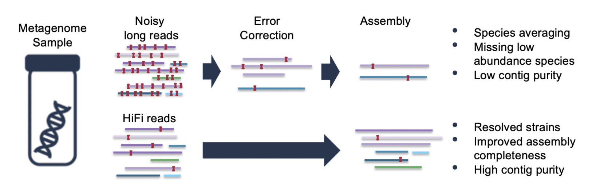
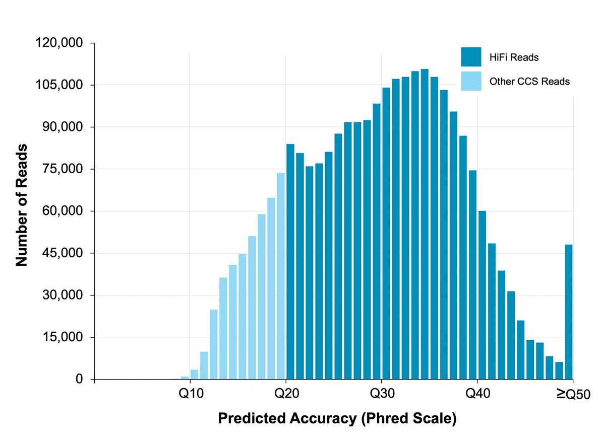
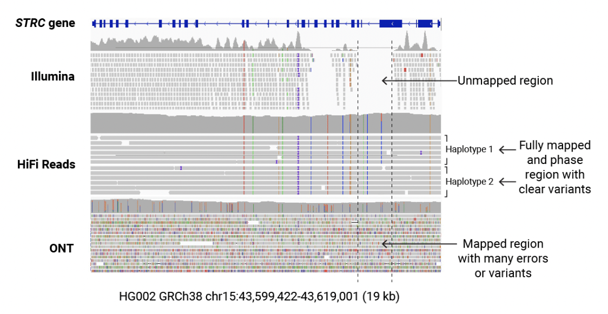
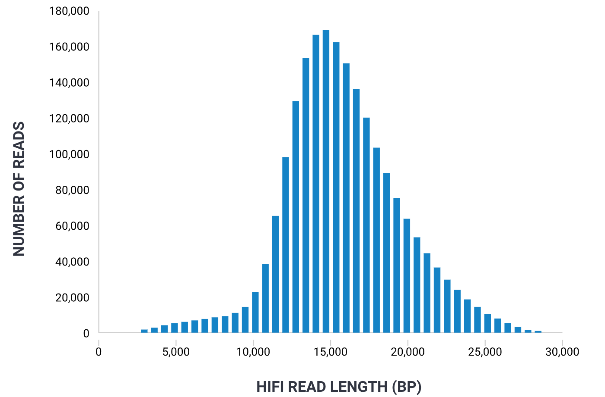

# PacBio Sequencing

## Background - What is PacBio Sequencing?
PacBio sequencing is the technology developed by the company Pacific Biosciences known as SMRT, which stands for Single Molecule Real Time. SMRT sequencing is a method of determining the nucleotide sequences of DNA and RNA molecules and outputting the detected strings of bases as “reads.” Other technologies that perform the same task include Sanger sequencing and Illumina sequencing. What differentiates SMRT sequencing from the aforementioned methods, however, is that SMRT is considered part of the class of third generation sequencing technologies. These technologies are known for being able to produce long and accurate reads. Sequencing methods are utilized to solve a multitude of biological tasks as well as to make new discoveries. The capabilities of PacBio sequencing in particular are applicable to various biological subfields, and its advantages over other sequencing technologies have allowed for the optimization and advancement of several biological problems. 

## How PacBio Sequencing Works
The PacBio SMRT sequencing pipeline involves several steps. The first step is to isolate DNA or RNA molecules from a sample of interest (PacBio). The sample can come from a wide range of organisms including plants, viruses, and vertebrates, as PacBio sequencing is applicable to DNA and RNA regardless of the source. The next step is to ligate special adapters to each end of the DNA creating a library of circular molecules (PacBio). Then, primers and DNA polymerase are added to the library and the library is loaded into PacBio’s SMRT cells.

After the SMRT cells are placed in the sequencer, the rest of the pipeline and sequencing reactions are automated. Each SMRT cell consists of millions of nanoscopic wells called Zero Mode Waveguides (ZMWs) which are about 100 nanometers in diameter (Browne). Each waveguide well can immobilize one molecule of DNA by binding the adapter to a molecule of DNA polymerase that becomes anchored to the bottom of each well (Browne). Below each of the ZMWs is a laser, which illuminates the bottom of the well. Importantly, the wavelength of these lasers is greater than the diameter of the ZMWs, which means only the very bottom of the well is illuminated (Browne). The nucleotides that are available in the SMRT cell for incorporation by DNA polymerase are fluorescently labeled and generate unique emission signals (Rhoads). Upon being incorporated in the replicate strand by DNA polymerase at the bottom of the well, the laser excites the label on the nucleotide and a fluorescent pulse is emitted. Critically, the label is bound to the phosphate group of the nucleotide; since the phosphate chain is cleaved during the synthesis of DNA, the fluorescent pulse dissipates after incorporation (Rhoads). The sequencing machine detects the sequence of these pulses as the string of bases representing the template strand.

As with most nucleotide incorporation detection technologies, SMRT sequencing is susceptible to including errors when detecting the fluorescent pulses that are created by the DNA synthesis reaction. However, PacBio has a system for circumventing these errors and maintaining the high accuracy levels that have come to define the HiFi reads their technology produces. Because SMRT sequencing utilizes a circular template DNA molecule, DNA polymerase can replicate the same template multiple times by cycling through the circular molecule continuously. This creates multiple subreads of the same template strand, with each subread connected by the adapter sequences that were ligated to the DNA at the beginning of the pipeline. A final consensus sequence is taken by aligning the subreads and taking the consensus (or most prevalent nucleotide at each position). This method is called Circular Consensus Sequencing (CCS). 

## Applications of PacBio Sequencing 

Whole Genome Sequencing: The Hi-Fi read accuracy is 99.9%, meaning that it can be used for a variety of applications in the field. Since PacBio sequencing uses long-read technology that can sequence the entirety of a genome, it allows for the assembly of whole complex genomes. It can resolve complex genomic regions, reduce error in highly repetitive regions, and allow for more contiguous assembly of genomes. It can also allow de novo sequencing due to these abilities. 

On average, the PacBio HiFi reads have a much higher predicted accuracy than other CCS reads. 

RNA Sequencing: Additionally, the long-read technology allows for the direct sequencing of the entirety of RNA molecules, which allows us to detect alternative splicing patterns in the molecule, directly identify different protein isoforms, and better display gene expression quantification. Since it can count the number of reads that correspond to isoforms, we can quantify the expression of each isoform and better understand gene expression and regulation. This allows us to gain better insight into the complexity of transcriptomes. 

Targeted Sequencing: Additionally, it can provide more complete and accurate representations of targeting regions due to its single molecule resolution, which is very important for identifying variants in disease-associated genes. The long reads allow for the validation of variants that targeting sequencing can identify. The accuracy can be determined by examining the reads that contain the variant positions. 

Variant Detection: Since PacBio sequencing can cover entire genomic regions, it is very effective in detecting genetic variants like SNPs (single nucleotide polymorphisms), insertions, deletions, and structural variations. Additionally, the CCS technology increases the accuracy of base calling, which allows for more reliability in identifying SNPs. It can identify insertions and deletions even in complex or repetitive regions where short-read sequencing would struggle. It can identify even large structural variants due to its spanning of repetitive sequences, allowing for accurate identification. 

HiFi reads can accurately map the entirety of the region to identify variants with its high accuracy and long reads. It can call single nucleotide variants and improve the mappability of the genome. 

Identification of Complex Populations: Since we are able to resolve complex genomic structures with long-read sequencing, we can identify the full diversity in a population, a valuable addition to metagenomic studies. In metagenomic studies, the genetic material may come from a variety of organisms with several different genomic structures and the long reads allow for better accuracy in representing genetic content. It can more accurately create genome assemblies and identify species and strains in a population. This way, we are able to contribute to metagenomic studies by showing us the full genetic diversity in a population, even low abundance species. 

Epigenetics: Pacbio can directly determine the modified bases in individual DNA molecules due to its single-base resolution technology, which is useful in the field of epigenetics by providing insight into gene regulation and development.

## Advantages of PacBio Sequencing 

Long Reads: PacBio reads can span fifteen thousand base pairs, The long reads could span entire genomic elements, such as introns and intergenic regions, enabling researchers to tackle challenges posed by repetitive sequences and structural variations. including insertions, deletions, and inversions, contributing to a more complete and accurate assembly. This has significant implications for understanding genetic diseases linked to structural variations.

Coverage Uniformity: PacBio sequencing utilizes SMRT technology, which involves sequencing individual DNA molecules in real-time. This approach differs from other sequencing methods, like Illumina sequencing, which often rely on PCR (Polymerase Chain Reaction) amplification. PCR amplification can introduce bias, particularly in GC-rich or GC-poor regions, because certain sequences may be more or less likely to amplify efficiently. SMRT sequencing bypasses the need for PCR, thus reducing this source of bias and producing a uniform coverage.

Epigenetics: The real-time monitoring of Pacbio sequencing enables the direct detection of base modifications,  expanding our understanding of epigenetic regulation. It can uncover patterns of DNA methylation and hydroxymethylation without the need for bisulfite treatment, preserving the native DNA sequence and allowing for a more accurate correlation between epigenetic modifications and gene expression.

Single Molecule Resolution: At single molecule resolution, PacBio sequencing can reveal the heterogeneity within a population of cells, capturing rare genomic events that might be missed by bulk sequencing. This level of detail provides insights into the dynamics of the genome and the variability of genomic elements, which is essential for personalized medicine and the study of genetic diversity within populations.

## Disadvantages of PacBio Sequencing 

High Cost: One of the most significant drawbacks of PacBio sequencing is the high cost. The expense is due to the sophisticated equipment and reagents required for the Single Molecule, Real-Time (SMRT) technology that PacBio employs. The cost may make this technique suboptimal for many research groups, especially when large-scale sequencing projects are considered, making it less accessible compared to more cost-effective platforms.

Low Throughput: PacBio systems have a lower throughput compared to some other sequencing technologies. They generate less data per unit of time, which can be a limiting factor for large-scale genomic studies that require the sequencing of many genomes or large amounts of DNA in a short period.

Computational Demand: The analysis of long reads from PacBio sequencing is computationally intensive. It requires powerful computing resources and specialized bioinformatics tools to assemble these reads accurately. The long-read nature of the data also means that more storage is required, and the data processing time is longer, which can slow down the research process and increase costs.

Error Rate: PacBio sequencing has been associated with higher raw error rates with its long reads, particularly in the form of insertions and deletions, compared to short-read sequencing technologies. Although advances in PacBio's technology and the use of circular consensus sequencing have significantly improved accuracy, error correction still requires additional computational efforts.

## Current Tools
The latest sequencer released by PacBio that is capable of performing SMRT sequencing is called Revio. PacBio boasts that Revio is capable of producing a fifteen fold larger HiFi read throughput than their previous system, Sequel IIe. This is due to the fact that Revio’s SMRT cells have 25 million Zero Mode Waveguides and the machine can run up to four SMRT cells in parallel (PacBio). Revio also has a shorter run time than previous systems. Another innovation included in the new Revio machines is the Google Health DeepConsensus suite of algorithms (PacBio). These algorithms allow for improved read accuracy as well as more accurate methylation calling. Additionally, the software has optimized file storage compared to older formats through techniques such as smart read ordering (PacBio). 

In 2023, Revio was awarded as Best Overall Genomics Solution by the publication MedTech (MedTech). This is because the Revio system is not only capable of sequencing, but also at detecting a slew of variants accurately and quickly. The Revio software is able to detect single nucleotide variants, indels, structural variants, 5mC methylation, and haplotype phasing all from a single sequencing run (PacBio). These capabilities position PacBio and Revio at the forefront of innovation, discovery, and improvement in the fields of genomics. 

## Works Cited
Browne, Dan. “PacBio Data Deep Dive: A Closer Look at HiFi Sequencing.” YouTube, uploaded 
by PacBio, 24 May, 2021. https://youtu.be/1aqnLQ-nwYk?si=O8pcYehL8x-t3HOY.

MedTech. “MedTech Breakthrough - 2023 Winners.” MedTech Breakthrough, 12 May, 2023. 
https://medtechbreakthrough.com/2023-winners/. 

PacBio. “PacBio Sequencing - How it Works.” YouTube, uploaded by PacBio, 4 Feb. 2020, 
https://youtu.be/_lD8JyAbwEo?si=IFFOVkk3z6obZ7Ss.

PacBio. “Revio System - Reveal more with accurate long-read sequencing at scale.” PacBio, 25 
Oct. 2022, https://www.pacb.com/revio/. 

PacBio. “The Hifi Sequencing Advantage for Metagenome Assembly.” PacBio, 21 Oct. 2020,
	www.pacb.com/microbial-sequencing-methods/hifi-for-metagenome-assembly/.
 
Rhoads, Anthon; Au, Kin Fai, PacBio Sequencing and Its Applications. Genomics, Proteomics & 
Bioinformatics, Volume 13, Issue 5, 2015, Pages 278-289, ISSN 1672-0229, https://doi.org/10.1016/j.gpb.2015.08.002. 

Wenger, Aaron M., et al. "Accurate circular consensus long-read sequencing improves variant
 	detection and assembly of a human genome." Nature Biotechnology, vol. 37, no. 10, Oct. 
2019, pp. 1155+. Gale Business: Insights, 
link.gale.com/apps/doc/A601579018/GBIB?u=ucsandiego&sid=bookmark-GBIB&xid=38364eb. Accessed 10 Dec. 2023. 
