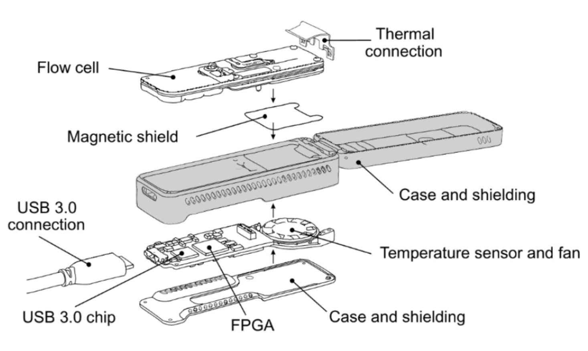
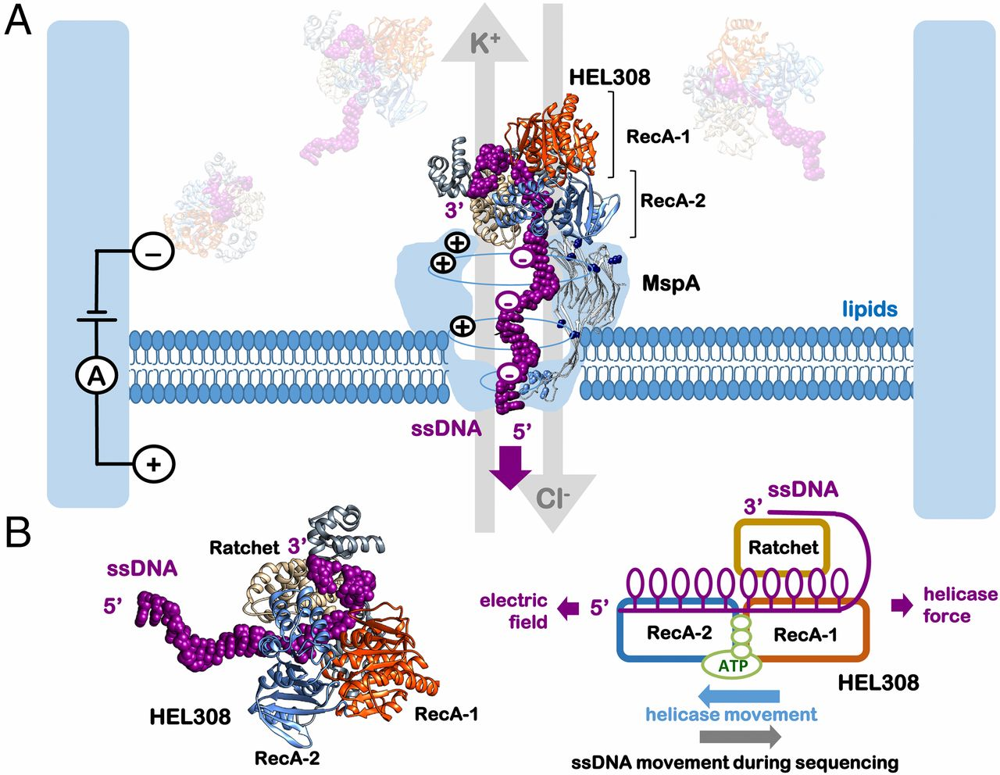
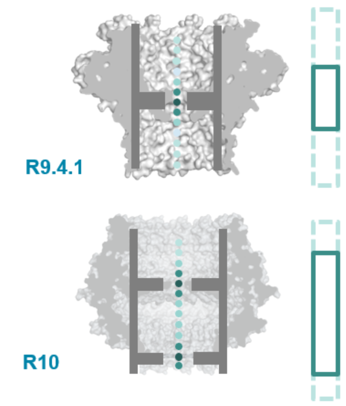
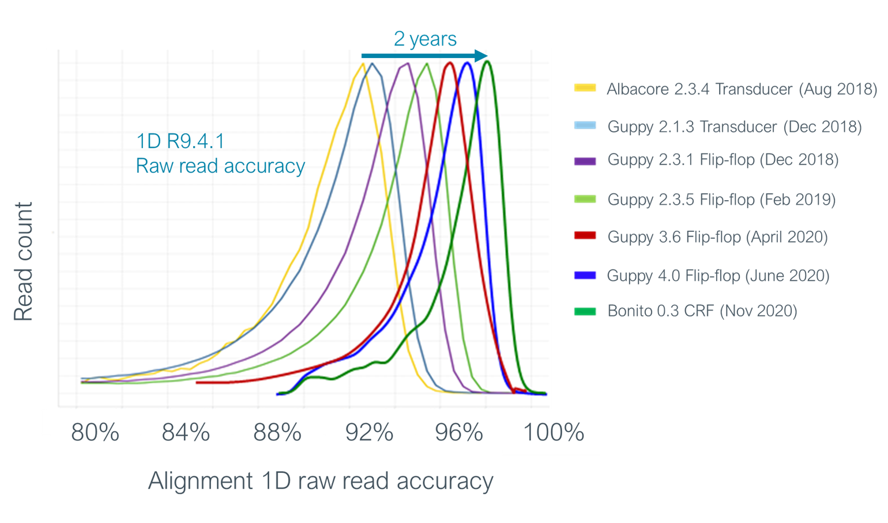
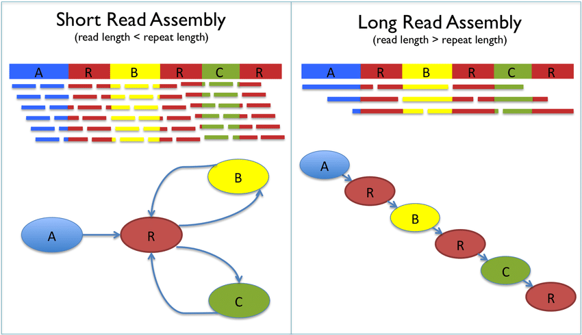
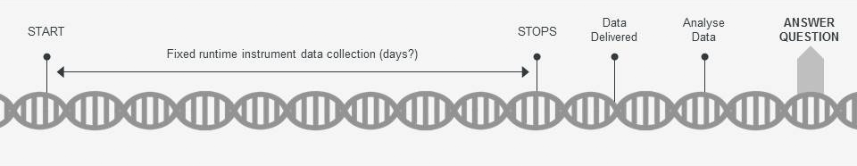
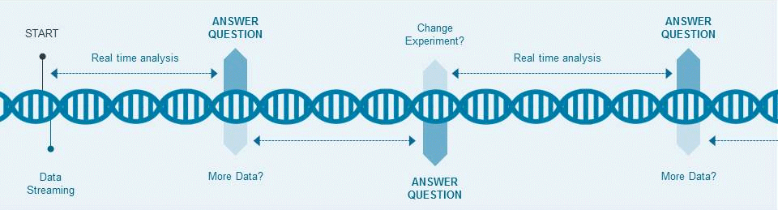
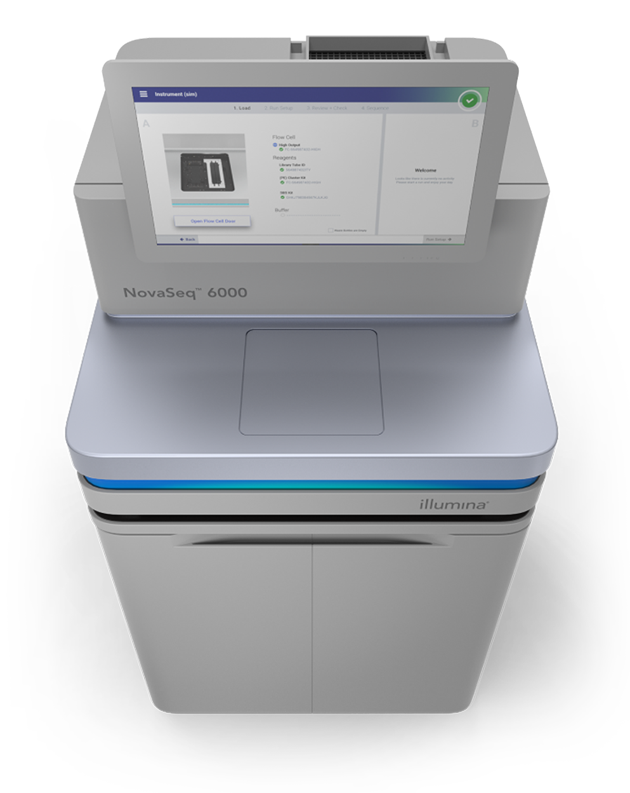
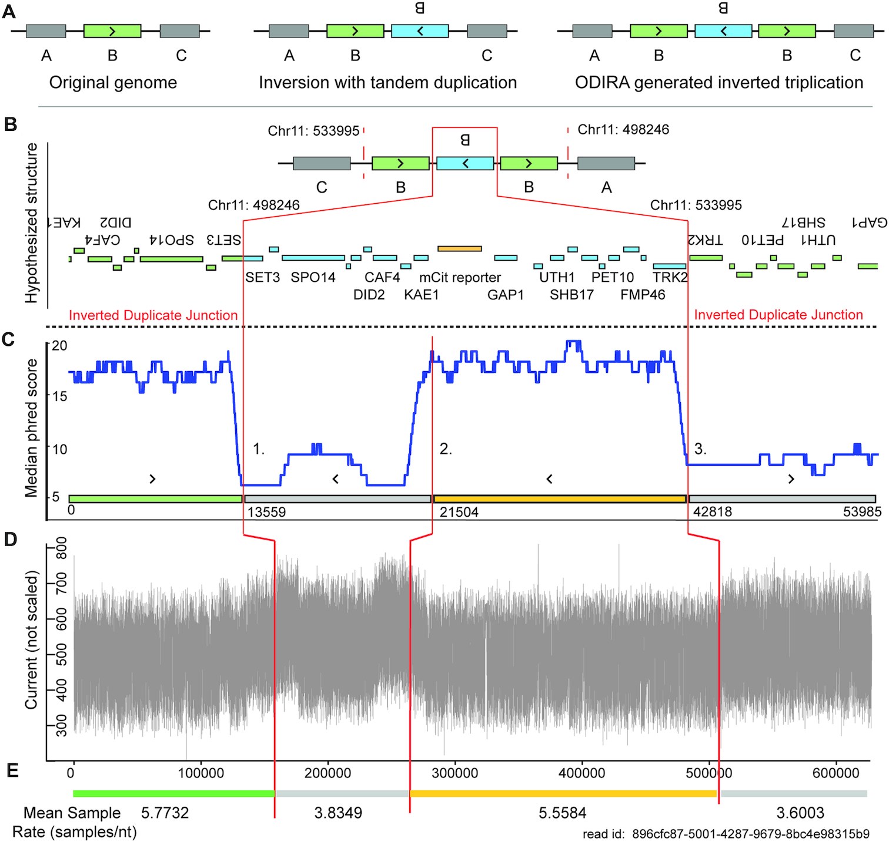
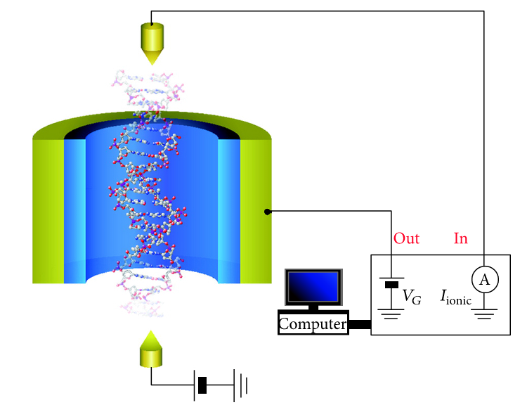

# Nanopore sequencing
##### Group 22: Rohan Vanheusden, Edward Tang, Coby Lin

## Overview

Nanopore sequencing is a third generation sequencing technology that has expanded the capabilities of bioinformatics research. As opposed to methods based on fluorescent imaging, nanopore sequencing measures electrical signals to produce ultra-long reads at lower costs. The first commercially-available nanopore sequencing device was released by Oxford Nanopore Technologies (ONT) in 2014.[^Wang2021] ONT products have improved the accessibility of the field by reducing size and power requirements, all while maintaining high-throughput performance.

## How it works

### Sequencing devices

The ONT sequencing platforms come in various sizes, but the principles behind sequencing are the same. Pictured below is the first-released and currently second-smallest platform, the MinION.

Diagram of primary MinION device components and flow cell.[^Branton2019]

For our purposes, the most interesting component is the flow cell, which contains an array of hundreds (in the case of the MinION) to thousands of microscaffolds[^ONT_flowcells], each of which houses a membrane and nanopore. Flow cells are the only non-reusable component of the MinION, as the nanopores and membranes within degrade over time and become obstructed with fragments from previously run libraries. However, through the use of wash kits, flow cells can be reused up to five times.[^ONT_faq]

### Raw data generation

(A) Fundamental components of nanopore sequencing, including the nucleic acid of interest, motor protein, nanopore, membrane, voltage source, and ammeter. (B) Rendering of motor protein domains and mechanical diagram of nucleic acid movement.[^Caldwell2017]

In order to sequence a DNA or RNA molecule of interest, the first step is to perform library prep, wherein adapter sequences and motor proteins are ligated to the ends of the molecule.[^Wang2021] Membrane-bound tethers help guide DNA or RNA strands tagged with the adapter sequence to a nanopore. Once the motor protein binds to the nanopore, sequencing can begin. In order to translocate single-stranded DNA or RNA across the membrane, a voltage is applied. Because the membrane is electrically resistive, the generated ionic current is forced to flow through the nanopore. The negatively charged nucleic acid is thus made to move from the negatively charged _cis_ side of the membrane to the positively charged _trans_ side by the induced ionic current.[^Wang2021]

However, the translocation speed due to voltage alone is too fast to produce accurate reads. The use of motor proteins, a major breakthrough in nanopore sequencing technology, solves this problem. Powered by ATP, the motor protein both unwinds the double-stranded DNA or RNA molecule and attempts to drive it in the opposite direction (_trans_ to _cis_), reducing the rate of translocation and making the molecule's movement through the nanopore more consistent.[^Caldwell2017]

To actually obtain data that can be used for base calling, an ammeter measures current many times per second. As ssDNA or ssRNA is driven through the nanopore, the procession of different nucleotide bases cause characteristic fluctuations in the current as a result of base-specific electrostatic interactions[^Wang2021]. To impart further specificity, the nanopore is designed to include one or more "pinch-points" where the ionic current is constricted.[^ONT_faq] This design makes ion flow primarily contingent upon the identity of the nucleotides (a _k_-mer) immediately proximal to these pinch-points[^Wang2021], simplifying base calling.

Comparison between two revisions of ONT nanopore designs, highlighting the inclusion of an additional pinch-point.[^ONT_newnanopore]

### Base calling

After raw current data is generated by the sequencing device, software called a base caller is used to transform this signal into predicted bases.

Overview of recurrent neural network (RNN) base calling algorithms.[^ONT_basecalling]

Currently, the best-performing basecallers developed by ONT are based on neural networks. These neural networks are trained using known sequences and the raw signals generated by sequencing them.[^ONT_basecalling]

Improvements to ONT base calling accuracy over time.[^ONT_basecalling]

Like other sequencing methods, the raw data generated during sequencing can be saved and then re-used. As shown in the above figure, the performance of nanopore sequencing basecallers is continually improving. Previously-generated data can be re-run with newer algorithms to produce higher-accuracy reads.

## Advantages compared to other technologies

### Workflow simplification
One of the key advantages of nanopore technology is that it simplifies the sequencing workflow at many levels. Since whole molecules are sequenced in real time, the sample does not need to go through an amplification process.[^ONT_platform] Due to PCR possibly skewing GC content, cutting out this step improves read quality while also reducing labor.

### Longer reads
While individual NGS reads are about 150 base pairs in length, nanopore reads can be orders of magnitude longer, in the range of 10 to 100 kilobases.[^Illumina_novaseq][^ONT_advantages] The longer the read, the fewer places that it can be matched to the genome, meaning that nanopore reads can be assembled with greater speed and accuracy. This makes nanopore particularly effective at detecting subtle variants, characterizing repeat sequences, and constructing genomes de novo. 

Diagram illustrating the advantages of long read assembly.[^Lee2014]

### Improved workflow
Operating a NGS sequencer involves loading up the machine and waiting 2 or 3 days for it to finish running.[^Illumina_platforms] On the other hand, a nanopore sequencer becomes immediately useful after starting a run because it delivers a live readout of sequencing data. As a result, data analysis can begin as soon as the sequencer begins to generate data and can be stopped when the data is sufficient. In addition, the electric signals can be saved and re-analyzed in the future with improved base calling algorithms.

Side-by-side comparison demonstrating the flexibility of the nanopore sequencing workflow.[^ONT_workflow]

### Size and cost
Another advantage of nanopore technology is that it takes up much less physical space. NGS needs hydraulics for nucleotide solutions and a powerful imaging system to detect fluorescence. For the purpose of sequencing a whole genome, the appropriate NGS technology would be the Illumina NovaSeq 6000, which costs about a million dollars.[^Illumina_cost] This is 4 times the cost of the most capable nanopore platform, the PromethION 48. These two options have a comparable cost per gigabase; $20 for the NovaSeq, and $30 for the PromethION.[^ONT_products] In terms of portability, the NovaSeq is only appropriate for the lab environment. It is the size of a washing machine, weighs over a thousand pounds, and has considerable power requirements. On the other hand, nanopore sequencers can be easily carried and deployed in the field.

The P2 integrated, PromethION 48, and P2 solo.[^ONT_products]

The Novaseq 6000.[^Illumina_Novaseq]

## Disadvantages compared to other technologies

Despite its unique characteristics and advantages in comparison to other sequencing technologies, nanopore technology has many disadvantages and limits worth paying attention to in order to better exploit its functions and use it in suitable scenarios. While many of these factors contribute to the technology not being widely adapted into research/studies, many features associated with these constraints have since been improved. Here are some of the constraints we choose to present to get a basic understanding of the limits of this technology:

### Low accuracy for certain genomic features

While nanopore is characterized as a sequencing method with cost benefits and the capability of reading longer DNA fragments, it is also known to have a higher error rate. In particular, it is known that the technology has difficulties in handling certain genomic features. Take **inverted duplicated sequences**, which appear commonly in structural variants (particularly copy number variants). Upon encountering regions with these sequences, nanopore sequencing tends to yield low confidence and high error rate base calls[^Spealman2020].

This is likely correlated with observations of systematically elevated electrical currents, increased translocation rates, and decreased sample rates, when such sequences are generated using nanopore technology[^Spealman2020].

Diagram highlighting properties of a long-read sequence that spans two inverted duplicated junctions, as generated by nanopore sequencing.[^Spealman2020]

In this image[^Spealman2020], \
**A** is the predicted sequence structure derived from aligning *Illumina* sequencing reads to the reference genome.\
**B** showcases the inverted duplicated region, within the two vertical red lines.\
**C** is a median phred quality score graph. It's noticeable that a lower phred score region begins at the left inverted duplicated junction. The low quality region has roughly the same length as the preceding, normal quality score region.\
**D** further shows that there's also a substantial uplift in current generated by nanopore when processing this region and the junctions.\
**E** marks the mean sample rate per nucleotide, noting that the uplifted region with low phred quality scores also have lower sample rates.

### Biological nanopores

Biological nanopores have many advantages, including dimensional reproducibility and low translocation velocity. However, there are several disadvantages worth considering. One of the most well-known ones is their tempermental operating conditions, such as **pH level**, **electrolyte concentration**, and **temperature**. Given these demands, one should consider if nanopore sequencing is appropriate when the sequencing environment deviates from these ideal operating conditions, given that such conditions lead to a reduction in the longevity and reliability of the system[^Liu2016].

Despite these drawbacks, biological nanopores have the significant advantage of being able to substantially reduce translocation velocity (when environmental conditions are favorable). For the other primary kind of nanopore, the solid-state nanopore, controlling translocation velocity is a significant challenge.

### Solid-state nanopores

Currently, solid-state nanopores suffer from having less controllable translocation speeds than biological nanopores. As a result, problems arise when attempting to call bases from the raw current signal. Such problems include **low temporal resolution** of single-base sequencing, as well as **poor spatial resolution** in separating adjacent bases, due to the large channel length.[^Liu2016] That being said, are several proposed solutions, realized or not, to this particular problem, including nanopore size reduction, modulation of internal nanopore surface charges, modification of DNA molecules themselves, and the creation of hybrid biological-solid-state nanopores.[^Liu2016]

Modulation of translocation velocity via gate voltage control.[^Liu2016]

Nonetheless, it is worth noting that these control methods, reasonably, each comes with additional requirements/constraints to examine in application.

#### Mass production difficulties

Compared to biological nanopores, solid-state nanopores are very promising due to their ease of fabrication. Yet, there are still remaining unsolved challenges in solid-state nanopore fabrication. Most strategies in existence or in development to fabricate solid-state nanopores still have many drawbacks, including size limitations, lack of uniformity in construction, and difficulties with mass production.[^Chen2019]

All currently known approaches to fabricating solid-state nanopores have challenges that are yet to be resolved in order to enable efficient manufacturing at scale.[^Chen2019] However, these fabrication techniques are continuously being refined, and we may eventually see solid-state nanopores arise as an economically viable competitor to biological nanopore systems.

### References
[^ONT_basecalling]: Oxford Nanopore Technologies. (2023, April 5). _How basecalling works_. https://nanoporetech.com/how-it-works/basecalling
[^ONT_newnanopore]: Oxford Nanopore Technologies. (2021, June 19). _R10.3: The newest nanopore for high accuracy nanopore sequencing – now available in store_. https://nanoporetech.com/about-us/news/r103-newest-nanopore-high-accuracy-nanopore-sequencing-now-available-store
[^ONT_flowcells]: Oxford Nanopore Technologies. (n.d.). _Nanopore store: Flow cells_. https://store.nanoporetech.com/flow-cells.html
[^ONT_faq]: Oxford Nanopore Technologies. (2021, June 19). _Nanopore sequencing 101 Q&A_. https://nanoporetech.com/events/nanopore-sequencing-101-online-event-qa
[^Caldwell2017]: Caldwell, C. C., & Spies, M. (2017). Helicase SPRNTing through the nanopore. _Proceedings of the National Academy of Sciences_, _114_(45), 11809–11811. https://doi.org/10.1073/pnas.1716866114
[^Branton2019]: Branton, D., & Deamer, D. W. (2019). _Nanopore sequencing: An introduction_. World Scientific.
[^Wang2021]: Wang, Y., Zhao, Y., Bollas, A., Wang, Y., & Au, K. F. (2021). Nanopore sequencing technology, Bioinformatics and Applications. _Nature Biotechnology_, _39_(11), 1348–1365. https://doi.org/10.1038/s41587-021-01108-x
[^Illumina_platforms]: Illumina. (n.d.). _Sequencing Platforms_. https://www.illumina.com/systems/sequencing-platforms.html
[^Illumina_novaseq]: Illumina. (n.d.). _NovaSeq 6000 System Specifications_. https://www.illumina.com/systems/sequencing-platforms/novaseq/specifications.html
[^Illumina_cost]: Illumina. (n.d.). _Illumina reveals new high-throughput instrument, Novaseq X_. https://www.genengnews.com/news/illumina-reveals-new-high-throughput-instrument-novaseq-x/
[^ONT_platform]: Oxford Nanopore Technologies. (n.d.). _Oxford Nanopore Technologies Platform Solutions_. https://nanoporetech.com/platform
[^ONT_products]: Oxford Nanopore Technologies. (n.d.). _Promethion_. https://nanoporetech.com/products/sequence/promethion
[^ONT_workflow]: Oxford Nanopore Technologies. (n.d.). _The nanopore sequencing workflow_. https://nanoporetech.com/how-it-works/nanopore-sequencing-workflow
[^ONT_advantages]: Oxford Nanopore Technologies. (n.d.). _Advantages of nanopore sequencing_. https://nanoporetech.com/how-it-works/advantages-nanopore-sequencing
[^Spealman2020]: Spealman, P., Burrell, J., & Gresham D. (2020). Inverted duplicate DNA sequences increase translocation rates through sequencing nanopores resulting in reduced base calling accuracy. _Nucleic Acids Research_, _48_(9), 4940–4945. https://doi.org/10.1093/nar/gkaa206
[^Liu2016]: Liu, Z., Wang, Y., Deng, T., & Chen, Q. (2016). Solid-state nanopore-based dna sequencing technology. _Journal of Nanomaterials_, 2016(5284786), 1–13. https://doi.org/10.1155/2016/5284786
[^Chen2019]: Chen, Q., & Liu, Z. (2019). Fabrication and applications of solid-state nanopores. _Sensors_, _19_(8), 1886. https://doi.org/10.3390/s19081886
