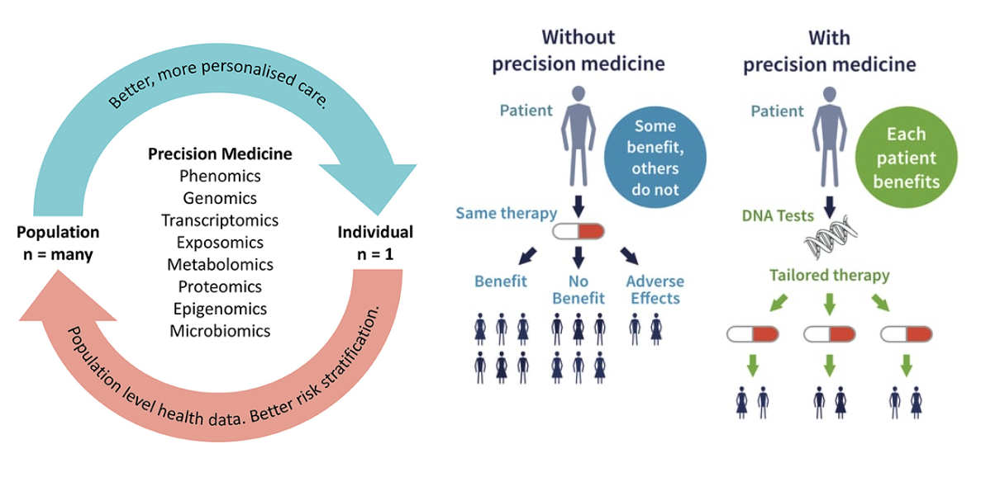
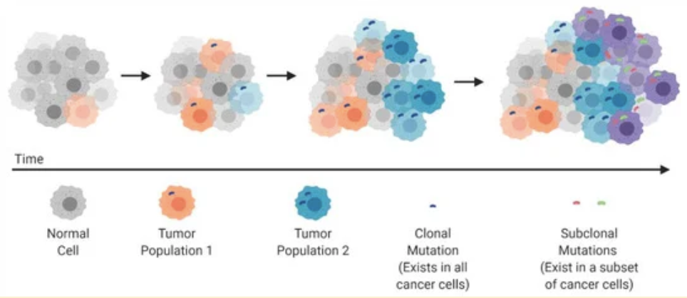
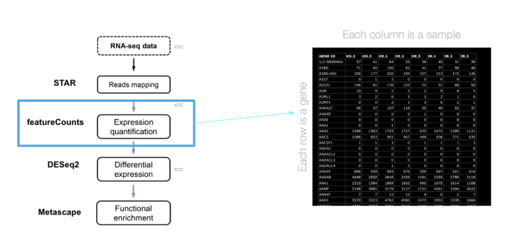
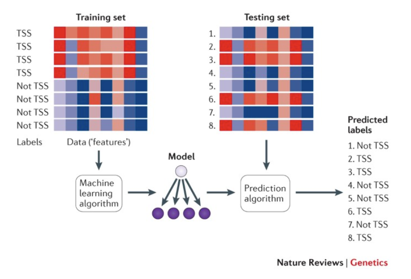
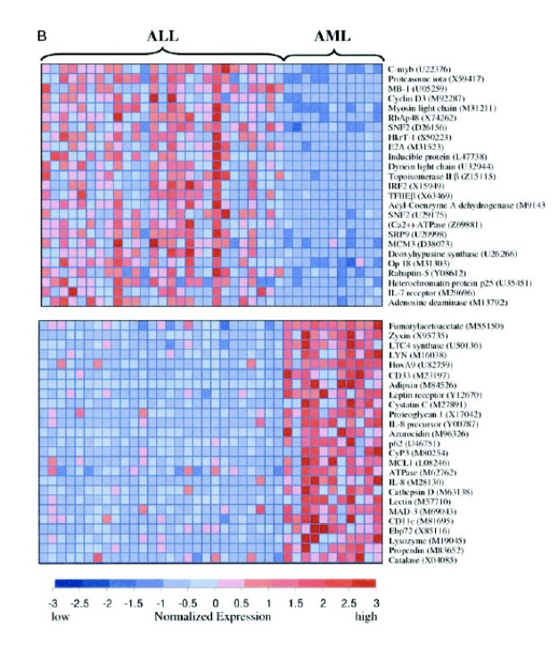
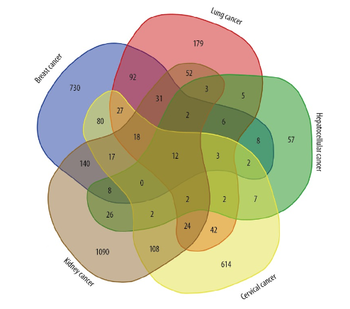
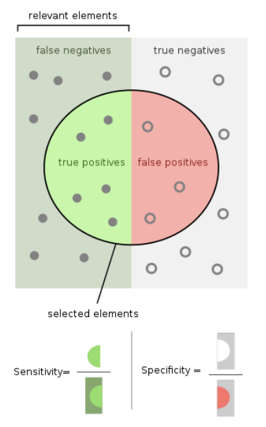

# Differential Gene Expression (DEG) in Precision Medicine

---

## Overview
1. What is Precision Medicine?
2. Background to Cancer + Genes 
3. Gene Expression Data in Precision Medicine
4. Precision Medicine, DEGs, and Cancer 
   1. Machine Learning
   2. Benefits/Examples/Case Studies 
   3. Limitations
5. Conclusions and Future Directions
6. References

---
## 1. What is Precision Medicine?
Precision medicine is the use of biotechnology methods such as genomics and proteomics to identify specific targets for subgroups within a disease population and develop effective therapies to address the novel targets [1]. 

A precision medicine approach has benefits because it allows for more personalized care that allows almost every patient in the disease subgroup to benefit. Over time this can help create cost benefits, improve quality of life, and improve patient outcomes.

  

<b>Figure 1: Precision Medicine Benefits</b> (Adapted From [2] and [3])

## 2. Background to Cancer + Genes

Precision medicine has been especially impactful in treating cancer due its highly heterogeneous nature. Heterogeneity in cancer refers to the existence of different cell populations with distinct genotypes and phenotypes, within a tumor or across different tumor types [4]. 

As seen in the figure below, intra-tumor heterogeneity can develop in a patient through various genetic mutations. As a result, even among patients with the same cancer subtype, treatment response and efficacy may vary. The heterogeneity across cancer subtypes and cancer types is even further amplified, presenting the need for targeted, personalized therapies through precision medicine.

  

<b>Figure 2: Tumor Cell Progression </b> [5]

One way to characterize cells beyond their cancer type is through their genetic signatures. The central dogma principle details how DNA transcribed into mRNA leads to the production of proteins, which ultimately affect the phenotype of the cell. Then, part of the heterogeneity of tumor cells can be accounted for by differences in the genes expressed in the cells. Thus, a precision medicine that utilizes genomic data is a valuable approach to cancer treatment. 

## 3. Gene Expression Data in Precision Medicine

Identifying which genes are expressed in a cell provide a lot of data for analysis, including to understand the genes expressed in a healthy versus diseased state. The RNA-seq pipeline provides the framework to access this data and set it up for precision medicine analysis.

Experimentally, the genes expressed in a cell can be identified at the RNA level so this RNA can be lysed from a cell, reverse transcribed into cDNA, and then sequenced [6]. This data can be mapped to the genome using STAR and then the genes can be annotated, allowing the creation of a feature counts matrix that provides the count of how many times each gene is expressed in a sample. 

  

<b>Figure 3: RNA-Seq to Differential Expression Pipeline </b> (Adapted from [7])

## 4. Precision Medicine, DEGs, and Cancer

### a. Machine Learning
We can take differential expression analysis a step further using machine learning. Machine learning models are a useful tool to draw patterns from data in order to develop predictions. One example of machine learning is classification, which involves data being clustered into groups. During classification, the ML model learns which features or collection of features are important to each group in a process called feature selection. [8]

In the context of classifying different subtypes of cancer, feature selection involves choosing the most significant genes that could be indicators of specific subtypes. This is where our previous differential expression analysis is very useful. By learning what genes are associated with which subtype, the machine learning model can be generalized to any other sample and correctly identify the subtype based on gene expression levels. Investigating which genes are important to each cancer type creates a better understanding of the heterogeneity of cancer.

  

<b>Figure 4: Classification Model Framework </b> [9]

### b. Examples
**_Example 1: Cancer Molecular Classification + Differential Expression Analysis_**

Golub, Slonim, Lander et al. <b>Molecular Classification of Cancer: Class Discovery and Class Prediction by Gene Expression Monitoring.</b> Science, Vol 286, 531-537.

In a 1999 paper, leukemia samples were classified into two different subtypes, named ALL and AML. As shown in the heatmap below, differential expression analysis was performed to determine the genes associated with subtype. Subsequently, a classification model was developed in order to distinguish between the two subtypes. The goal of the model was to classify a patient sample into one of the two subtypes of leukemia based on relevant genes. This allows for greater specificity when determining treatment plans in the context of precision medicine [10]. 

  

<b>Figure 5: ALL vs AML Gene Heatmap After Classification from Study </b> [10]

**_Example 2: Identification of Common Gene Signatures_**

Xue JM, Liu Y, Wan LH, Zhu YX. <b>Comprehensive Analysis of Differential Gene Expression to Identify Common Gene Signatures in Multiple Cancers.</b> Med Sci Monit. 2020 Feb 8;26:e919953. doi: 10.12659/MSM.919953. PMID: 32035007; PMCID: PMC7027371.

A 2020 study aimed to identify common genes expressed across 5 cancer subtypes, namely: lung liver, kidney, cervical, and breast cancer which can be potential therapeutic targets for drug development. After using differential gene expression, GO analysis, and path enrichment 12 differentially expressed genes were found across the subtypes, involved in processes such as cell division, cell cycle checkpoint, and nuclear division. This is an application of DEGs in precision medicine, because the identified genes can be targeted genes for the downstream development of therapeutics [11].

  

<b>Figure 6: Identified Differentially Expressed Genes Across Cancer Subtypes </b> [11]

### c. Limitations

One of the most important steps in developing a machine learning model is completing an assessment of its accuracy in order to understand how well it is actually able to perform predictions. Two measurements that can be used to evaluate a classifier are sensitivity and specificity. 

Sensitivity is also known as the true positive rate. This is defined as the proportion of positives that are correctly identified out of all positives in the sample. Similarly, specificity is defined as the true negative rate, or the proportion of negatives that are correctly identified out of all negatives [12]. Sensitivity and specificity are often used to assess the ability of a test to correctly detect whether a patient has a medical condition. Ultimately, calculating and interpreting these statistics make up one of the final steps before being able to deploy a machine learning model for real-world use. 

  

<b>Figure 6: Calculating Sensitivity (left) and Specificity (right) (Adapted from [12])

## 5. Conclusion and Future Directions
Precision medicine has been established as a valuable tool in developing cancer treatments. Specifically, leveraging the advantages of machine learning and sequencing technologies allows precision oncology to be delivered in an economical and effective manner. The trade-off to this success is that it only benefits small subsets of the population as the nature of the treatment is meant to be highly personalized. Thus, the full potential of precision medicine has yet to be realized. In particular, the method has yet to be implemented across a majority of tumor types or in the general population. 

Moving forward, multi-omics is an important approach to understanding tumor landscapes and identifying potential targets for gene therapies, rather than a singular focus on gene expression data. The improvement of sequencing technologies would help rapidly generate large amounts of data in order to establish the validity of clinical biomarkers. This data-driven approach in conjunction with better infrastructure and communication would dramatically advance the capabilities of precision medicine [13]. 

---
## 6. References

1. BENG 183, Lecture 10: https://docs.google.com/presentation/d/19p-7f2P90dpXeBYPWCszkPU3T12OrDij/edit#slide=id.p1
2. Figure 1: https://www.frontiersin.org/articles/10.3389/fpubh.2019.00042/full
3. Figure 1: https://www.reprocell.com/blog/5-benefits-of-pm
4. https://www.ncbi.nlm.nih.gov/pmc/articles/PMC3593543/#:~:text=Tumour%20heterogeneity%20refers%20to%20the,inter%2Dtumour%2C%20respectively).
5. Figure 2: https://www.mdpi.com/2072-6694/13/4/806
6. https://github.com/Zhong-Lab-UCSD/BENG183_2023Fall_Applied-Genomic-Technologies/blob/main/Chapter/Overview_of_RNA_sequencing.md
7. Figure 3: BENG 183, Lecture 7: https://docs.google.com/presentation/d/19W8Wrmjsxafmjl4OmN33SeSc0fj_z19E/edit#slide=id.p23
8. https://machinelearningmastery.com/an-introduction-to-feature-selection/ 
9. Figure 4: https://www.nature.com/articles/nrg3920 
10. Figure 5: https://pubmed.ncbi.nlm.nih.gov/10521349/
11. Figure 6: https://www.ncbi.nlm.nih.gov/pmc/articles/PMC7027371/ 
12. Figure 7: BENG 183 Lecture 14: https://docs.google.com/presentation/d/19qMntNgJxbfxNfmLsUWQzo0u5t9i4y_I/edit?usp=drive_link 
13. https://www.ncbi.nlm.nih.gov/pmc/articles/PMC10454858/ 

