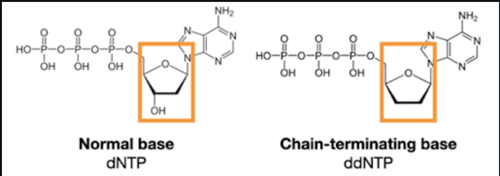
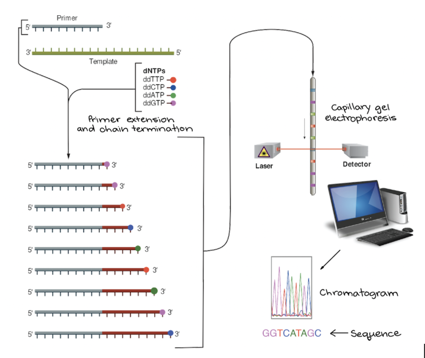
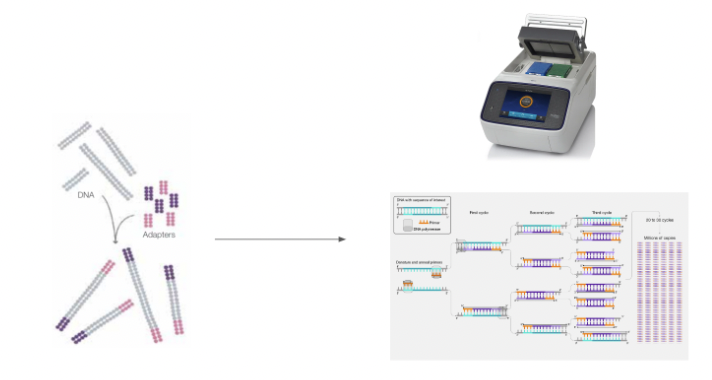
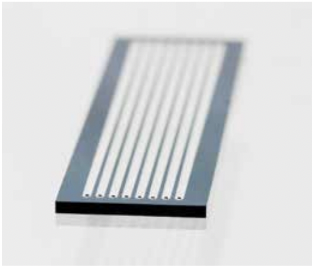
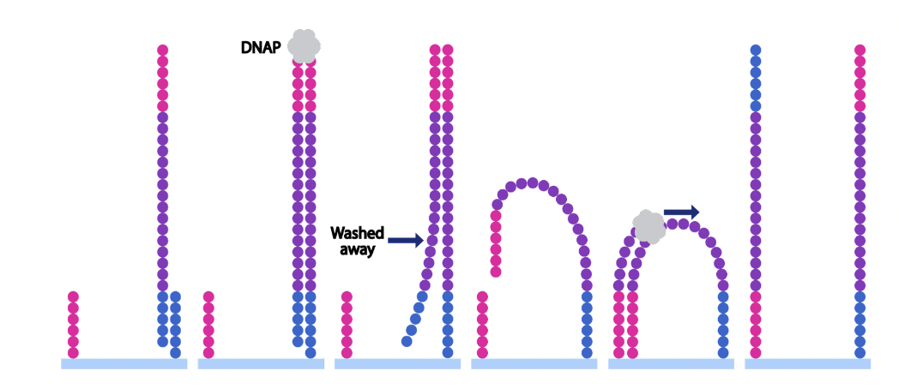
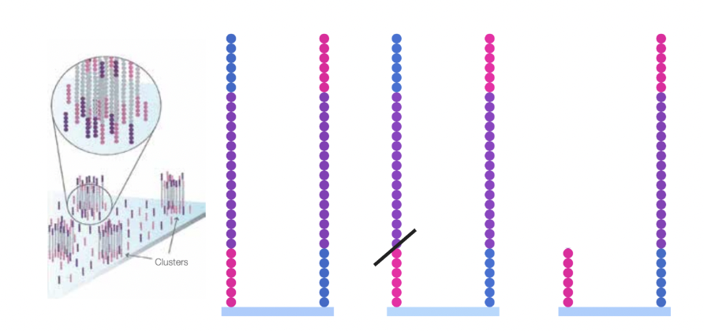
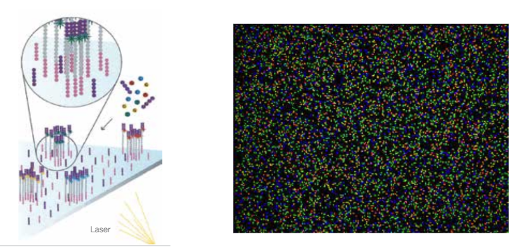

# Sequencing Technologies

### Written by: Nidhi Pareddy, Ivana Roque, Ananya Prasad

## Contents
- Introduction
- DNA Strcuture and ddNTPs
- Sanger Sequencing
- Next Generation Sequencing

## Introduction

DNA sequencing is a extremely important development to the field of molecular biology and other fields. Such development of sequencing technologies can have a wide variety of applications. Notably, the development of these techniques has enabled the human genome to be sequenced and is used in many clinical applications. To give a few examples, some applications include diagnosis of genetic disorders, guiding treatment decisions (precision medicine), understanding evolutionary relationships, identifying microbes in environmental samples, and much more.

Before dicussing about sequencing techniques and technologies, it is important to familiarize ourselves with the structure of DNA, the process of DNA synthesis, and dideoxynucleoside triphosphates.

## DNA structure
DNA is composed of repeating subunits called nucleotides. These nucleotides are composed of three main components: the phosphate group, the sugar, and the nitrogenous base. The linking of nucleotides is faciliated by a DNA polymerase where the main reaction is the nucleophilic attack of the 3' hydroxyl group at the end of the growing strand to the 5' alpha phosphate of the incoming dNTP. The result of this reaction is the formation of a phosphodiester bond between the growing stand and the newly attached nucleotide. However, if the additional nucleotide to be added is a ddNTP, termination of DNA synthesis will occur due to the lack of a 3' hydroxyl group.

  

    Figure 1.1: ddNTP

## Sanger Sequencing

Sanger Sequencing was developed by Fredrick Sanger in 1977 to sequence DNA based on selectively adding dNTPs and ddNTPs by DNA polymerase during DNA replication in vitro [1]. Sanger sequencing was used in the Human Genome Project to determine the sequencing of small DNA fragments through the overlapping of portions of the fragments to recreate the sequence of longer regions of DNA [2]. Though slow and costly, Sanger Sequencing is still used today to sequence fragments of DNA in instances of DNA cloning or PCR [2].

### Method 

Simple chain termination method requires a single stranded template DNA, a primer, DNA polymerase, dNTPs and ddNTPs. The addition of ddNTPs terminates the elongation process due to its lack of a 3’- OH group [2]. The principle behind Sanger sequencing is to recreate enough fragments of the DNA template strand ending at different nucleotide bases to sequence the original strand [2]. 

    
    <figcaption>Figure 2.1: Sanger sequencing steps diagram.</figcaption>

### Steps 
1. First, a mixture is created with the template strand, primer, dNTPs and a small quantity of ddNTPs tagged with different colors of dye.
2. This mixture is heated to denature the template strand and is cooled so the primer can attach to the now single stranded template.
3. The temperature is risen so DNA polymerase can add nucleotides starting from the primer sequence onwards. When a dideoxy nucleotide is added instead of a nucleotide, the strand terminates as no more nucleotides can be added.
4. This cycle is repeated continuously so there is a guarantee that all the ddNTPs have been added to every position in the template single strand.
5. Finally, the mixture will now contain fragments of varying lengths concluding at every nucleotide position.
6. Using the capillary gel electrophoresis method to sequence the fragments, the mixture is then put through a capillary tube. Smaller fragments move faster than larger fragments. Each fragment is illuminated by a laser, the dye is detected corresponding to one of the four types of nucleotides.
7. Once the data is recorded, the DNA sequence can be read from the peaks in the chromatogram.

    
    <figcaption>Figure 2.2: Sanger sequencing chromatogram</figcaption>

8. We can also run gel electrophoresis on the DNA fragments to separate them by size. The larger fragments travel slower, meaning that we read the gel from the bottom up. The colors correspond to the different nucleotide bases: Adenine, Thymine, Guanine, and Cytosine.[2]

    
    <figcaption>Figure 2.3: Sanger sequencing results using the gel electrophoresis method.</figcaption>

### Advantages and Limitations

Sanger sequencing allows for the sequencing of around 900 base pairs, making it perfect for situations such as PCR [1]. In addition, when kept under 900 base pairs, the tradeoff between cost and precision is not an issue as it is relatively cost effective. This means that lengths of around 900bp can be sequenced with high precision for a lower cost. 

On the other hand, sequencing DNA strands of above 1000 bp proves to be both expensive as well as slow. In the case of large scale sequencing, techniques such as next generation sequencing would be faster [2]. 

## Next Generation Sequencing

Next Generation Sequencing (NGS) is a revolutionary technology that has transformed DNA and RNA sequencing in the field of bioinformatics. In contrast to the high time cost of Sanger sequencing, NGS can sequence the entire human genome within less than a day. Applications include sequencing the whole genome, sequencing target regions, analyzing epigenetic factors, studying the microbiome, and identifying novel pathogens. [3]

While NGS refers to any sequencing technology that is high throughput (sequencing millions of strands in parallel), we will be discussing the methodology behind Illumina’s NGS technology. [4]

### Method
Illumina NGS technology uses a sequencing by synthesis method to track labeled DNA nucleotides in a massive cluster of DNA strand copies.

### Steps
1. Sample Preparation
    1. The DNA is fragmented
    2. Two adapters are ligated to the ends of the DNA fragments
    3. PCR  is used to amplify these fragments

    
    <figcaption>Figure 3.1: DNA fragmentation and sample preparation</figcaption>

2. Bridge Amplification and Cluster Generation
    1. The DNA fragments are amplified and sequenced on a flow cell (pictured below)

    
    <figcaption>Figure 3.2: Illumina Flow Cell</figcaption>

    3. The flow cell has 2 types of oligonucleotides attached to its surface. These oligonucleotides are complementary to the 2 adapters ligated to the DNA fragments earlier
    4. The DNA fragments are loaded onto the flow cell via hybridization to the oligonucleotides
    5. A polymerase creates a compliment of the fragment
    6. The original template is denatured and washed away
    7. The fragment folds over and hybridizes to the other oligonucleotide
    8. A polymerase creates a complement, forming a double bridge
    9. The strands unbridge into a forward and reverse strand attached to the flow cell surface

    
    <figcaption>Figure 3.3: Bridge amplification on flow cell</figcaption>

      
    10. The bridging process is repeated until there is a cluster of strands
    11. Then, either the forward or reverse strand is denatured and washed away to avoid directionality conflicts during sequencing

    
    <figcaption>Figure 3.4: Cluster generation on flow cell</figcaption>

        
3. Sequencing by synthesis
    1. The flow cell is loaded into the sequencer
    2. A primer binds to the tethered strand
    3. Four reversibly-labeled nucleotides (A, C, G, T) are added
    4. The complementary nucleotide is incorporated,the color signal is read, the dye and other nucleotides are washed away
    5. This process is repeated until the whole sequence has been imaged [5]

    
    <figcaption>Figure 3.5: Sequencing by synthesis</figcaption>

### Advantages and Limitations
1. Advantages
    1. High throughput
    2. Cost efficient
    3. Time efficient
    4. Precise and Accurate
2. Limitations
    1. Short read lengths
    2. Error rate of 0.1-1% per nucleotide

## Conclusion
There are many advantages and disadvantages for different DNA sequencing technologies. Sanger sequencing is most beneficial when sequencing smaller fragments of DNA while NGS is suited for larger sequences. In addition, each technique has a different run time depending on the nucleotide count. NGS is perfect for cases where accuracy and cost is a priority when sequencing larger DNA fragments. When sequencing specific fragments, Sanger sequencing is more cost effective. Therefore, the use case must be taken into account when deciding on which technology must be applied. 

## Sources Used
1. https://www.sigmaaldrich.com/US/en/technical-documents/protocol/genomics/sequencing/sanger-sequencing
2. https://www.khanacademy.org/science/ap-biology/gene-expression-and-regulation/biotechnology/a/dna-sequencing
3. https://www.ncbi.nlm.nih.gov/pmc/articles/PMC3841808/
4. https://www.illumina.com/science/technology/next-generation-sequencing.html
5. https://www.illumina.com/documents/products/techspotlights/techspotlight_sequencing.pdf
6. https://bio.libretexts.org/Courses/Portland_Community_College/Cascade_Microbiology/22%3A_Appendix_B_-_Molecular_Genetics_Review/22.2%3A_Structure_and_Function_of_DNA
7. https://www.thetech.org/ask-a-geneticist/articles/2019/sanger-vs-next-gen-sequencing/
8. https://www.illumina.com/documents/products/techspotlights/techspotlight_sequencing.pdf
9. https://www.genome.gov/genetics-glossary/Polymerase-Chain-Reaction
10. https://www.fishersci.com/shop/products/proflex-pcr-system-2-x-384-well/4484077
11. https://www.broadinstitute.org/files/shared/illuminavids/sequencingSlides.pdf
12. https://zhonglab.gitbook.io/3dgenome/chap0-preparation/0.2-sequencing-technologies 
