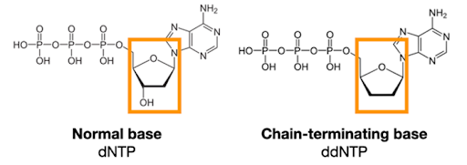

# Sequencing Technology Overview
1. Introduction
2. Sanger Sequencing
3. Next Generation Sequencing
## Introduction
DNA sequencing is a extremely important development to the field of molecular biology and other fields. Such development of sequencing technologies can have a wide variety of applications. Notably, the development of these techniques has enabled the human genome to be sequenced and is used in many clinical applications. To give a few examples, some applications include diagnosis of genetic disorders, guiding treatment decisions (precision medicine), understanding evolutionary relationships, identifying microbes in environmental samples, and much more. 

Before dicussing about sequencing techniques and technologies, it is important to familiarize ourselves with the structure of DNA, the process of DNA synthesis, and dideoxynucleoside triphosphates.
### DNA structure
DNA is composed of repeating subunits called nucleotides. These nucleotides are composed of three main components: the phosphate group, the sugar, and the nitrogenous base. The linking of nucleotides is faciliated by a DNA polymerase where the main reaction is the nucleophilic attack of the 3' hydroxyl group at the end of the growing strand to the 5' alpha phosphate of the incoming dNTP. The result of this reaction is the formation of a phosphodiester bond between the growing stand and the newly attached nucleotide. However, if the additional nucleotide to be added is a ddNTP, termination of DNA synthesis will occur due to the lack of a 3' hydroxyl group.
