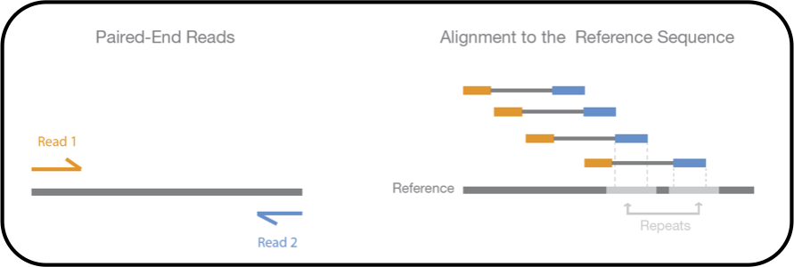

# Team 31: Read Mapping to Genomes using STAR
1. [Background](#311) 
2. [STAR Background Information](#316) 
3. [History of RNA Sequencing](#312) 
4. [Setting Up](#313) 
5. [Ways of Fixing the Ambiguous Mapping Problem](#314) 
6. [Improving the Process](#315) 
7. [Overview of STAR Steps](#317) 
7a.[Example STAR run](#320) 
8. [Applications](#318) 
9. [Potential Errors](#319) 
10. [Different Tools for BAM Mapping to Genome](#3110) 
11. [References](#3111) 

## 1. Introduction

  One of the most common tools for human genome analysis is RNA-sequencing. This tool is used for defining alternative splicing sites and for finding differentially expressed genes. This presentation is about the program used for genome mapping portion of RNA-sequencing and differential analysis; STAR. STAR was created in order to address the pitfalls of high rates of mapping errors, low speed, and limited read lengths found in previous aligner programs. 

## 2. STAR Background Information

  STAR stands for spliced transcripts alignment to a reference (genome). Universally, this is a program used for alignment. It creates an indexed genome in order to map faster. STAR is especially useful for finding non-canonical splice sites, chimeric sequences, and can map full length RNA sequences. 

## 3. History of RNA Sequencing

  Before we dive into STAR, it is important to look back on the developmental past of RNA-sequencing like microarrays. Microarrays were first used with fluorescent markers in order to identify hybridization events. Although microarrays can identify hybridization events, it cannot help with alternative splicing events, SNP variations, or mutations.  We are briefly mentioning these other technologies since they all helped to contribute to the development of RNA sequencing. STAR is able to help address pitfalls in these previous technologies.

## 4. Setting Up

  To actually start mapping, we need two things: 
- cleaned and trimmed reads
- reference genome
  
  We are going to be mapping the reads to the reference genome. The reason we use a reference genome and not a specifically built genome is because it takes up a lot of memory and time. But there is also another reason. Any differences between the mapped reads and the reference could be attributed to mutations. The next step is to actually map the reads. The initial approach was to brute force pattern matching. Essentially taking the read and moving downstream until a match is found. But while this works well for short genomes and single reads, it doesn’t work for hundreds of reads and a full genome length. If we imagine the genome as a book, and a read as a phrase, what we are essentially trying to do is skim through the book to find the phrase. But what happens if there is a typo in the phrase, or a mutation in the read? One solution we just have is to just tell the program that we are using that it’s okay if there isn’t an exact match. Let's say, for example, that we want a 99% similariy between a read and the genome. This allows for single nucleotide polymorphisms to be kept in, and since the match is mostly exact, we can continue mapping. 
  The STAR program creates its own indexed reference genome in order to more quickly sequence probable sites to map the reads. STAR uses a method called Maximal Mappable Prefixes in order to look for the longest sequence that aligns to the reference genome. The efficiency is obtained as STAR does not returned to this mapped part of the reference genome when it seeks for the second MMP. STAR specifically uses an uncompressed suffix array to iterate through the whole genome, which allows for large reference genomes to be sequenced at fas speeds compared to alternative programs. 

## 5. Ways of Fixing the Ambiguous Mapping Problem

  Another problem that exists in read mapping is ambiguous mapping. Assume that the genome resembles a puzzle, and a read is a puzzle piece. In some cases, a piece can look like it fits into multiple spots. This is essentially what goes on with ambiguous reads. One read could map to multiple locations. (Using the book metaphor from the previous section, one phrase could be present in multiple pages) A way to solve this is to use paired end reads, which are reads that are read both forwards and backwards. Looking at the read from both directions can give us clues as to what spot the read belongs in. Going back to the puzzle metaphor, let’s assume we have this piece below.

  If we look at it from just the top, we would put it in the blue area. If we look at it from the bottom, we would put it in the purple area. Looking at it from both directions gives us a better understanding of the location of the piece. Paired end reads work the same way, as they are read both forward and backwards. This gives us clues as to the exact location of the read.

  The next step is to make sure that the reads map well. (This is also useful to see if the correct location is chosen for the ambiguous read). For this we need to calculate a mapping quality, which is the probability that the mapping is incorrect. This is calculated using the individual read base qualities. If the quality is good, then we can feel confident in our mapping location of the read. And it’s this whole process in which STAR comes in.

## 6. Improving the Process

  So how can we fix these mapping problems? We can improve mapping speed. STAR is about 50 fold faster than other current aligners. As shown in the table to the right, STAR does trade this efficiency with RAM usage, but it is significantly faster than other programs.  We can increase the lengths of reads being sequenced. With STAR having its own indexing command we are able to remove the limitations on read length. We can improve on, or more efficiently achieve the same accuracy as previous programs. 

## 7. Overview of STAR Steps

1) Index the reference genome extracted from FASTA/FASTQ files and given annotations via a GTF file. These genome indexes only need to be generated once for each pairing for reference genome and given annotation. This is critical to facilitate the alignment of RNA-seq reads in the next steps.

2) Align reads, in the form of a FASTA/FASTQ file, to the previously indexed reference genome. This step allows for the fine-tuning of parameters such as read length and sequence type to optimize alignment accuracy.

	  - Seed search: This involves searching for the longest sequences that exactly match one or more locations on the reference genome. Such sequences are called MMPs (Maximal Mappable Prefixes). Seeds refer to short sequences (12-24 bps) within reads that will signal potential matching locations in the reference genome which are mapped separately. STAR searches for the unmapped part of the read, again searching for the next MMP. This next MMP then becomes “seed2”. The figure below illustrates the MMP search’s detection of (a) splice junctions, (b) mismatches and (c) tails.

    - Clustering, stitching, and scoring: Clustering refers to the grouping of separate seeds together based on how close they are to a set of seeds that are not part of multi-mapping, called anchor seeds. Stitching involves combining the seeds to create the best alignment for the read. The quality of alignment is based on features such as mismatches, gaps, indels, etc. The assessment of the quality of alignment is called scoring. The combination of these three steps allows for accurate and complete mapping of RNA-seq reads to the genome.
    
		 

3) Once the alignment is completed, the resulting files, typically in SAM or BAM format, are ready for a comprehensive analysis. Beyond the alignment data, valuable information such as mapping statistics summaries, spliced junctions, and details on unmapped sections enrich the dataset, providing a more holistic perspective for subsequent in-depth exploration and interpretation of RNA-seq results. Downstream analyses such as gene expression quantification, differential gene expression, etc. can be performed on the output data.

### 7a. Example STAR run<a name="320"<>/a>

1. Make directory to store outputs
 `cd1 ____`
 `mkdir ____`
3. Generating Genome Indices
 `--runThreadN NumberOfThreads --runMode genomeGenerate --genomeDir /path/to/genomeDir --genomeFastaFiles /path/to/genome/fasta1 /path/to/genome/fasta2 --sjdbGTFfile /path/to/annotations.gtf --sjdbOverhang ReadLength-1`
4. Mapping to STAR indexed genome
 `--runThreadN NumberOfThreads --genomeDir /path/to/genomeDir --readFilesIn /path/to/read1 [/path/to/read2 ]`
* (source: STAR manual 2.7)

## 8. Applications

  One application for STAR read mapping is that we can identify mutations and variants. If there are enough small differences in the lineage we are studying, then we can say that it is a variant of the original lineage. These variants can then be studied to make vaccines, if the genome that we are studying is a virus. This is clearly shown today when looking at covid. Another application is identifying gene expression levels. If one gene is expressed in greater levels than before, then with read mapping, we can identify the sequence that corresponds to said gene. Once that is identified, we can then conduct experiments to figure out what exactly that read does for gene expression. This could be applied to studying various diseases which cause, or are caused by, changes in gene expression levels. 

## 9. Potential Errors

While STAR is a very useful tool for RNA-seq analysis, several potential errors and challenges should be considered:

 1) __Updating reference genomes__: Modifications or additions can be incompatible with previously mapped BAM files. An issue arises when reference genomes are updated, meaning that previously mapped BAM files become outdated, so we need to remap to the most recent reference genome version. This process can be particularly difficult for large datasets, negatively affecting the efficiency of the analysis pipeline. 

 2) __Compatibility issues with downstream analysis tools__: The immediate BAM/SAM output of certain remapping tools may not seamlessly integrate with subsequent analytical platforms. Thus, this may require additional processing/modifications to continue.

 3) __Errors in the reference genome__: This can compromise the precision of the mapping process. Inaccuracies in the genome sequence can lead to misalignments, therefore also affecting downstream analyses such as variant calling, the process of identifying and categorizing genetic variations, and gene expression analysis.

 These challenges can extend to other mapping tools as well, such as the ones discussed in the following section.

## 10. Different Tools for BAM Mapping to Genome

Besides STAR, there are other tools that we can employ in order to map reads to the genome, each with their own strengths and weaknesses. Examples of three such alternative tools are as follows:

1. __HISAT2__ (Hierarchical Indexing for Spliced Alignment of Transcripts 2) is the best alternative to STAR as it is a splice-aware aligner that is considered to be even faster and more memory-efficient than STAR. A splice-aware aligner refers to taking into account the fact that reads can span multiple exons. HISAT2 was created using BWT (discussed further below) to compress the genome and uses FM indexing (Ferragina-Manzini indexing) to further decrease the amount of memory used. The creation of HISAT2 was highly influenced by the Bowtie2 implementation (discussed further below) in order to become a rival of STAR.

2. __Bowtie1 & Bowtie2__ are short sequence mapping tools. While Bowtie is suitable for shorter reads, Bowtie 2 accommodates longer reads exceeding 50 base pairs and offers additional features. Like HISAT2 and BWA it uses BWT to compress genes to increase memory-efficiency. Just like HISAT2, Bowtie employs FM-indexing, which allows for quicker searches. However, it is important to note that Bowtie1 & Bowtie2 are usually not recommended for RNA-seq read mapping to the genome because they are not splice-aware. However, using TopHat, which uses Bowtie in order to align the reads, and then takes care of issues such as splice junctions.

3. __BWA__ (Burrows-Wheeler Aligner) is an alignment tool based on BWT (Burrows-Wheeler Transform) and designed for mapping low-divergent sequences against large reference genomes. Low-divergent sequences refer to sequences that share a significant similarity with the reference genome. BWA is primarily designed for aligning short reads against a genome. Due to this efficiency specifically for short reads, BWA comprises three algorithms for different read lengths and alignment scenarios:

    - BWA-backtrack: For sequence reads up to 100 bp
    - BWA-SW: For sequence reads from 70 bp to 1 Mbp
    - BWA-MEM: The recommended algorithm since is produces the most high quality queries and can handle a greater range of sequence reads than BWA-SW or BWA-backtrack
 Again, it is important to note that BWA is not splice-aware, meaning that it cannot recognise introns in eukaryotes, so BWA is usually not recommended for RNA-seq read mapping to a genome, rather it is better designed for mapping to a transcriptome. 

## 11. References

- Keisaris, Sofoklis. “Galaxy Training: RNA-Seq Alignment with Star.” 
Galaxy Training Network, Galaxy Training Network, 3 Nov.
2023, 
training.galaxyproject.org/training-material/topics/transcriptomics/tut
orials/rna-seq-bash-star-align/tutorial.html#alignment-to-a-reference-genome.
- Dobin, Alexander, et al. “Star: Ultrafast Universal RNA-Seq Aligner.” 
Bioinformatics 
(Oxford, England), U.S. National Library of Medicine, 1 Jan. 2013, 
www.ncbi.nlm.nih.gov/pmc/articles/PMC3530905/. 
- Uhrig, Sebastian. “Workflow.” Arriba, 
arriba.readthedocs.io/en/latest/workflow/. Accessed 27 
Nov. 2023. 
- Star Manual 2.7 - Cornell University, 
physiology.med.cornell.edu/faculty/skrabanek/lab/angsd/lecture_notes/
STARmanual.pdf. 
Accessed 27 Nov. 2023. 
- Koboldt, Daniel C, et al. “Challenges of Sequencing Human Genomes.” Briefings in Bioinformatics, 
U.S. National Library of Medicine, Sept. 2010, 
www.ncbi.nlm.nih.gov/pmc/articles/PMC2980933/. 
- Mapping with STAR (biocorecrg.github.io)
- Emms, David M., and Steven Kelly. “Orthofinder: Phylogenetic Orthology Inference for Comparative
 Genomics - Genome Biology.” BioMed Central, BioMed Central, 14 Nov. 2019, 
genomebiology.biomedcentral.com/articles/10.1186/s13059-019-1832-y. 
- Burrows-Wheeler Alignment (BWA) - Research Computing Documentation, 
wiki.rc.usf.edu/index.php/Burrows-Wheeler_Alignment_(BWA). Accessed 27 Nov. 2023.
- Meeta Mistry, Bob Freeman. “Alignment with Star.” Introduction to RNA-Seq Using High-Performance Computing - ARCHIVED, 7 June 2017, hbctraining.github.io/Intro-to-rnaseq-hpc-O2/lessons/03_alignment.html#:~:text=STAR%20uses%20an%20uncompressed%20suffix,performing%20iterative%20rounds%20of%20mapping. 
- Burrows-Wheeler Alignment (BWA) - Research Computing Documentation, 
wiki.rc.usf.edu/index.php/Burrows-Wheeler_Alignment_(BWA). Accessed 27 Nov. 2023.
- Meeta Mistry, Bob Freeman. “Alignment with Star.” Introduction to RNA-Seq Using High-Performance Computing - ARCHIVED, 7 June 2017, hbctraining.github.io/Intro-to-rnaseq-hpc-O2/lessons/03_alignment.html#:~:text=STAR%20uses%20an%20uncompressed%20suffix,performing%20iterative%20rounds%20of%20mapping.
- BWA or STAR for RNAseq? [Online forum post]. (2018). Biostars. https://www.biostars.org/p/330942/
Arasappan, D. (2023, June 13). Mapping with BWA. The University of Texas at Austin. https://wikis.utexas.edu/display/bioiteam/Mapping+with+BWA
- Bowtie for RNA Seq data [Online forum post]. (2013). Biostars. https://www.biostars.org/p/63477/
- R. Franco, A. (2022). Questions about using Bowtie2 [Online forum post]. Biostars. https://www.biostars.org/p/166381/
- TopHat2 and Bowtie compatibility. (n.d.). Read the Docs. https://tophat2-and-bowtie-compatibility.readthedocs.io/en/latest/
- Ryan, D. (2022). RNA-seq differential expression analysis, which aligner to choose between BWA/tophat/Bowtie? [Online forum post]. Biostars. https://www.biostars.org/p/130451/
- Bedre, R. (2023, April 9). HISAT2: Fast Aligner for NGS Data (Complete Tutorial) [Video]. RS Blog. https://www.reneshbedre.com/blog/hisat2-sequence-aligner.html
- Arasappan, D. (2022, June 15). Mapping with HISAT2. The University of Texas at Austin. https://wikis.utexas.edu/display/bioiteam/Mapping+with+HISAT2
- Kim, D., Langmead, B., Pertea, G., & Salzberg, S. (n.d.). HISAT: Hierarchical Indexing for Spliced Alignment of Transcripts. Center for Computational Biology. http://www.ccb.jhu.edu/software/hisat/index.shtml
- Kim, J. S., Fırtına, C., Cavlak, M. B., Cali, D. S., Alkan, C., & Mutlu, O. (2022). FastRemap: a tool for quickly remapping reads between genome assemblies. Bioinformatics, 38(19), 4633–4635. https://doi.org/10.1093/bioinformatics/btac554
- Dobin, A. (2019). STAR manual 2.7.0a. https://physiology.med.cornell.edu/faculty/skrabanek/lab/angsd/lecture_notes/STARmanual.pdf
- Dobin, A., Davis, C. A., Schlesinger, F., Drenkow, J., Zaleski, C., Jha, S., Batut, P., Chaisson, M., & Gingeras, T. (2012). STAR: ultrafast universal RNA-seq aligner. Bioinformatics, 29(1), 15–21. https://doi.org/10.1093/bioinformatics/bts635
- Piper, M. M. B. F. M. (2017, June 7). Alignment with STAR. Introduction to RNA-Seq using high-performance computing - ARCHIVED. https://hbctraining.github.io/Intro-to-rnaseq-hpc-O2/lessons/03_alignment.html
