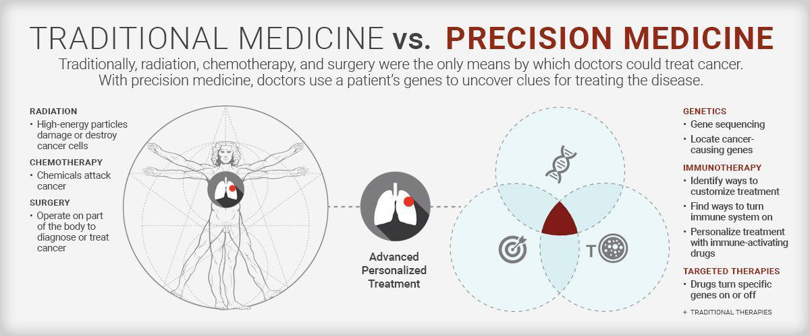
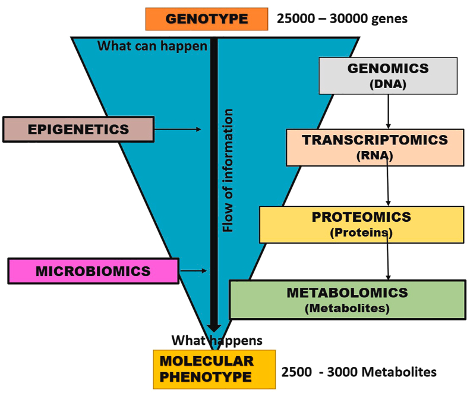
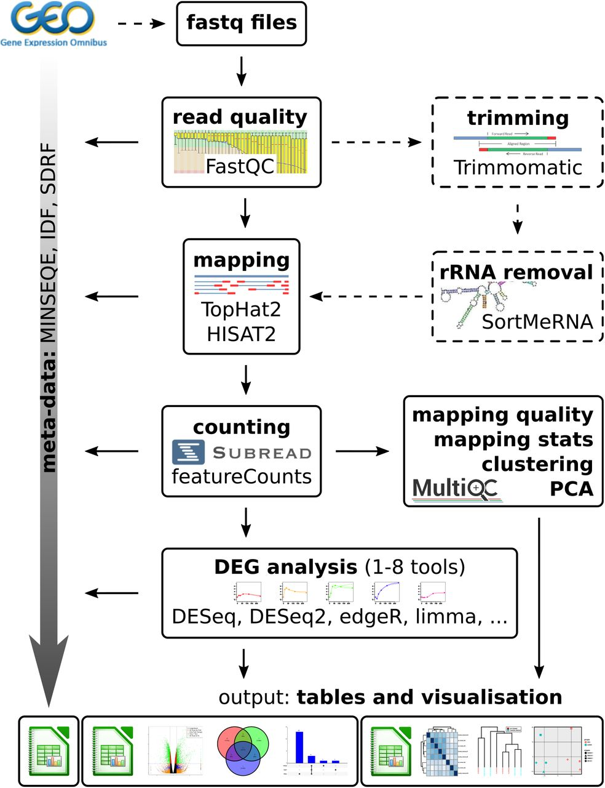
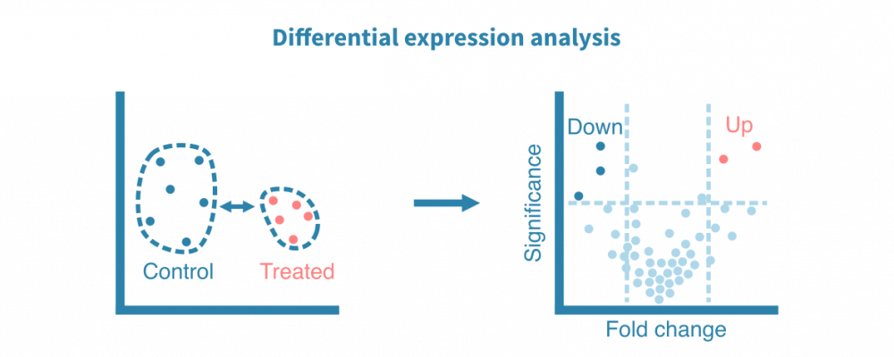
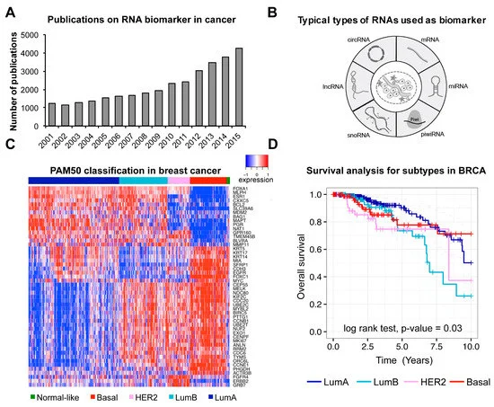
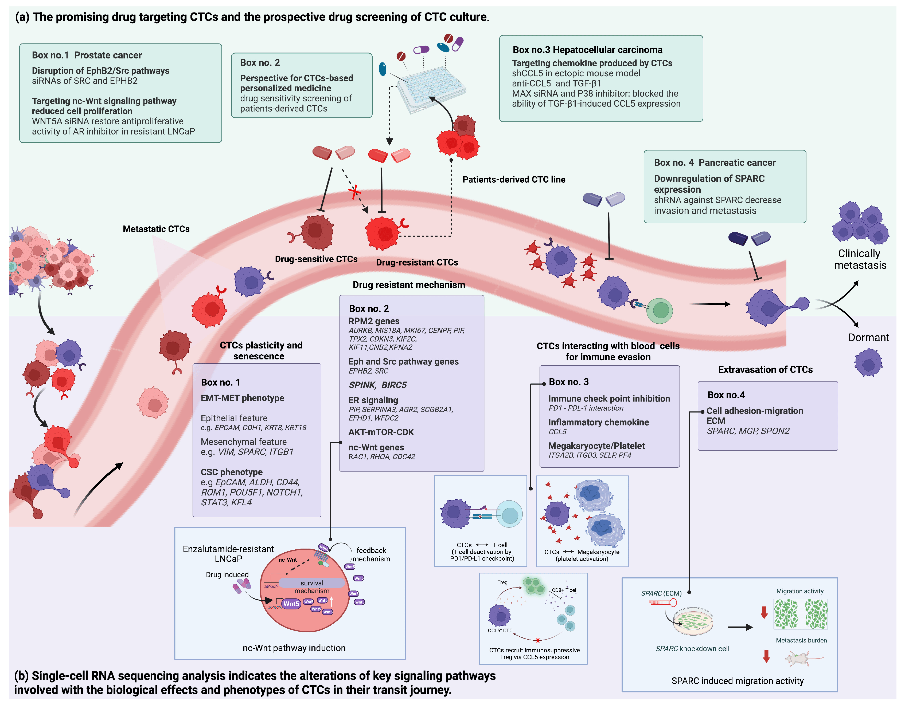

# Precision Medicine with RNA-Seq
> By Shirley Xie, Charles Choi, Jiachen Xu 2023

#### Outline

- Introduction to Precision medicine
    - Advantages
    - Tools and Strategies Applied by Precision Medicine
        - RNA-Seq
        - Differential Analysis
- Applications
    - Use of Biomarkers (eg. RNAs, cells) & RNA-Seq
    - Differential Analysis of Biomarkers
- Dicussion of disadvantages
- Reference

## Introduction

### What is Precision Medicine ?

> Medical approach that considers factors such as  genomic makeup ,  molecular profile  of the disease, lifestyle and other individual factors. Precision medicine helps guide treatment decision in cancer treatments and targeted therapies.

#### Advantages over Traditional Treatment
*  Increase of effectiveness of the drug
*  Decrease of side effects 
*  Customize disease-prevention strategies 
*  Monitor treatment effectiveness and resistance 
*  Prediction of response 

### How does it work?

#### Common Tools/Strategies of Precision Medicine
* Machine Learning
* Big Data
* Omics Biomolecule Studies

    - Genomics, transcriptomics, proteomics, metabolomics 
    
        

* <mark>**RNA-seq** </mark> -- *main focus in this presentation*

    > Provides insights into gene expression, alternative splicing and transcriptomic changes within cells or tissues. Which can be analyzed to predict treatment outcomes, to monitor the progress and efficacy of treatment and to understand the expression pattern. These information can be interpreted to give the optimal treatment plan.

    - **Pipeline**

          

    - **Differential Expression Analysis**

        > Compare gene expression levels between different conditions or groups, such as  healthy vs. diseased samples,  treated vs. untreated samples , or  different developmental stages. Differential expression analysis helps stratify patients into subgroups based on gene expression profiles, enabling the selection of the most appropriate and effective treatment strategies for each subgroup.

          

## Applications

### **RNAs** as <mark> biomarker

> RNA-seq allows detection of all different types of coding RNAs (mRNA) and non-coding RNAs (snRNA, miRNA...). Differential expression of some specific genes of these types would positively or negatively correlate with disease pathology. Therefore, they serve as the biomarkers. This bioinformatics method would enhance our understanding of biological pathways and regulatory mechanisms associated with diseases.

  

#### Examples of tissue-based RNA biomarkers for cancer

| Biomarker Name  |	RNA Type	|Cancer Type	|Up/Down	|Value	|
|---|---|---|---|---|
|PAM50	|mRNA	|Breast cancer	|-	|Diagnosis/Prognosis|
|Cell Cycle Progression mRNA panel	|mRNA|	Prostate cancer|	Up|	Prognosis|
|PCA3	|lncRNA|	Prostate cancer|	Up|	Diagnosis|
|HULC	|lncRNA|	Pancreatic cancer|	Up|	Prognosis|
|HOTAIR	|lncRNA|	Nasopharyngeal cancer|	Up|	Prognosis|
|miR-21	|miRNA|	Pancreatic cancer|	Down|	Clinical outcome prediction, potential therapy   target|
|piR-651	|piwiRNA|	Lymphoma|	Down|	Prognosis|
|SNORD33, SNORD66, SNORD76	|snoRNA|	Non-small-cell lung cancer|	Up|	Diagnosis|
|Hsa_circ_002059	|circRNA|	Gastric cancer|	Down|	Diagnosis|

---

### **Cells** as <mark> biomarker

> Single Cell RNA-Seq can be applied to determine the  size of the population of a specific cell type  that is related to metastasis. Principle component analysis (PCA), an unsupervised machine learning algorithm is used to reduce the dimension of the data obtained from scRNA-Seq. Other clustering algorithms, like k-means clustering, are also used isolate discrete transcriptome of the cancer related cells. The characterization of individual cell types at high resolution provides valuable information for therapeutically targeting tumor metastasis and their interplay in transit and beyond.

* **Circulating Tumor Cells (CTC)**

    > CTCs hold unique biological characteristics that directly involve them in hematogenous dissemination

      

## Disadvantages

Cost and Technical Complexity:
* Costly Procedures: RNA-Seq involves high costs, including library preparation,    sequencing, computational resources, and expertise.
* Technical Expertise: Data analysis requires bioinformatics expertise, and the complexity of workflows demands skilled personnel.

Transcriptome Complexity:

* Alternative Splicing and Isoforms: RNA-Seq might struggle to accurately capture and quantify alternative splicing events and rare transcript isoforms due to their complexity.

Limited Sensitivity for Low-Abundance Transcripts:
* Detection Limits: RNA-Seq might miss detection of very low-abundance transcripts, leading to underrepresentation of rare transcripts.

## Reference

[1]: Wang, Z., Gerstein, M. & Snyder, M. RNA-Seq: a revolutionary tool for transcriptomics. Nat Rev Genet 10, 57–63 (2009). https://doi.org/10.1038/nrg2484

[2]: Anders, S., McCarthy, D., Chen, Y. et al. Count-based differential expression analysis of RNA sequencing data using R and Bioconductor. Nat Protoc 8, 1765–1786 (2013). https://doi.org/10.1038/nprot.2013.099

[3]: Naithani N, Sinha S, Misra P, Vasudevan B, Sahu R. Precision medicine: Concept and tools. Med J Armed Forces India. 2021 Jul;77(3):249-257. doi: 10.1016/j.mjafi.2021.06.021. Epub 2021 Jul 3. PMID: 34305276; PMCID: PMC8282508. https://www.ncbi.nlm.nih.gov/pmc/articles/PMC8282508/

[4]: Xi, X.; Li, T.; Huang, Y.; Sun, J.; Zhu, Y.; Yang, Y.; Lu, Z.J. RNA Biomarkers: Frontier of Precision Medicine for Cancer. Non-Coding RNA 2017, 3, 9. https://doi.org/10.3390/ncrna3010009

[5] Orrapin, S.; Thongkumkoon, P.; Udomruk, S.; Moonmuang, S.; Sutthitthasakul, S.; Yongpitakwattana, P.; Pruksakorn, D.; Chaiyawat, P. Deciphering the Biology of Circulating Tumor Cells through Single-Cell RNA Sequencing: Implications for Precision Medicine in Cancer. Int. J. Mol. Sci. 2023, 24, 12337. https://doi.org/10.3390/ijms241512337