# Machine Learning

Group 33 (Gary Lin, Owin Gong, Manaswini Kanaparthy)

## Table of Contents

1. Introduction
2. Clustering
    - Distance Functions
    - Hierarchical Clustering
    - K-means Clustering
3. Classification
    - k-nearest neighbors
    - Decision Trees
    - Linear Classifiers
    - Support Vector Machines
    - Neural Networks
4. Conclusion
5. Sources
6. Image Credits

## Introduction
Machine learning is a field that develops models and algorithms that allows computers to make decisions or predictions by learning from inputs and data without needing to be explicitly programmed. This field has many real-world applications and in a variety of areas within the field of bioinformatics. Examples of machine learning applied in bioinformatics are personalized medicine, disease prediction and diagnosis, functional genomics, and much more.These algorithms utilized in bioinformatics and other various areas can and are able to be trained on unsupervised and supervised learning models. With supervised learning models, it gets trained on labeled data in which the relationships between input features and their corresponding output labels are learned, for example, the various types of classification, such as k-nearest neighbors, decision trees, linear classifiers, support vector machines, and neural networks. Another example is disease diagnosis where the model learns relationships between MRI scans and a healthy or diseased heart to determine future undiagnosed MRI scans, given and trained on already labeled, determined data of MRI scans confirmed as healthy or not. Then, with unsupervised learning models, it discovers patterns and relationships given an unlabeled dataset, such as hierarchical clustering and K-means clustering. 

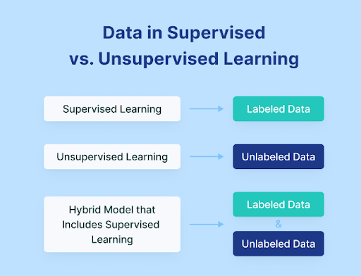

## Clustering

Clustering is an example of an unsupervised machine learning method. It would organize the input dataset into different clusters such that objects in one cluster would be more similar to each other than those that are in other clusters. Clustering only requires one unlabeled dataset as the input with a general format of an $p$ dimension data array $x = [n_1, n_2, n_3, \dots, n_a]$. The output would be $k$ numbers of $p$ dimension data array $y_i = [m_1, m_2, m_3, \dots, m_b]$ where $k$ is the number of clusters the user requires. 

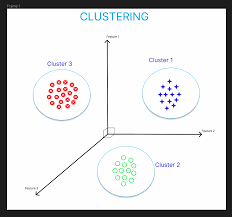

### Distance Functions

To compare distances between objects, we need to define a distance function. Common ways of comparing distances includes Euclidean Distance, Manhattan Distance, and Cosine Distance. The standard distance used is usually Euclidean, which is given by the equation: $$d(\mathbf{x}, \mathbf{y}) = \sqrt{\sum_i (x_i - y_i)^2}$$ 

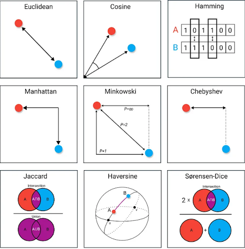

### Hierarchical Clustering

Hierarchical clustering algorithm builds a hierarchy of clusters based on their similarities. The algorithm is given by the following steps. 
1. Create a cluster for each data point to be in. 
2. Calculate the similarities between the clusters. 
3. Combine the 2 clusters that are most similar to each other. 
4. Repeat when we only have $k$ clusters left, where $k$ is defined by the user. To perform this algorithm, we first need to define the differences between clusters. This could be done in several ways. 
    - Single Linkage - The difference between two clusters is the distance between the two most similar objects between the clusters.
    - Complete Linkage - The difference between two clusters is the distance between the two most different objects between the clusters.
    - Average Linkage - The difference between two clusters is the distance between the average of the difference two most different objects between the clusters.
    - Unweighted Pair Group Method (UPGMA) - Calculates the average distance from each point in the cluster to all other points in another cluster

The runtime of the basic hierarchical clustering methods would be $O(n^3)$ and $\Omega(n^2)$ memory is required. This runtime can be improved to $O(n^2\log(n))$ if we use a heap. 

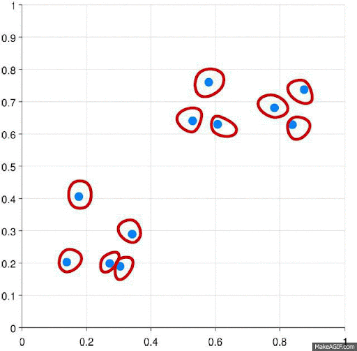

A dendrogram is usually used to display our hierarchy. Other diagrams like heatmaps and vendiagrams could also be used to represent our result.

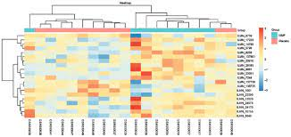

### K-means Clustering

K-means clustering creates $k$ clusters such that every objects in the dataset would be sorted into the cluster with the nearest mean. The algorithm of a basic $k$-means clustering is given by the following steps: 
1. Select $k$ different points to serve as cluster means to create our initial clusters and pick an iteration limit $t$. 
2. Assign each data point to the cluster with the cluster mean closest to it. 
3. Recalculate the cluster means using the new clusters. 
4. Repeat step 2 and 3 until either 
    - the iteration limit is reached, or 
    - all the clusters are defined, meaning that no data points are being assigned to new clusters when we recalculate the cluster means.

The runtime of $k$-means clustering is $N(nKT)$, where $n$ is the number of data points, $K$ the number of clusters, and $T$ the number of iterations. The reason we would put a iteration limit is because this algorithm would not guarantee a stop without it. It is possible that the algorithm would run into an infinite loop. Furthermore, the cluster means picked at the beginning of the algorithm would affect the end results. Finding the optimum solution would be a NP hard problem. However, it is possible to find a local solution using efficient heuristic algorithms. 

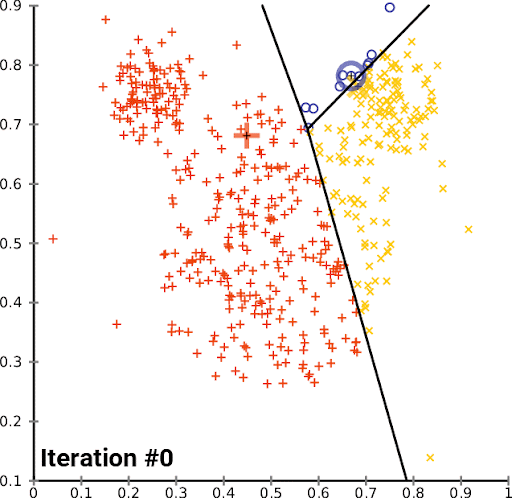

This figure shows how for every iteration the cluster changes until the algorithm finishes. For each iteration, the cluster and its cluster mean changes until the algorithm is finished. 

## Classification

Classification is done by a variety of supervised learning methods that take in input data and some predetermined categorical labels, and trains a model to match these labels on so-called training data the best that it can by minimizing a loss function. The hope is that when encountering unseen data, the model will have found features that help to correctly identify the category to which the new data belongs. There is a delicate balance, however, when it comes to minimizing the loss, or the amount the model is wrong by predicting labels for its input data. If the training loss is too low, then the model is likely ‘overfitted,’ essentially memorizing or taking into too much consideration the slight noise apparent in the data, while missing the general trend.

### k-Nearest Neighbors

$k$-Nearest Neighbors ($k$-NN) is a classification algorithm that, given some defined distance metric between two data points, assigns a new unseen data point to pre-assigned labels. It works by first sorting the $k$ nearest neighbors, the ones with the fewest distance, and taking a majority vote of the labels. 

In the below figure, the green dot represents new data that needs to be classified. The distance metric that appears to be used is as the crow flies, or the Euclidean distance metric. When $K$, the number of neighbors, is equal to four, the four closest neighbors to the green dot are the four blue dots next to it. The vote then would be unanimously blue, so the green dot would be classified as blue. When $K=9$ however, the next five neighbors are red, and the vote would instead be 5-4 red, so the green dot would be recolored red. Thus, the number of neighbors has a huge effect on the final result of the classification and must be fine-tuned as a hyperparameter.

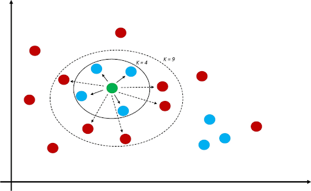

As can be seen from the above figure, the choice of how many nearest neighbors to take into account plays huge consideration into the final outcome, as can be seen by the “decision boundary” which classifies any unseen data point within them to its corresponding label. The figure below shows the different decision boundaries that can be created off of the same data.

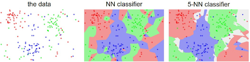

The NN classifier, which classifies based on the closest point, is quite sharp and has several enclaves of one color inside another larger colored region. The increase to 5 nearest neighbors, however, reduced the noise in the data, although there are now regions where there is a tie (and a tie breaking procedure needs to be implemented). There is a delicate balance between having the classifier be as close to the training data as possible and capturing the general trend past the statistical noise.

### Decision Trees in a Random Forest

Another way to classify things is by a decision tree, which is sort of works like a flowchart, where at each node there is some feature that is tested and separates the things into two or more groups where they may be split more. The goal is to create an optimal decision tree that correctly labels all of its training data, in the hope that passing a new data point through it outputs the appropriate label.

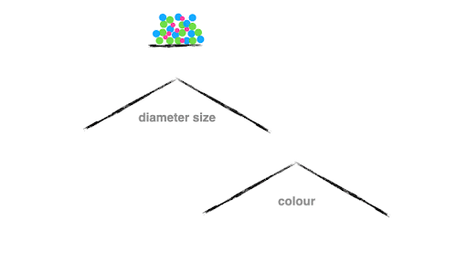

In the above figure, circles are separated based on their diameter size and color, although one can imagine that if the data were more complex, there would be more features. These decision trees can get pretty complex, and eventually give different results. How do we know which ones are right? By democracy, of course. 

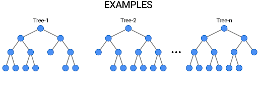

With the random forest algorithm, several decision trees are created. This is to avoid the possibility of any one decision tree being overfitted to their training data. A new data point is tested by all the decision trees which come to their own individual outcome, and then come to a consensus about which label to ultimately assign the data point. 

### Linear Classifiers

A linear classifier is a type of classifier that takes in a feature vector and outputs a label based on a linear combination of the characteristics. If we input $\vec{x}$ as our feature vector, then our output score is $$f(\vec{w} \cdot \vec{x}) = f\left(\sum_j w_jx_j\right)$$ where $\vec{w}$ is the vector of weights, or scalars that determine our linear combination. The weight vector in turn is updated based on the training data. In the end, we have a line that aims to separate the data into two clean groups, and any new point will be given a corresponding label based on where it is from the line.

In a perceptron (shown below), the model keeps updating until the number of wrongly classified points is zero. If the points are linearly separable, then the perceptron will converge to a solution. Otherwise, it will loop forever.

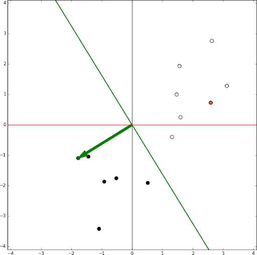

### Support Vector Machines

Support Vector Machines are a special type of linear classifier, but more robust. Instead of trying to fit a line between data clusters, a support vector machine will find an optimal hyperplane (generalizing to multidimensional space) that maximizes a margin between the hyperplane and the data.  

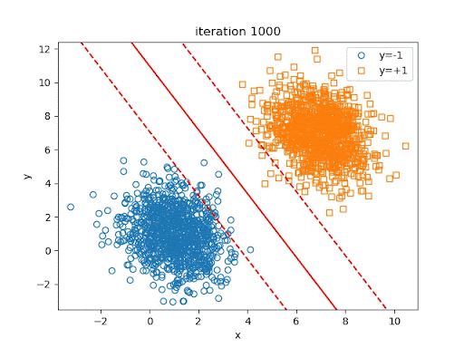

Support vector machines are more robust than other types of linear classifiers because it can efficiently form non-linear classification (such as the figure below on the right) by performing the “kernel trick,” which uses a feature map or kernel to map the data to higher or infinite dimensional feature spaces. 

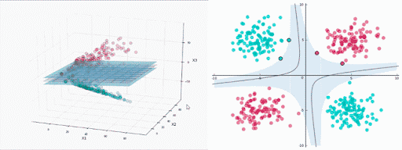

### Neural Networks

Finally, neural networks are some of the most powerful models that can be used for classification. Neural networks attempt to mimic the biological neuron circuits happening in our brain to stimulate statistical learning. Like the linear classifiers before it, neural networks take in a feature network and have a bunch of weights associated with each node in the network that is steadily updated as the model trains and learns on input data. Unlike linear classifiers however, the connections between neuron layers are usually nonlinear functions. Eventually it gives an output which can serve as our classification.

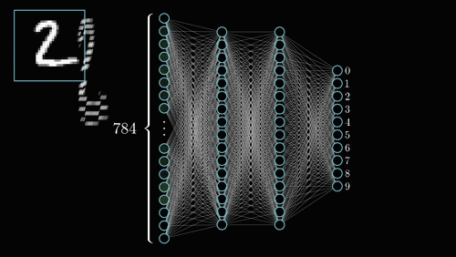

During training, initial weights are chosen and passed through activation functions during forward propagation. Then, the backpropagation method is run which uses the chain rule to update weights via automatic differentiation.

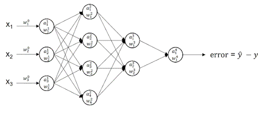

There are a myriad of different neural networks, all with different architectures and applications. Among them are autoencoders, convolutional neural networks, recurrent neural networks, generative adversarial neural networks, and more. 

## Conclusion

In our increasingly digitized world, and with bioinformatics growing as a field to continually meet the ever-burgeoning needs to analyze and find patterns in biological data, machine learning as a tool has significant prospects for the workflow of a bioinformatician who can rely on mathematical concepts to find trends and previously unseen biological relationships that may revolutionize areas like precision medicine or functional genomics in the future.

## Sources: 

Libbrecht, M., Noble, W. Machine learning applications in genetics and genomics. Nat Rev Genet 16, 321–332 (2015). https://doi.org/10.1038/nrg3920

Manipur, I., Granata, I., Maddalena, L., & Guarracino, M. R. (2020). Clustering analysis of tumor metabolic networks. BMC bioinformatics, 21(Suppl 10), 349. https://doi.org/10.1186/s12859-020-03564-9

Yan Y, Zhang JW, Zang GY, Pu J. The primary use of artificial intelligence in cardiovascular diseases: what kind of potential role does artificial intelligence play in future medicine? J Geriatr Cardiol. 2019 Aug;16(8):585-591. doi: 10.11909/j.issn.1671-5411.2019.08.010. PMID: 31555325; PMCID: PMC6748906.

Clustering in machine learning - javatpoint. www.javatpoint.com. (n.d.). https://www.javatpoint.com/clustering-in-machine-learning 

Ren Qi, Anjun Ma, Qin Ma, Quan Zou, Clustering and classification methods for single-cell RNA-sequencing data, Briefings in Bioinformatics, Volume 21, Issue 4, July 2020, Pages 1196–1208, https://doi.org/10.1093/bib/bbz062

## Image Credits:

https://www.v7labs.com/blog/supervised-vs-unsupervised-learning

https://medium.com/@chandu.bathula16/understanding-classification-regression-and-clustering-in-machine-learning-machine-learning-8b77b4b27c87

https://towardsdatascience.com/9-distance-measures-in-data-science-918109d069fa

https://mlalgorithm.wordpress.com/2016/06/08/hierarchical-clustering/

https://forum.knime.com/t/hierarchical-clustering-dendrogram/19313

https://medium.com/swlh/implementing-a-k-means-clustering-algorithm-from-scratch-214a417b7fee

https://www.researchgate.net/figure/k-nearest-neighbors-A-diagram-showing-an-example-of-the-k-nearest-neighbor-machine_fig1_356781515

https://cornell-data.medium.com/interview-case-study-1-sampling-methods-and-parameter-changes-4799c580aa42

https://medium.com/@divyavpatil24/decision-tree-algorithm-8d16cc5680bb

https://blog.tensorflow.org/2021/05/introducing-tensorflow-decision-forests.html

https://commons.wikimedia.org/wiki/File:Perceptron_training_without_bias.gif

https://nianlonggu.github.io/2019/05/24/tutorial-on-SVM/

https://medium.com/cube-dev/support-vector-machines-tutorial-c1618e635e93

https://medium.com/@vkrntkmrsngh/simplifying-ml-with-google-clouds-vertex-ai-2c3acd95bb1d

https://medium.com/@datalab_70093/from-data-to-dollars-a-deep-dive-in-time-series-forecasting-iii-18557be51c2c 
