# 35 FASTQC: Quality Check of RNAseq Reads
1. [Background](#351)
2. [QC Report Analysis Modules](#352) 
	2.1. [Basic Statistics](#3521) 
	2.2. [Per Base Sequence Quality](#3522) 
	2.3. [Per Tile Sequence Quality](#3523) 
	2.4. [Per Sequence Quality Scores](#3524) 
	2.5. [Per Base Sequence Content](#3525) 
	2.6. [Per Sequence GC Content](#3526) 
	2.7. [Per Base N Content](#3527) 
	2.8. [Sequence Length Distribution](#3528) 
	2.9. [Sequence Duplication Levels](#3529) 
	2.10. [Overrepresented Sequences](#35210) 
	2.11. [Adapter Content](#35211) 
3. [Conclusion](#353)

## 35.1 Background

Quality assessment of raw reads is the first and very crucial step in the RNAseq analysis pipeline. FastQC is one of the widely used tools to evaluate the quality of high throughput sequencing data. Developed by Simon Andrews at the Babraham Institute, FastQC was developed to address the vast amount of sequencing data produced from NGS in a fast and comprehensive manner. 

FastQC takes a FASTQ file, and analyzes it to generate an easily interpretable report based on a variety of metrics, including sequence quality scores, sequence length distribution, GC content, sequence duplication levels, and the presence of overrepresented sequences or adapter contamination.

FastQC is extremely significant as it allows scientists to identify issues within their data such as poor quality bases, and make decisions about pre-processing steps like data trimming with FastP. This ensures we have high quality data, which is very important for downstream analysis.

Some examples of current tools that extend from or are similar to FastQC are PRINSEQ and MultiQC[13]. 

## 35.2 QC Report Analysis Modules
FASTQC generates a final report in a .html file, which can be opened with any browser. Looking through this report, we can read the analysis modules and their metrics to assess the quality of our sequencing data.  

The report starts with a summary of the modules, each with an icon to represent their status as **PASS**, **WARNING**, or **FAIL**. The **WARNING** and **FAIL** flags are not meant to be taken at face value, rather noted as a sign to take a closer look at that module [3].

### 1) Basic Statistics
This is the first module given in a FastQC report.  
Contains:
1. **Original file name**
2. **File type**: whether the file appeared to contain actual base calls or colorspace data which had to be converted to base calls
3. **Encoding**: which ASCII encoding of quality values was found in this file.
4. **Total number of sequences processed**
5. **The number of sequences flagged as poor quality**
6. **Sequence Length**: the length of the shortest and longest sequence in the set. If all sequences are the same length, only one value is reported.
7. The **overall GC content** of all bases in all sequences in this file [1].

Basic Statistics [8]:  
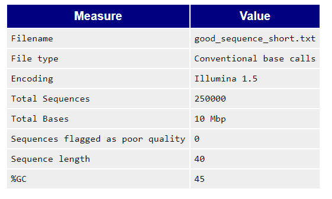  

This module does not report failing or warning. Generally it is a good idea to ensure that the read length and %GC content are as expected [3]. 

### 2) Per Base Sequence Quality
**Phred quality scores** are numerical scores that report the probability that a base call is incorrect, as determined by the formula: Q = -10 log₁₀(P). The higher the Phred quality score, the higher the base call accuracy.

Phred Quality Scores[9]:  
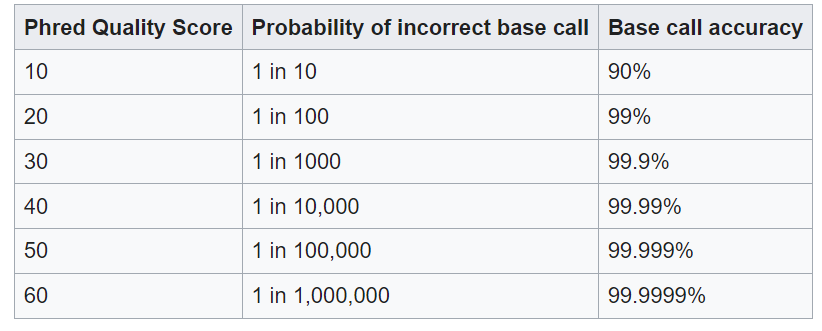  

This module gives us the Phred quality score across all bases at each position in reads in the form of box and whisker plots. The background color of the graph indicates the quality of our bases, and we want all of our data to lie in the green region.  

It is normal for quality to start low for the first 5-7 bases, then rise. Additionally, average quality scores generally drop over the length of the read. Both phenomenon are related to signal intensity and purity of fluorescent signaling during Illumina Sequencing[3]. 

Passing Module[8]:  
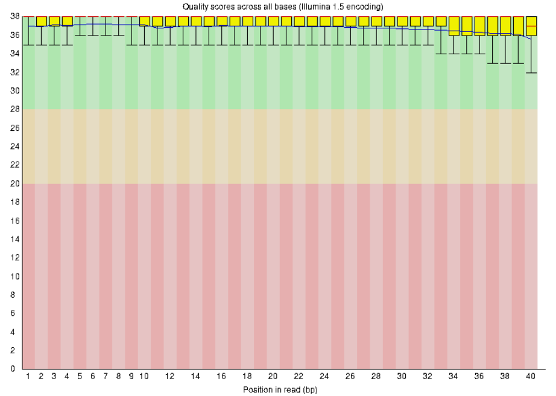   
Failing Module[7]:  
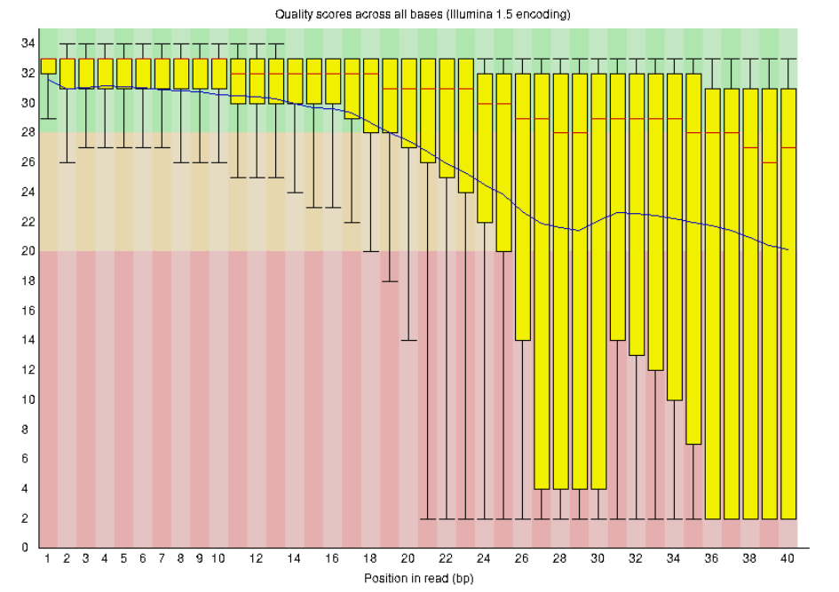  

**Warning**: issued if the lower quartile < 10 or median < 25 for any base.

**Failure**:  issued if the lower quartile < 5 or median < 20 for any base[1].

### 3) Per Tile Sequence Quality
In Illumina sequencing, a flow cell has eight lanes, and each lane can be divided into tiles, which are the sections to be imaged.

Tile Refernce[10]:  
  

Per Tile Sequence Quality shows the deviation from the mean Phred quality for each tile.This plot will only appear in the FastQC report for Illumina library which retains its original sequence identifiers, so RNA-seq report does not have this module.

Cold colors indicate the quality was at or above the average for that base, while hot colors indicate that a tile had worse quality than other tiles for that base, which point out the problems on some certain tiles in the flow cell [1]. 

Passing Module[8]:  
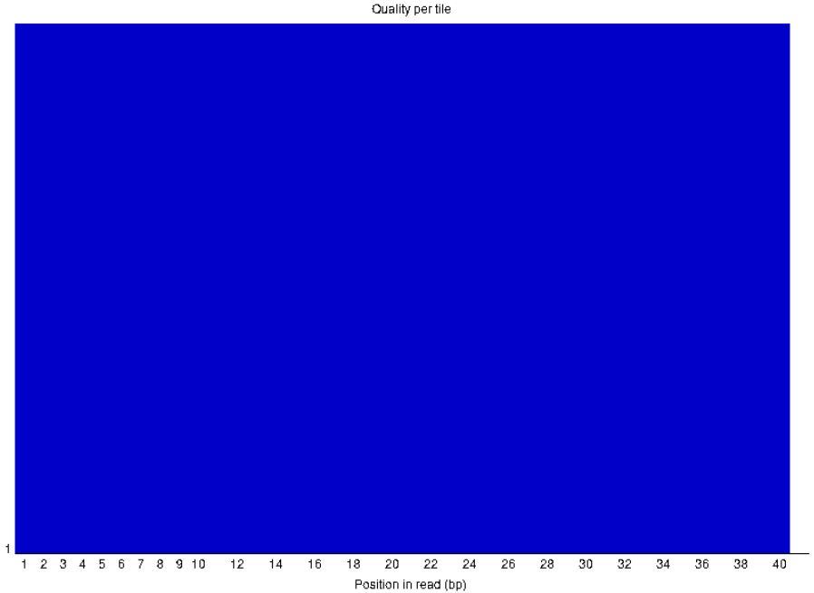  
Failing Module[1]:  
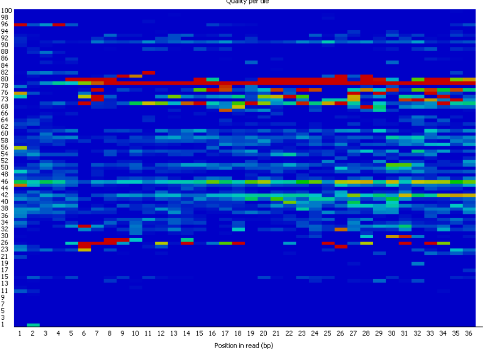  
**Warning**: issued if any tile shows a mean Phred score >2 lower than the mean for that base across all tiles.

**Failure**: issued if any tile shows a mean Phred score >5 lower than the mean for that base across all tiles [1].

### 4) Per Sequence Quality Scores
This module shows the distribution of average quality scores per read in the input file.
A left-skewed distribution is desirable, as it means more sequences have higher Phred quality scores [1].

Small bumps could be caused by systematic imaging issues - for example, these sequences might be located on the edge of our field of vision, so they have a universally poor quality [1]. As long as they are just a small subset of sequences, they are not problematic, but they also suggest you take a quick examination of readings that result in low quality scores [3].

Passing Module[8]:  
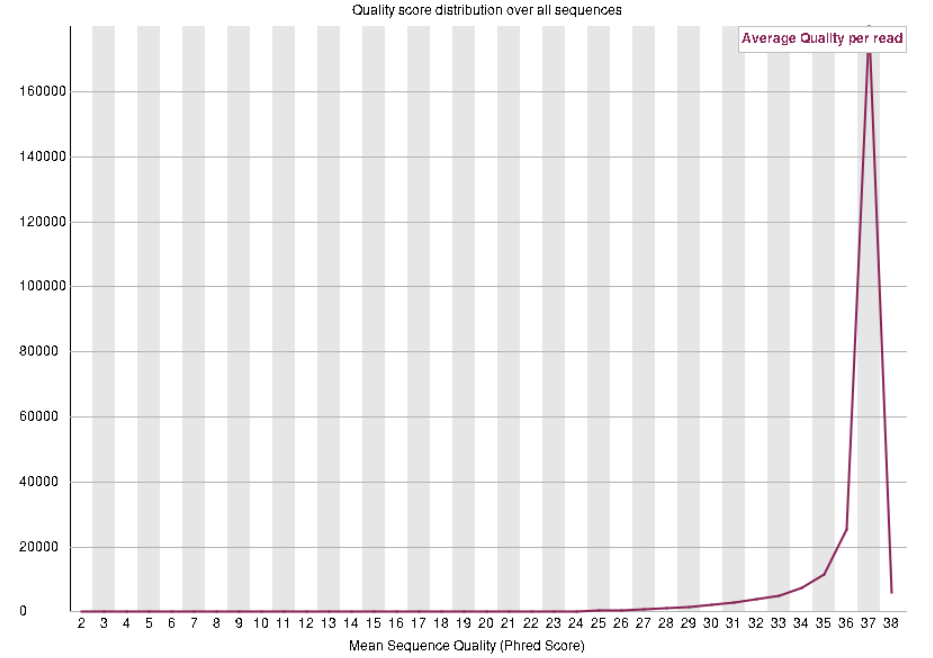  
Passing Module with Bump[7]:  
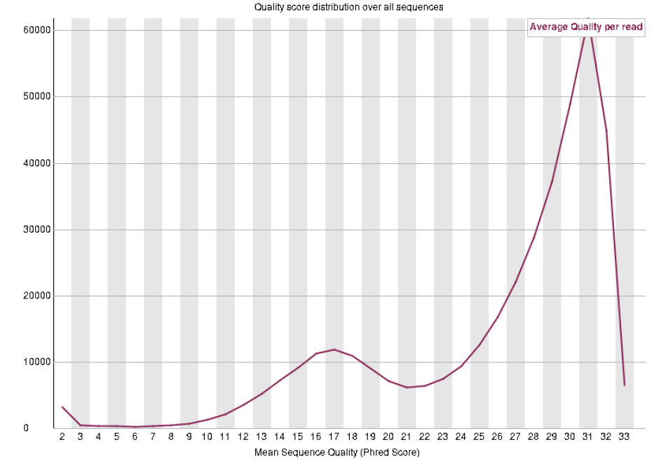  

**Warning**: issued if the most frequently observed mean quality is <27.

**Failure**: issued if the most frequently observed mean quality is <20.

### 5) Per Base Sequence Content
This module presents the proportion of each base (A, T, C, G) at each base position in the input file [1].

The proportion of each base should be as constant as possible across the reads with %A=%T and %G=%C. This indicates that the position on a read does not affect the result of base call [4].

However, RNA-seq data usually gives a FAIL because the ‘random’ hexamer priming that occurs during reverse transcription would make the first 10-12 bases biased [3].

Passing Module[4]:  
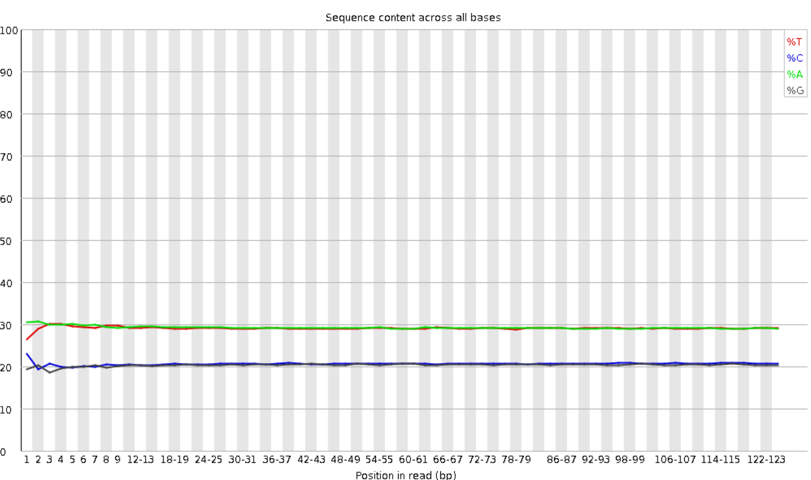  
RNA-seq Results[11]:  
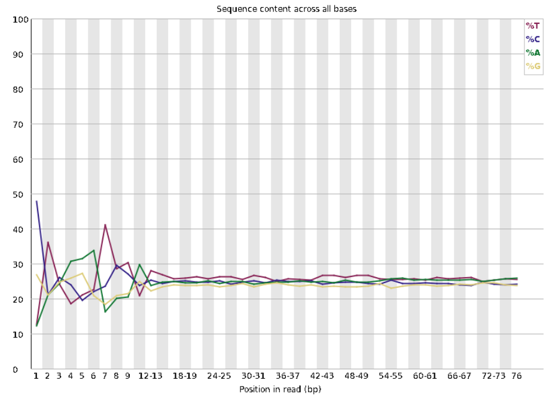  

**Warning**: issued if the difference between A and T, or G and C is >10% in any position.

:**Failure**: issued if the difference between A and T, or G and C is >20% in any position.

### 6) Per Sequence GC Content
This module gives the GC content across each sequence in the input file (red) and compares it to a modeled normal distribution of GC content for that organism (blue) [1].

A roughly normal distribution that overlaps mostly with the modeled distribution is desired. Deviation from the modeled distribution indicates contamination or biased sequences. Sharp peaks might represent the contamination from a specific sequence, such as adapters, while broad peaks might represent contamination from another species. A normal but shifted distribution might indicate some systematic bias independent of base position [1]. In RNA sequencing, a greater or lesser distribution of mean GC content among transcripts might cause the observed distribution to be wider or narrower than an idealized normal distribution [4].

Passing Module[8]:  
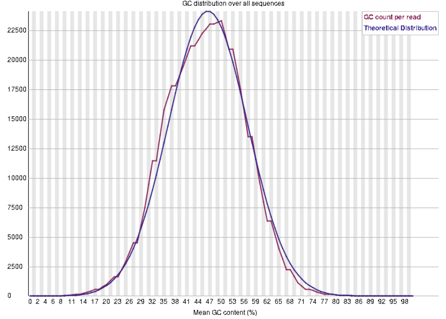  
Failing Module[3]:  
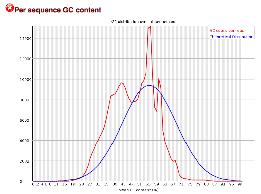  

**Warning**: issued if the sum of the deviations from the normal distribution represents more than 15% of the reads.

**Failure**: issued if the sum of the deviations from the normal distribution represents more than 30% of the reads.

### 7) Per Base N Content
This module reports the percentage of undetermined bases (N) at each position in the input file.

We want per base N content to be kept at zero. It is usual to see a low percentage of N, especially at the end of the read. However, if the percentage rises too high, it suggests that the analysis pipeline was unable to make valid base calls – probably due to the low quality of sample [1].

Passing Module[8]:  
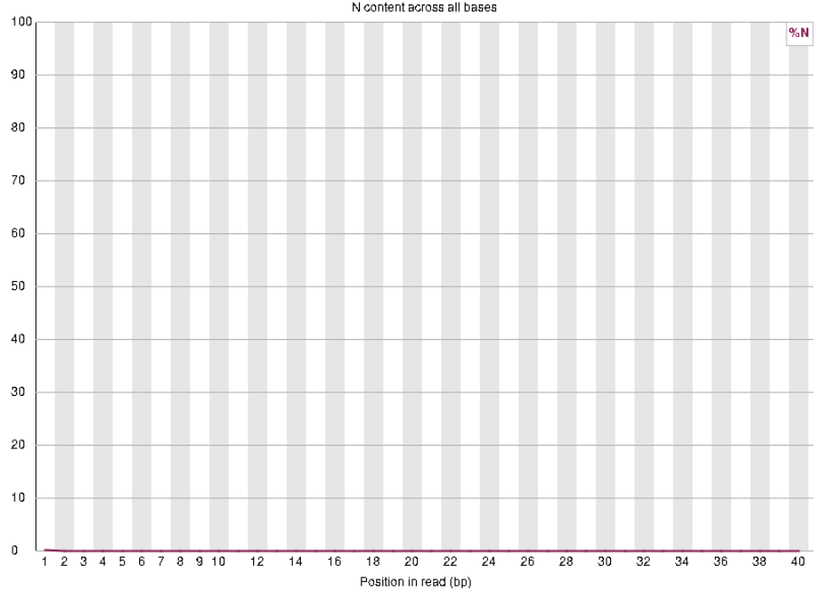  
Passing Module with Bump[7]:  
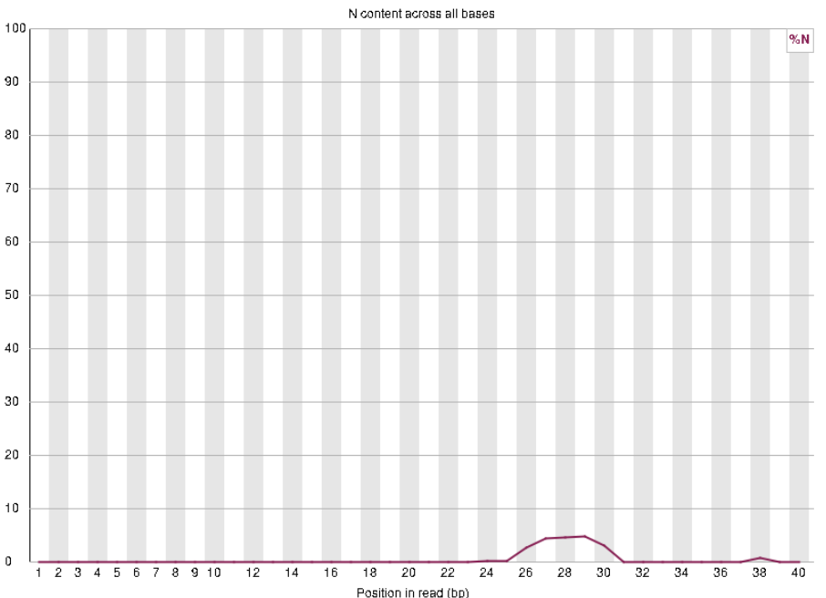  
Failing Module[4]:  
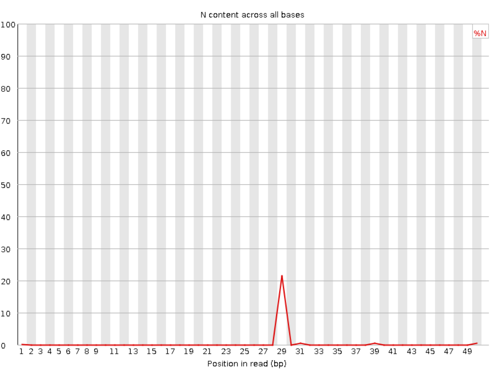  

**Warning**: issued if any position shows an N content of >5%.

**Failure**: issued if any position shows an N content of >20%.

### 8) Sequence Length Distribution
This module shows the distribution of lengths or the reads in the input file.
Many sequencers will generate sequence fragments of uniform length, but variable length FastQ files can result in varying fragment lengths. Processing of sequences can also include trimming to remove shorter reads or those with poor base quality at the end [1].

Passing Module[8]:  
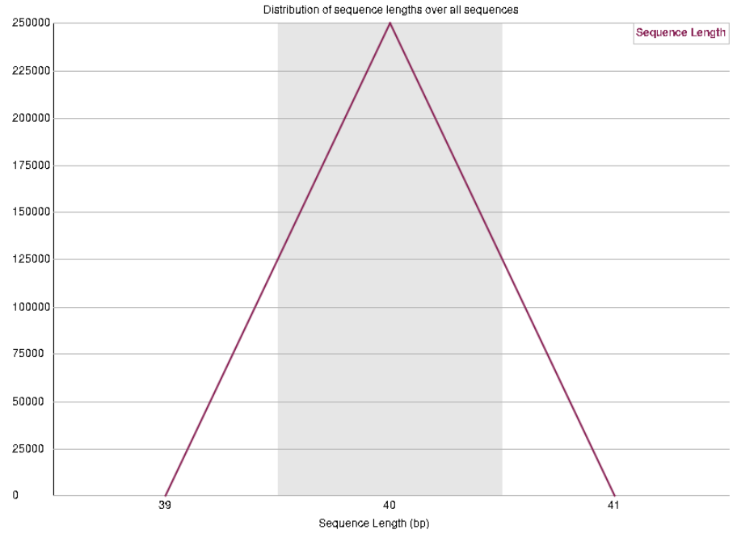  
Warning Module[11]:  
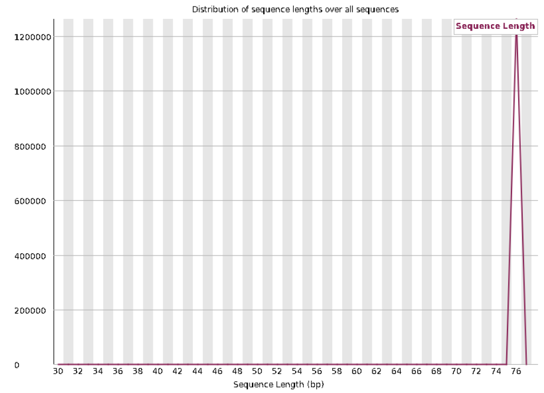  

**Warning**: issued if not all sequences are the same length.

**Failure**: issued if any sequences have zero length [2].

### 9) Sequence Duplication Levels
This module takes the degree of duplication for every sequence in the library and plots the relative number of sequences [1].

Sequence duplication is an indication of the complexity of a library. Low levels of duplication indicate high coverage of the target sequences, which is ideal. High levels of duplication can indicate enrichment biases such as PCR over-amplification. For pilot experiments, this might prompt our sequencing pipeline in the future [3]. 

In some cases, particular transcripts may be abundant in the library, which would produce high duplication levels but is an expected case [4].

Passing Module[8]:  
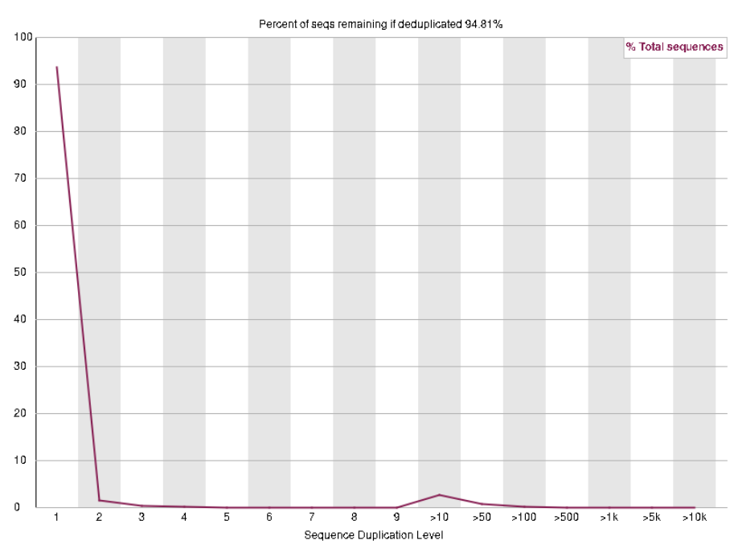  
Failing Module[11]:  
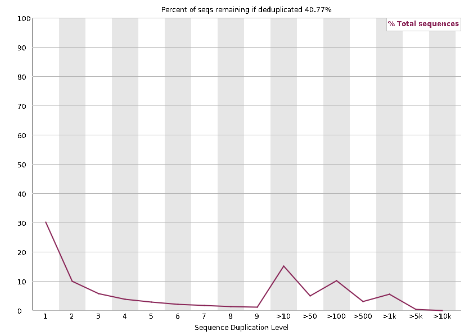  

**Warning**: issued if non-unique sequences make up > 20% of all sequences.

**Failure**: issued if non-unique sequences make up > 50% of all sequences [2].

### 10) Overrepresented Sequences
A normal library contains a diverse set of sequences, where no individual sequence comprises more than a small fraction of the library. If a sequence is overrepresented, this indicates that either it is either highly significant, the library is contaminated, or the library is not very diverse.

Because sequences are listed with possible sources, contaminators, such as adapter or vector sequences, are identified as such. If there is no source listed, BLAST can be used to determine sequence identity.

Mapping tools such as STAR, which are used later in the RNA-seq analysis pipeline, are able to account for adapter and vector contamination, so these are generally not a concern [3].

Warning Module[7]:  
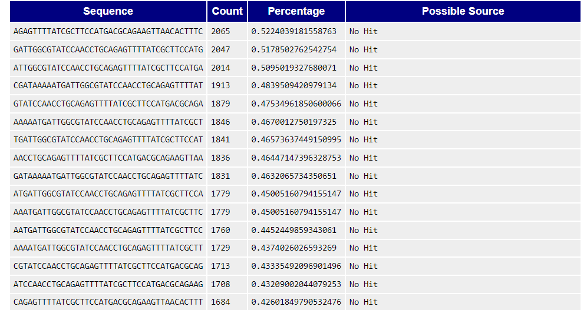  

**Warning**: issued if any sequence represents ≥ 0.1% of all total sequences.

**Failure**: issued if any sequence represents ≥ 1% of all total sequences [2].

### 11) Adapter Content
This module plots the fraction of reads where an adapter sequence has been identified at that base position.

For any one particular sequence analyzed, once an adapter is identified, it is considered as present in all bases from there to the end of the read [1].

Ideally, there should be no adapters present in the data. However, sometimes when working with long read lengths, inserts shorter than the read length have read-throughs to the adapter at 3’ end. If adapter content is present and constant throughout the length of the read, this indicates adapter dimer contamination [4].

Passing Module[8]:  
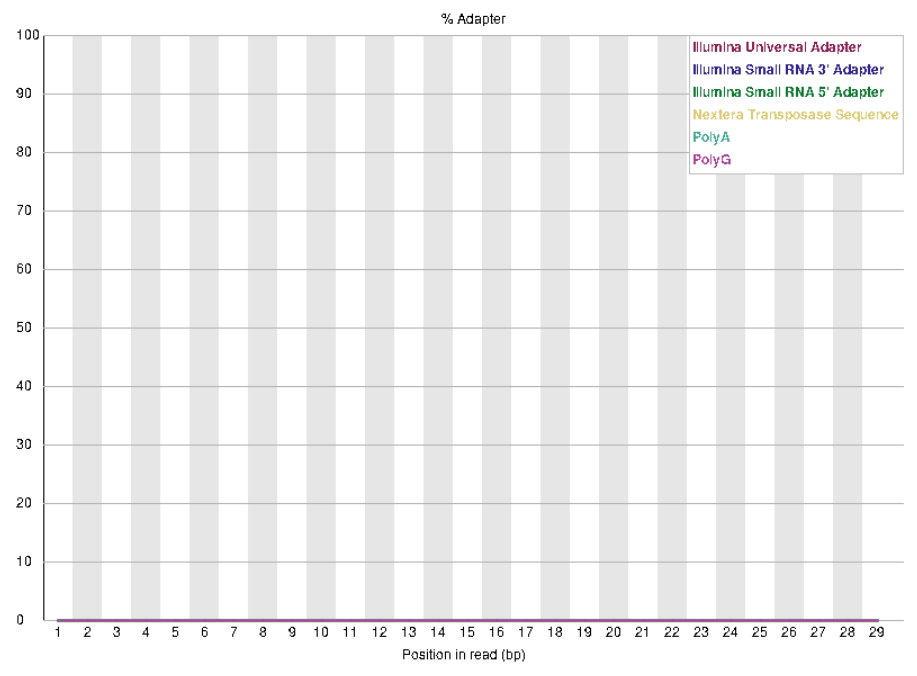  
Passing Module with Long Reads[4]:  
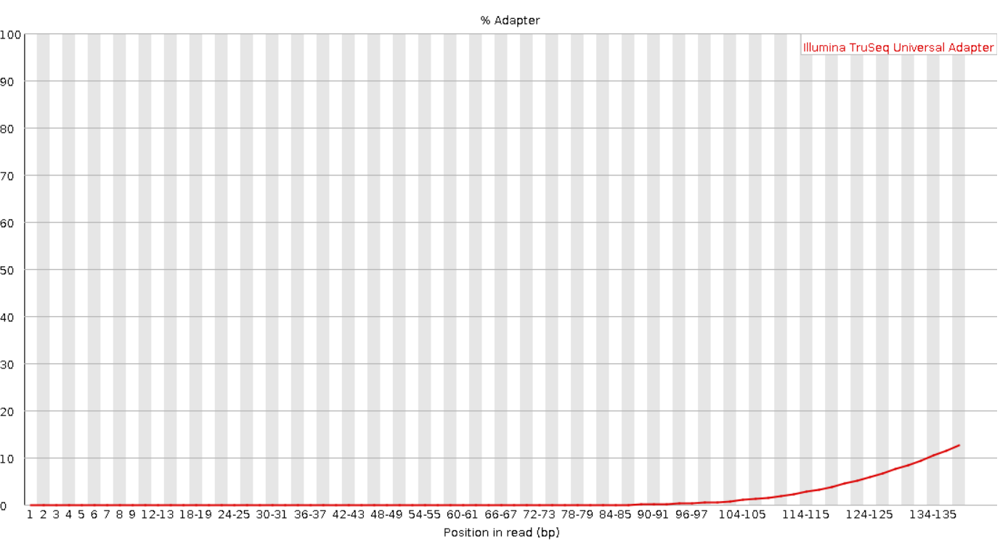  
Adapter Dimer Contaminated Module[4]:  
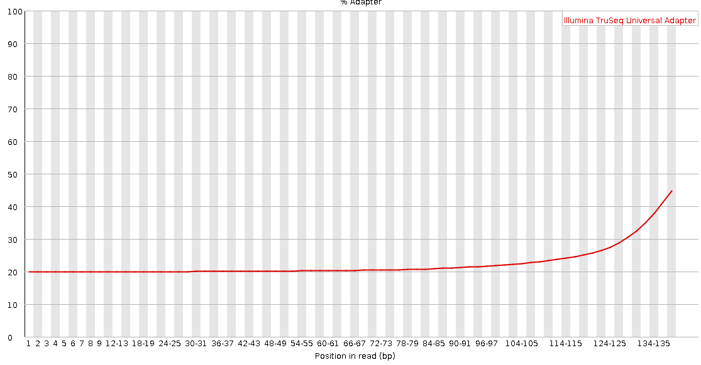  

**Warning**: issued if any sequence is present in > 5% of all sequences.

**Failure**: issued if any sequence is present in > 10% of all reads [1].

## 35.3 Conclusion
Looking over the FASTQC report, we can identify possible problems with our data such as:
- Poor and failed sequencing
	- Quality that drops off evenly over the course of a run
	- Poor quality which only affects a subset of sequences
	- Poor quality which affects a run
- Base call bias
	- Biases affecting the whole run
	- Biases affecting certain base positions
- Sample contamination via  
	- Primer/Adapters
	- Repeats
	- Ribosomal RNA  

[12]   

In general, FASTQC reports simple quality control checks to ensure that there are no problems with the raw data, as these may affect the ability to draw biological conclustions from the data later in the RNA-seq analysis pipeline[1].  

# References
[1] Babraham Bioinformatics. Index of /projects/fastqc/Help/3 Analysis Modules. https://www.bioinformatics.babraham.ac.uk/projects/fastqc/Help/3%20Analysis%20Modules/  
[2] University of Missouri. FASTQC_Manual. https://dnacore.missouri.edu/PDF/FastQC_Manual.pdf  
[3] Hbctraining. Introduction to RNA-seq. https://hbctraining.github.io/Intro-to-rnaseq-hpc-salmon/lessons/qc_fastqc_assessment.html  
[4] Michigan State University. FASTQC Tutorial & FAQ. https://rtsf.natsci.msu.edu/genomics/technical-documents/fastqc-tutorial-and-faq.aspx  
[5] Babraham Bioinformatics. FASTQC. https://www.bioinformatics.babraham.ac.uk/projects/fastqc/  
[6] https://bioinformaticshome.com/tools/rna-seq/descriptions/PRINSEQ.html#gsc.tab=0  
[7] Babraham Bioinformatics. (2023, May 18). FASTQC Report: bad_sequence.txt. https://www.bioinformatics.babraham.ac.uk/projects/fastqc/bad_sequence_fastqc.html  
[8] Babraham Bioinformatics. (2023, May 18). FASTQC Report: good_sequence_short.txt. https://www.bioinformatics.babraham.ac.uk/projects/fastqc/good_sequence_short_fastqc.html   
[9] Wikipedia. Phred quality score. https://en.wikipedia.org/wiki/Phred_quality_score  
[10] Sheikh, M.A., Erlich, Y. (2012). Base-Calling for Bioinformaticians. In: Rodríguez-Ezpeleta, N., Hackenberg, M., Aransay, A. (eds) Bioinformatics for High Throughput Sequencing. Springer, New York, NY. https://doi.org/10.1007/978-1-4614-0782-9_5  
[11] Romero, Natsuki. FASTQC Report: ERR188044_chrX_1.fastq. file:///C:/Users/natsuki/Documents/BENG%20183/HW3/fastqc/ERR188044_chrX_1_fastqc.html  
[12] Bioinfo-Core. (2010 October 28). Assessing Sequence Quality Data. http://bioinfo-core.org/index.php/9th_Discussion-28_October_2010#The_type_of_problems_which_occur_during_sequencing_experiments  
[13] https://bioinformaticshome.com/tools/rna-seq/descriptions/PRINSEQ.html#gsc.tab=0  