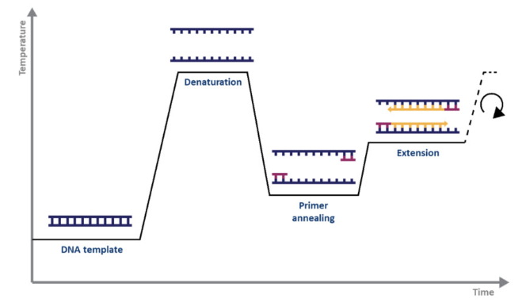
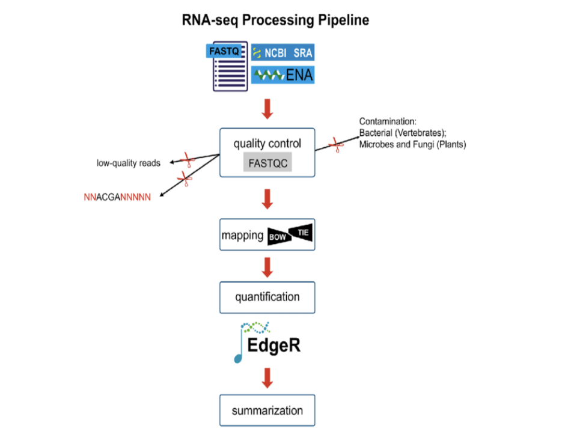
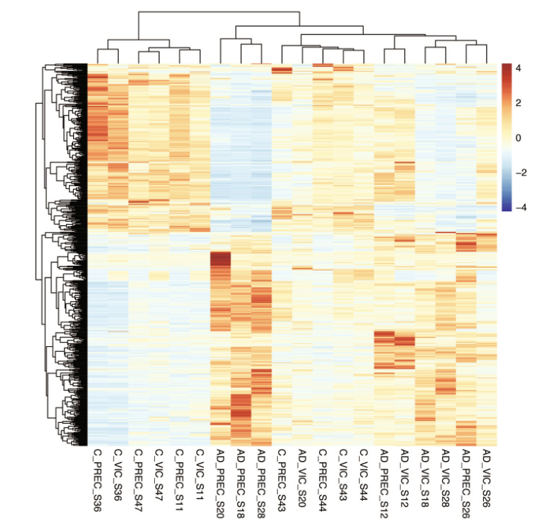
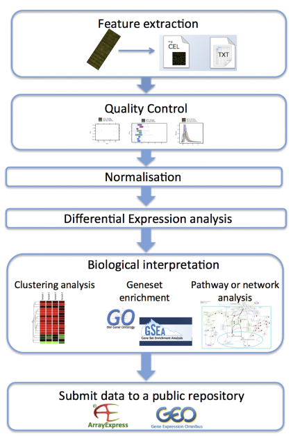
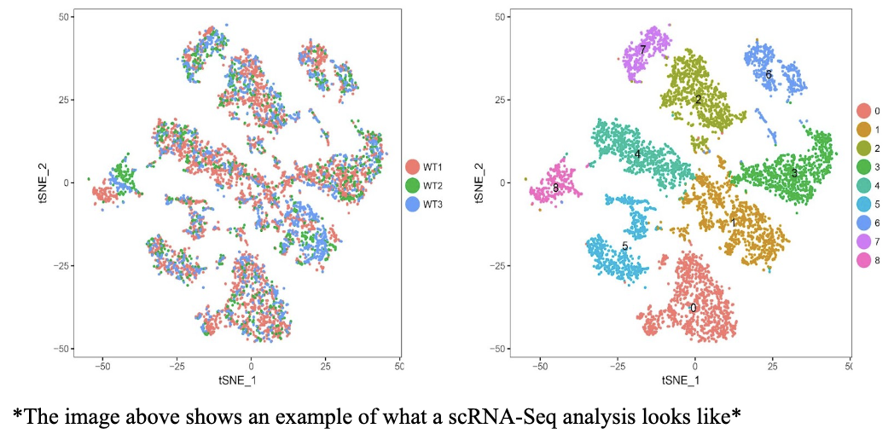

# Quantification of Gene Expression In Disease States

## Overview
You are the Principal Investigator at a distinguished immuno-oncology lab at UCSD. You and your team hope to discover the cause for a rare type of non-small cell lung cancer. With the support of a clinical collaborator, you obtain blood samples from normal, healthy volunteers as well as samples from patients who suffer from this rare cancer. You hope to identify genes that could be causing this disease, and lead the efforts in developing novel therapeutics to help treat, or even cure the cancer. One potential way to explore this, is to look at differentially expressed genes between the healthy and diseased patients. Differentially expressed genes are statistically relevant differences between the same gene in different groups, or under different conditions. Genes can be differentially expressed in many benign situations simply due to natural genetic variability, or in non-life threatening situations, like between a person with a cold and someone without. But, in some cases, these differentially expressed genes can provide extremely important information about how diseases come about and how they progress. 
To identify these differentially expressed genes, there are a few techniques that can be used. To name a few, RT-qPCR, microarrays, and RNA-sequencing are tools that we will discuss in this paper. We will explain how all of these techniques can be extremely useful in identifying key changes in certain genes between our healthy and diseased samples.  

## Techniques of the Quantification
There are three main techniques that help us in quantifying gene expression. They are Reverse-Transcription (or Real-Time) PCR, Microarrays, and RNA Sequencing. 

In this tutorial you're gonna learn:
1. RT-QPCR
2. Microarrays
3. RNA-Seq
4. How all these are used in detecting differential gene expression in diseases?

    

## 1) RT-qPCR:
RT-qPCR stands for reverse transcription, quantitative polymerase chain reaction. Also called real time qPCR because you can monitor the amplification in real time.

RT-qPCR aims to quantify the amount of specific RNA in a sample. It, first, takes our RNA template and turns it into complementary DNA (cDNA) via reverse transcription and marks it with fluorescent probes, which ultimately allow quantification during the PCR process. The traditional process of PCR takes place with temperature fluctuations to denature the cDNA, add primers, and replicate. Overall, the process is a sensitive technique that enables the reliable detection and measurement of products generated during each cycle of the PCR process.

RT-qPCR is a great tool to use in the detection of genes we know and are interested in studying. qPCR is generally not a good exploratory technique, because the process is reliant on primers made specifically for the specific DNA strand we are looking for, in order to amplify it. Although we can not easily discover new genes with RT-qPCR, the technique is extremely good at detecting changes in our gene or genes of interest between two groups. 

If we were interested in studying Gene X, because of its involvement in other cancers, we could easily, quickly, and cheaply run qPCR on our clinical samples to amplify this gene. We would be able to identify whether the gene was differentially expressed in a matter of hours. 

### The Steps of RT-qPCR:

### Process of Polymerase Chain Reaction: 

The process of fluctuating temperature to induce denaturation of the template into single strands and then, the annealing of DNA primers which allow the synthesis of a new strand. This temperature fluctuation process repeats over thousands of cycles to amplify our gene of interest. 

## 2) Microarrays:

Microarrays are a common tool that is used for studying gene expression as well. A microarray chip is a collection of microscopic dots in which DNA is arranged and attached to a solid surface or membrane. Due to its high throughput its widely applied in gene expression analysis. 
We can use microarrays using microarray chips to detect differentially expressed genes through three simple steps.
- Sample Prep: We first start out with prepping the sample by taking mRNA from twoo sample: experimental sample and a reference sample. They are then converted into cDNA and labeled with fluorescent probes of different colors.
- Hybridization: The next step is to take the cDNA from the previous step and mix it. Then we let it bind to the probes on the microarray chip. 
- Detection: The last step is detecting how each gene was expressed on the chip. To do this we scan the microarray chip. The spot on the microarray appears red if the expression of a particular gene is higher in the experimental compared to the reference. The color varies from green to yellow depending on the level of expression. 

Specifically when using microarray data in differential expression we like to take a large set of gene expression values. They are usually from two samples one from a control and one from autoimmune/genetic diseases and when completed we can see each gene’s expression levl represented in the two different states, either healthy or diseased in our case. We can represent the dat in the form of a heatmp, where we have each row representing a gene and then each column would be a sample. Just like with the actual chip, the heatmap will have different colors to represent the expression level of each gene. 

## 3) RNA-Sequencing:

RNA sequencing is one of the most common tools to study gene expression. The diagram above gives a quick overview of the pipeline most generally used in RNA-seq. We take raw data from databases like NCBI and it usually goes through quality control steps using FASTQC. This helps us remove low-quality reads and contamination. The next step would be to align it to a reference genome which can be done using a tool like Bowtie. Next comes the quantification step using aa tool called EdgeR. The last step would just be some summarization to help in the interpretation of the gene expression levels. 
RNA-Seq helps us get a whole view of the transcriptome because it uses high-throughput sequencing to analyze all the RNA transcripts in a cell. It is much more detailed and gives us a more detailed and quantitative view of gene expression. It has quite reevolutionized transcriptomics because it enables precise measurements of transcript levels and the identification of novel transcript isoforms and features without needing too much prior knowledge. 

RNA sequencing is especially useful in helping us identify genes tht are differentially expressed in neurodegenerative disease research. Just like microarrays we can use heatmaps to interpret the different levels of gene expression. Above is an example of a heatmap. We can see that there are different levels of gene expression in the different colors we see throughout the map. 
To interpret the read counts and differential expression we must us statistical methods to discover quantitative changes in gene expression levels between the two groups we are testing. One of the outputs we get from RNA-seq is count data. This count data is the number of sequence reads that came from a particular gene. The more reads we have that come with that gene the more expression we have from it. It indicates a higher level of expression of that gene from that sample. This is what differential expression is and can help us see what the difference between the two samples may be. 

## 4) Challenges and Considerations:
Quantification of gene quantification faces various technical challenges. These challenges include the quality of our sample, data variability, and the need for appropriate controls. In RNA-Seq, sample quality and data variability can affect the detection of true biological signals. In qPCR, the selection of stable reference genes and proper normalization are critical for accurate gene expression analysis. One of the challenges of having the appropriate controls, specifically in disease states, is choosing the right endogenous control gene for gene expression analysis such as in real-time PCR. It’s difficult to predict how a gene will behave under different experimental conditions, and the most stable control genes across these conditions need to be identified. Another challenge is in genetic manipulation. There are still challenges in accurately targeting the correct gene and in inducing the transcription-control system with specific small molecules. This is specifically important when studying the role of genes in disease states because off-target effects and unintended consequences of genetic manipulation need to be carefully considered. 

There are many methods to address or overcome these challenges. This includes careful experimental design, quality control measures, and the use of appropriate data analysis methods. In RNA-Seq, addressing sample quality and data variability is very important and crucial. Rigorous sample preparation techniques, quality control assessments, and the use of statistical methods to account for data variability, are required to overcome these challenges. In qPCR, to overcome the challenge of selecting stable reference genes is through careful validation of candidate genes across different experimental conditions. It is very important to evaluate several candidate genes to identify the most appropriate controls for specific experimental variables, especially in disease states. Some examples of data analysis methods that scientists can use to address or overcome these challenges include: Supervised and Unsupervised data analysis - this can be used to predict gene function classes and cancer classification; differential expression analysis - commonly used for RNA-sequencing data to identify genes that are differentially expressed between different sample type; and data reduction - reduce the complexity of datasets to a manageable size, making it easier to understand and eliminating inherent noise. 

## 5) What does the future look like? 
There are emerging technologies to improve the quantification of gene expression even further. One of them is single-cell RNA seq. Single-cell RNA sequencing (scRNA-seq) technologies enable the dissection of gene expression at single-cell resolution, which provides new and more advanced opportunities for exploring gene expression profiles. There have now been scRNA-seq protocols proposed such as cell isolation, lysis, reverse transcription, and amplification. These technologies have facilitated the understanding of dynamic gene expression at the single-cell level. There are computational analysis pipelines that can be used for analyzing scRNA-seq data. This allows for the identification of complex and rare cell populations. They function to uncover regulatory relationships between genes and track the trajectories of distinct cell lineages in development. Advancements in RNA-Seq (including single-cell and long-read sequencing) are predicted to significantly impact disease research. These methods offer enhanced resolution and the ability to capture rare cell populations. From here scientists can gain a deeper understanding into the mechanisms of the disease. Additionally, improvements in data processing and analysis are expected to make these techniques more routine and cost-effective for labs. This makes the improvements more scalable and realistic for a better understanding of disease pathogenesis and the development of more targeted therapies. 

## 6) Conclusion
The quantification of gene expression and its methods such as qPCR, Microarrays, and RNA-Seq has been a groundbreaking foundation for the study of genetics, especially in regards to disease states. These technologies have transformed our understanding of disease pathogenesis in the way that it allows for precise measurement of gene expression levels and the identification of therapeutic targets. This development is leading and still developing to significantly impact patient care and improve the quality of life. In the context of disease states and looking deeper into their mechanisms, quantification of gene expression has been a groundbreaking contribution for the advancements of human health, providing such major information and identification of disease states and essentially therapies for them.

## 6) Citations

1) [A beginner’s guide to RT-PCR, qPCR and RT-qPCR](https://portlandpress.com/biochemist/article/42/3/48/225280/A-beginner-s-guide-to-RT-PCR-qPCR-and-RT-qPCR)

2) [RNA sequencing role and application in clinical diagnostic](https://www.ncbi.nlm.nih.gov/pmc/articles/PMC8960934/)

3) [Translating RNA sequencing into clinical diagnostics: opportunities and challenges](https://www.nature.com/articles/nrg.2016.10)

4) [What are the differences between PCR, RT-PCR, qPCR, and RT-qPCR?](https://www.enzolifesciences.com/science-center/technotes/2017/march/what-are-the-differences-between-pcr-rt-pcr-qpcr-and-rt-qpcr?/)

5) [Revisiting Global Gene Expression Analysis](https://www.ncbi.nlm.nih.gov/pmc/articles/PMC3505597/)

6) [Statistical methods for identifying differentially expressed genes in RNA-Seq experiments](https://cellandbioscience.biomedcentral.com/articles/10.1186/2045-3701-2-26)
