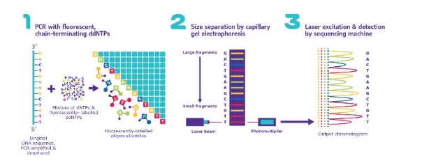
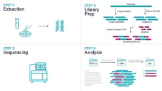
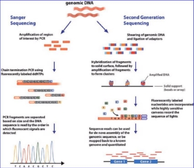
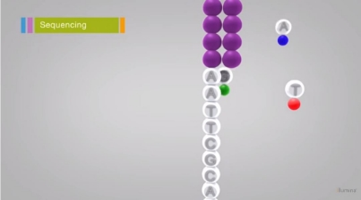
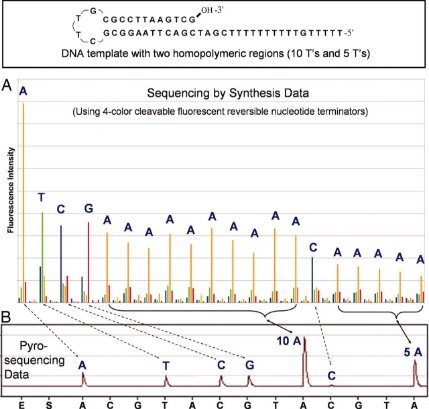

Automation of Sanger Sequencing & Sequencing by DNA Synthesis By Lenny Lei, Owen Guan, Yi Qie

1. **DNA Sequencing![ref1]**
- DNA sequencing is the process that deciphers the exact order of the nucleotides in a given sequence of genome. The deciphering of the order allows us to comprehend unique genetic information that are encoded in organisms which is akin to reading the intricate of life and the underlie of biological functions and diversity.
2. **DNA Synthesis![ref1]**
- DNA synthesis is the artificial or natural creation of new strands of DNA. In laboratory settings, researchers create specific segments of the DNA for targeted study in many fields which provides scientists with power to manipulate and engineer genetic information for a wide range of purposes.
- Oligonucleotide Synthesis: assemble of short sequences of nucleotides
- Column Based Oligonucleotide Synthesis: sequential coupling of nucleotide onto a solid support matrix
- Microarray-based Oligonucleotide Synthesis: parallel synthesis on a solid support surface at predefined locations
3. **Sanger Sequencing![ref1]**
- A DNA decoding technique developed by Frederick Sanger in 1977. This technique harnesses DNA replication and a chain termination strategy. The uniqueness of this technique is that during the replication process, the introduction of modified nucleotides (ddNTPS) halts the replication process. Through introduction of ddNTPS and gel electrophoresis to separate DNA fragments based on mass, Sanger Sequencing enables precise determination of the sequence.

4. **Next-Gen Sequencing (NGS)![ref1]**
- NGS enables rapid and cost-effective sequencing of DNA and RNA.
- The process begins with library preparation, involving the extraction and fragmentation of genetic material, followed by the ligation of sequencing adapters and PCR amplification.
- NGS platforms are capable of sequencing millions of DNA fragments simultaneously which provides a comprehensive view of the genome.
- NGS has applications in diverse areas.
- NGS accelerates genomic studies and paving the way for personalized medicine by using individual genetic information

 

5. **Why did Next-Gen Sequencing Replace Sanger?![ref1]**
- Due to the amount of fragments of sequencing, Sanger sequencing cost can increase with the increase in the length of the DNA where NGS is more cost effective in the situation.
- NGS can sequence multiple fragments in parallel thus greatly decreasing the time it takes to sequence the genome
- NGS generates massive amounts of data which provides a more comprehensive view
- NGS is more flexible as it can be used for various purposes where Sanger is more limited

6. **Advantages and Disadvantages of Sanger vs Next-Generation Sequencing**

||Sanger|Next-Generation Sequencing|
| :- | - | - |
|Advantages|Quickest and cheapest for targets with low numbers (1-20)|
Up to 1% sensitivity due to more sequencing depth

Better sample throughput Larger discovery power

More data generation with the same input of DNA

Higher mutation resolution
|
|Disadvantages|
Low sensitivity with a detection limit ~15-20%

Bad scalability with increasing sample input

Lower discovery power

Cost-inefficient for targets with higher numbers (>20)
|
More expensive for targets with low numbers (1-20)

Time-inefficient for targets with low numbers
|

[4]

7. **Illumina NGS Sequencing![ref1]**
- Illumina NGS varies from Sanger chain-termination by the use of sequencing by synthesis technology
- DNA chain copying occurs at the same time as labeled nucleotides are tracked
- Illumina sequencing generates extensive DNA sequencing data at a much cheaper and faster rate compared to Sanger
- Illumina sequencing can output 300kb to a few TB worth of data output in a single run depending on how it is prepared
- Illumina NGS steps can be laid out as follows:
1. DNA Library Preparation-fragmentation of DNA after extraction, with an adapter added to each fragment facilitates sequencing and amplification.
1. DNA amplification-*flow cells* attach to DNA fragments and are amplified to create DNA fragment clusters.
1. Sequencing by Synthesis-reverse terminators are used to fluorescently add labeled nucleotides to clusters/
1. Image Analysis-Images of each signal is captured by a camera to record each signal which determines the sequences (measured by intensity).
1. Base Calling-the fluorescent signal translate into DNA sequences and is stored in numerous short reads during each cycle
1. DNA sequencing analysis-DNA alignment with a reference genome or a *de novo* sequence assembly is conducted to remake the sequence and the DNA is sequenced for analysis.

[5]

8. **Nanopore Sequencing![ref2]**
- Nanopore sequencing is a type of technology enabling analysis of long DNA and RNA fragments by analyzing changes in electrical current when nucleic acids pass through a protein nanopore.
  - Nanopore-based devices, offering single-molecule detection, allow for high-throughput analysis of nucleic acids without amplification or labeling. These devices, capable of processing kilobase length polymers, reflect the native order of nucleobases in the detected signal sequence. Advances in nanopore technology have led to improved accuracy, read length, and throughput in sequencing DNA and RNA. These advancements are instrumental in genome assembly, transcript detection, and base modification analysis, with potential applications in clinical diagnoses and outbreak surveillance. Continuous development in nanopore technology, base-calling methods, and tailored experimental protocols promise further enhancements in data quality and analytical capabilities. [6], [7]
- Resolves variations in complex structures and repetitive regions
- Upon the research area of detecting structural variants, Stancu et al expand the advantages of nanopore sequencing. They explore the use of the MinION nanopore sequencer for detecting and understanding structural variations (SVs) in human genomes. It highlights the limitations

  of short-read sequencing in identifying complex SVs, such as chromothripsis rearrangements. The study demonstrates nanopore sequencing's effectiveness in detecting de novo SVs and phasing genetic variations in patients with congenital abnormalities. It also reveals that nanopore sequencing can uncover novel variants missed by short-read methods. This research suggests a significant potential for nanopore sequencing in clinical and research applications, especially for complex genomic rearrangements. [8]

- Sequences whole microbial genomes in a single read
  - Over the past decade, next-generation sequencing (NGS), particularly metagenomic sequencing, has become vital in microbial research and clinical diagnostics. This technique enables the detection of a wide range of microbes, including rare pathogens, from small clinical samples. It has shown effectiveness in diagnosing infections from primarily sterile materials like cerebrospinal, joint, and ocular fluids [9]. Nanopore sequencing, a new-generation technology, stands out in metagenomic research for its rapid library preparation and real-time analysis capabilities, significantly reducing turnaround time. This method has proven effective in identifying pathogens quickly and sensitively in various infectious diseases, including bacterial meningitis and pneumonia.
- Simplifies de novo assembly
- One example of illustrating the de novo assembly by nanopore sequencing is the study done by Schmidt et al. Their study details the sequencing of the S. pennellii LYC1722 genome using Oxford Nanopore long reads, enhanced by Illumina short reads for refinement. The achieved genome assembly was of similar or superior quality compared to the Illumina-based LA716 assembly, as indicated by genome contiguity, genic completeness, and other quality metrics. This high-quality genome enabled comparisons of gene content within and across species. Additionally, the use of Oxford Nanopore data facilitated unique analyses, such as the direct measurement of methylation. [10]
- Improves existing reference genomes
- Nanopore sequencing significantly improves the accuracy and quality of existing reference genomes, contributing to more reliable genomic databases.

[11]

9. **Identifying DNA methylation![ref1]**
- DNA methylation, a critical process in epigenetics, involves the addition of a methyl group to the DNA molecule, typically at the 5th carbon of the cytosine ring.
- DNA methylation regulates gene expression by recruiting proteins involved in gene repression or by inhibiting the binding of transcription factor(s) to DNA. During development, the pattern of DNA methylation in the genome changes as a result of a dynamic process involving both de novo DNA methylation and demethylation. As a consequence, differentiated cells develop a stable and unique DNA methylation pattern that regulates tissue-specific gene transcription.
- Reported in literature, DNA methylation regulation is vital for cognitive function and that its alteration can lead to mental impairment. Temporal

  regulation of these processes influences the differentiation of neural progenitor cells into neurons and astrocytes. The review article by Moore et al highlights the involvement of specific DNA methyltransferases (Dnmts) in regulating gene expression during neural development, particularly in the context of the Gfap gene promoter, and touches upon the involvement of methyl-binding proteins like MeCP2 in neuronal development and function, relating these processes to neurological and psychiatric disorders. [12]

- In Sanger sequencing, DNA methylation can be identified by bisulfite sequencing, where unmethylated cytosines are converted to uracil and subsequently to thymine during PCR, whereas methylated cytosines remain unchanged.
  - Pyrosequencing, methylation-specific PCR, and Sanger sequencing of bisulfite-treated DNA are commonly used for analyzing specific DNA regions, like a gene's promoter or a CpG island. These techniques depend on bisulfite conversion, which changes unmethylated cytosines to uracils, while methylated cytosines stay unchanged. In PCR, uracils are replaced by thymines, allowing the detection of methylation differences as variations in base sequences. [13], [14]
  - Bisulfite Amplicon Sequencing (BSAS) is a method for analyzing DNA methylation in specific genomic regions. This technique involves bisulfite conversion and PCR amplification before next-generation sequencing, providing detailed methylation quantitation at the base level. It addresses limitations of previous methods by offering high throughput and quantitative accuracy. BSAS can be applied to various genomic regions and is valuable in research studies for both hypothesis testing and confirming genome-wide methylation analyses findings. [15]
- This conversion creates a difference in the sequence compared to the original, unmethylated DNA, allowing for the detection and mapping of methylation patterns.
- The article "The Behaviour of 5-Hydroxymethylcytosine in Bisulfite Sequencing'' investigates how 5-hydroxymethylcytosine (5-hmC) behaves in bisulfite sequencing, a technique used to map DNA methylation. The study reveals that bisulfite treatment converts 5-hmC into cytosine 5-methanesulfonate (CMS), but does not cause deamination to uracil, making 5-hmC indistinguishable from 5-methylcytosine (5-mC) in bisulfite sequencing. This suggests that regions rich in 5-hmC could be underrepresented in methylation analyses, as CMS tends to inhibit DNA polymerase during PCR amplification. This has implications for understanding DNA methylation patterns, particularly in embryonic stem cells and neurons, where 5-hmC is prevalent. [16]

[16]

10. **Sequencing by Synthesis(SBS)![ref2]**
- SBS is a widely-used method in next-generation sequencing technologies.
  - Ju et al discusses an innovative DNA sequencing method where DNA is sequenced on a solid surface using polymerase reaction. This method involves modifying the four DNA nucleotides (A, C, G, T) by adding a cleavable fluorophore and capping the 3′-OH group with a reversible moiety. The addition of an allyl group allows these modified nucleotides to be used as reversible terminators in sequencing by synthesis (SBS). During the sequencing process, the fluorophore and 3′-O-allyl group are simultaneously removed, enabling the continuation of the polymerase reaction. This efficient sequencing method was successfully tested on DNA templates with homopolymer regions using a DNA chip and a four-color fluorescent scanner. [17]
- It involves synthesizing a complementary DNA strand and sequentially identifying the incorporated bases.
- SBS technologies, like Illumina sequencing, use reversible terminator-based methods, where fluorescently-labeled nucleotides are added, imaged, and then the label and terminator are removed, allowing for the next cycle of nucleotide addition.
- The DNA sequencing by synthesis (SBS) method is a promising new sequencing technology, recently making significant advancements. This method typically involves three steps: first, incorporating fluorescently

  labeled nucleotide analogs; second, identifying each nucleotide based on its fluorescent emission; and third, removing the fluorescent marker to allow the sequencing process to continue. This account reviews the creation of a DNA-immobilized chip and the development of new nucleotide reporters for the SBS sequencing platform. [18]

[17]

[18]

11. **Sequencing by Synthesis(SBS)-Chemistry and Engineering**
- The chemistry of SBS is intricate, involving engineered nucleotides that carry a removable![ref2] fluorescent label and a reversible terminator.
  - The work by Bainbridge et al presents a study that used massively parallel sequencing by synthesis to profile the transcriptome of LNCaP, a human prostate cancer cell line. The researchers generated approximately 20 megabases of EST data, identifying transcription from over 10,000 gene loci, 25 previously undescribed alternative splicing events, and over 1,500 high-quality single nucleotide discrepancies with the reference human sequence. The study also detected nearly 10,000 ESTs in genome regions with no predicted transcription. The findings highlight the utility of sequencing by synthesis in transcript profiling, discovering novel transcripts and variants, and understanding disease states. The study suggests that this technology could be pivotal in discovering new disease treatment targets. [19]
- The engineering aspect includes designing and calibrating high-throughput sequencing instruments capable of accurately detecting the fluorescent signals emitted by labeled nucleotides.
- Brockman et al describe advancements in DNA sequencing technologies, specifically sequencing-by-synthesis (SBS), and their application in polymorphism detection. It focuses on data from the Roche (454) Genome Sequencer 20, detailing methods for improving quality scores and automated polymorphism detection. The researchers developed base-specific error predictors and an improved quality score system, proving more effective than existing system software. They also created a SNP detection method evaluated on known-truth datasets, demonstrating high specificity and accuracy, particularly in high-coverage data, with no false positives in a 215 kb genomic segment.[20]
- This process requires precise control and synchronization of chemical reactions, imaging, and data processing to ensure high accuracy and throughput in DNA sequencing.
- Turcatti et al describe the development and testing of a new family of 3′-OH unprotected cleavable fluorescent 2′-deoxynucleotides for high-throughput DNA sequencing by synthesis (SBS). This research introduces modified nucleotides with a cleavable disulfide Alexa Fluor® 594 dye, evaluated for their ability to act as reversible terminators in DNA SBS. The method, tested on solid-phase immobilized synthetic DNA and DNA polymerized colonies or clusters, enables a binary read-out (signal-no signal) with each addition of a labeled nucleotide, promising advancements in DNA sequencing techniques.[21]
12. **References**
1. AD;, H. R. (n.d.). *Synthetic DNA synthesis and assembly: Putting the synthetic in Synthetic Biology*. Cold Spring Harbor perspectives in biology. https://pubmed.ncbi.nlm.nih.gov/28049645/
1. *DNA sequencing fact sheet*. Genome.gov. (n.d.). https://www.genome.gov/about-genomics/fact-sheets/DNA-Sequencing-Fact-Shee t#:~:text=What%20is%20DNA%20sequencing%3F,in%20a%20particular%20DNA %20segment
1. Sanger Sequencing Steps & Method. (n.d.). https://www.sigmaaldrich.com/US/en/technical-documents/protocol/genomics/sequ encing/sanger-sequencing
1. Illumina Inc. (n.d.). *DNA sequencing*. Oxford Nanopore Technologies. https://nanoporetech.com/pplications/dna-nanopore-sequencing
1. Illumina Inc. (n.d.). NGS vs. Sanger Sequencing. https://www.illumina.com/science/technology/next-generation-sequencing/ngs-vs-s anger-sequencing.html
1. Wang, Y., Zhao, Y., Bollas, A., Wang, Y., & Au, K. F. (2021). Nanopore sequencing technology, bioinformatics and applications. *Nature Biotechnology*, *39*(11), 1348–1365. https://doi.org/10.1038/s41587-021-01108-x
1. Branton, D., Deamer, D. W., Marziali, A., Bayley, H., Benner, S. A., Butler, T. J., Di Ventra, M., Garaj, S., Hibbs, A. D., Huang, X., Jovanovich, S., Krstić, P., Lindsay, S., Ling, X., Mastrangelo, C. H., Meller, A., Oliver, J. S., Pershin, Y. V., Ramsey, J. M., . . . Schloss, J. A. (2008). The potential and challenges of nanopore sequencing. *Nature Biotechnology*, *26*(10), 1146–1153. https://doi.org/10.1038/nbt.1495
1. Stancu, M. C., Van Roosmalen, M. J., Renkens, I., Nieboer, M. M., Middelkamp, S., De Ligt, J., Pregno, G., Giachino, D., Mandrile, G., Valle-Inclán, J. E., Korzelius, J., De Bruijn, E., Cuppen, E., Talkowski, M. E., Marschall, T., De Ridder, J., & Kloosterman, W. P. (2017). Mapping and phasing of structural variation in patient genomes using nanopore sequencing. *Nature Communications*, *8*(1). https://doi.org/10.1038/s41467-017-01343-4
9. Jun, K. I., Oh, B. L., Kim, N., Shin, J. Y., & Moon, J. (2021). Microbial diagnosis of endophthalmitis using nanopore amplicon sequencing. *International Journal of Medical Microbiology*, *311*(4), 151505. https://doi.org/10.1016/j.ijmm.2021.151505
9. Schmidt, M. H.-W. ., Vogel, A., Denton, A. K., Istace, B., Wormit, A., van de Geest, H., Bolger, M. E., Alseekh, S., Maß, J., Pfaff, C., Schurr, U., Chetelat, R., Maumus, F., Aury, J.-M., Koren, S., Fernie, A. R., Zamir, D., Bolger, A. M., & Usadel, B. (2017). De Novo Assembly of a New Solanum pennellii Accession Using Nanopore Sequencing. The Plant Cell, 29(10), 2336–2348. https://doi.org/10.1105/tpc.17.00521
9. Illumina, Inc. (n.d.). *Next-generation sequencing (NGS)*. Explore the technology. https://www.illumina.com/science/technology/next-generation-sequencing.html
9. Moore, L., Le, T. T., & Fan, G. (2012). DNA methylation and its basic function. *Neuropsychopharmacology*, *38*(1), 23–38. <https://doi.org/10.1038/npp.2012.112>
9. Mikeska, T., Bock, C., El‐Maarri, O., Hübner, A., Ehrentraut, D., Schramm, J., Felsberg, J., Kahl, P., Büttner, R., Pietsch, T., & Waha, A. (2007). Optimization of quantitative MGMT promoter methylation analysis using pyrosequencing and combined bisulfite restriction analysis. *The Journal of Molecular Diagnostics*, *9*(3), 368–381. <https://doi.org/10.2353/jmoldx.2007.060167>
9. Kreutz, M., Hochstein, N., Kaiser, J. N., Narz, F., & Peist, R. (2013). Pyrosequencing: powerful and quantitative sequencing technology. *Current Protocols in Molecular Biology*, *104*(1). https://doi.org/10.1002/0471142727.mb0715s104
9. Masser, D. R., Stanford, D. R., & Freeman, W. M. (2015). Targeted DNA methylation analysis by next-generation sequencing. *Journal of Visualized Experiments*, *96*. https://doi.org/10.3791/52488
9. Huang, Y., Pastor, W. A., Shen, Y., Tahiliani, M., Liu, D. R., & Rao, A. (2010). The behaviour of 5-Hydroxymethylcytosine in bisulfite sequencing. *PLOS ONE*, *5*(1), e8888. https://doi.org/10.1371/journal.pone.0008888
9. Ju, J., Kim, D. H., Bi, L., Meng, Q., Bai, X., Li, Z., Li, X., Marma, M. S., Shi, S., Wu, J., Edwards, J., Romu, A., & Turro, N. J. (2006). Four-color DNA sequencing by synthesis using cleavable fluorescent nucleotide reversible terminators. *Proceedings of the National Academy of Sciences of the United States of America*, *103*(52), 19635–19640. https://doi.org/10.1073/pnas.0609513103
18. Guo, J., Lin, Y., Turro, N. J., & Ju, J. (2010b). An integrated system for DNA sequencing by synthesis using novel nucleotide analogues. *Accounts of Chemical Research*, *43*(4), 551–563. https://doi.org/10.1021/ar900255c
18. Bainbridge, M. N., Warren, R. L., Hirst, M., Romanuik, T. L., Zeng, T., Go, A., Delaney, A., Griffith, M., Hickenbotham, M. T., Magrini, V., Mardis, E. R., Sadar, M. D., Siddiqui, A., Marra, M. A., & Jones, S. J. (2006). Analysis of the prostate cancer cell line LNCaP transcriptome using a sequencing-by-synthesis approach. *BMC Genomics*, *7*(1). https://doi.org/10.1186/1471-2164-7-246
18. Brockman, W. W., Álvarez, P., Young, S., Garber, M., Giannoukos, G., Lee, W. L., Russ, C., Lander, E. S., Nusbaum, C., & Jaffe, D. B. (2008). Quality scores and SNP detection in sequencing-by-synthesis systems. *Genome Research*, *18*(5), 763–770. https://doi.org/10.1101/gr.070227.107
18. Turcatti, G., Romieu, A., Fedurco, M., & Tairi, A. (2008). A new class of cleavable fluorescent nucleotides: synthesis and optimization as reversible terminators for DNA sequencing by synthesis †. *Nucleic Acids Research*, *36*(4), e25. https://doi.org/10.1093/nar/gkn021

[ref1]: Aspose.Words.604e79ec-8c47-4735-97ad-2557c6d5e1dd.001.png
[ref2]: Aspose.Words.604e79ec-8c47-4735-97ad-2557c6d5e1dd.008.png
