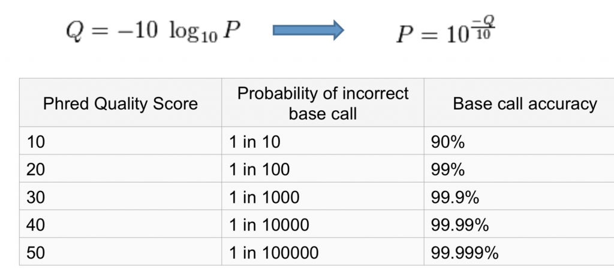
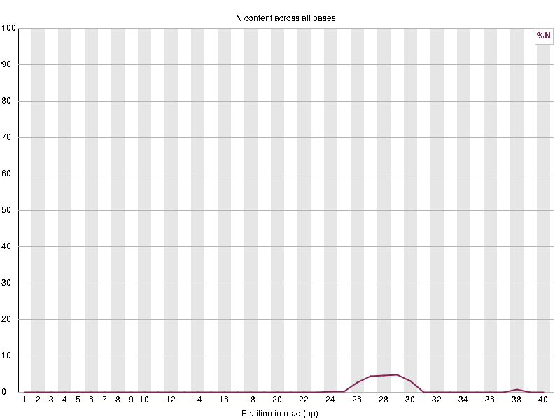
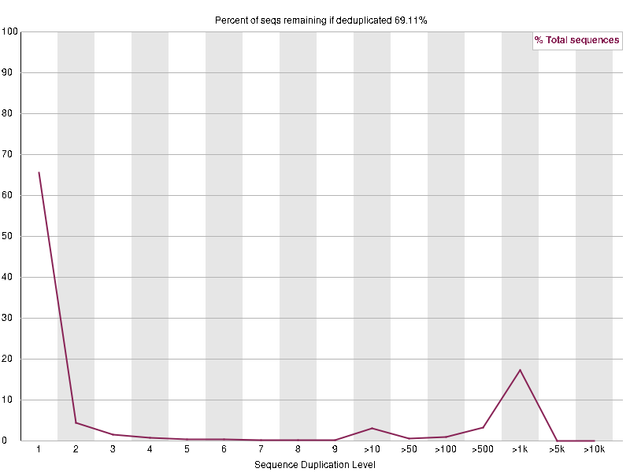
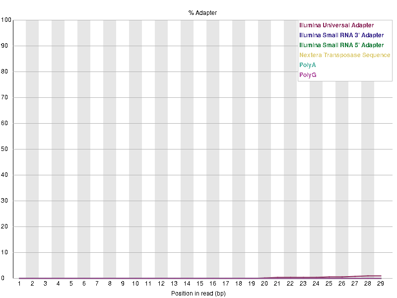
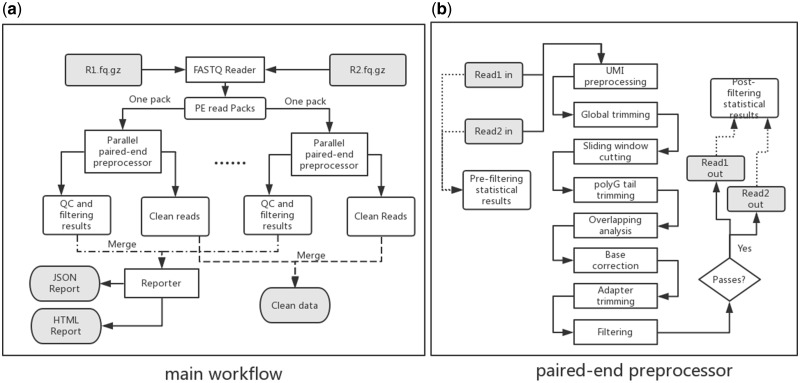
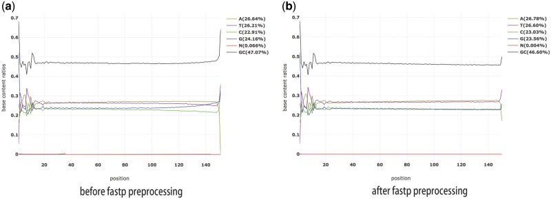
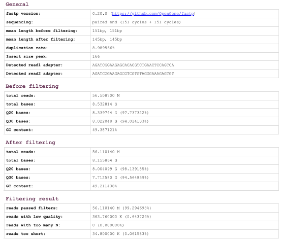

# RNA Sequencing: Quality Control for Raw Data 
   Maggie Ma, Nimrit Kaur, Zhirui Zhu:) 
# Table of Contents  
1. Overview of RNA-Sequencing Pipeline
2. Why Do We Need Quality Control for RNA-seq Data?
3. Raw Data
   
     a. Fastq file
   
     b. Phred Score
   
     c. Fastqc Report
4. Fastp Tool for RNA-seq Data Preprocessing

     a. Overview

     b. Workflow

     c. Result

5. References

## Overview of RNA-Sequencing Pipeline
Before exploring the process of quality control for raw data, we will go through a quick recap of the RNA-sequencing pipeline. The RNA-sequencing pipeline involves a few key parts - the first being obtaining and sequencing reads from a sample (NGS), getting a FASTQ file that we perform FASTQC or Adapter Trimming on to perform quality control checks and make sure the data is usable, splice-aware mapping to the genome and counting reads associated with genes, and finally using statistical tools to analyze and identify differentially expressed genes. These processes are illustrated in the diagrams below where the figure on the left shows the specifics of preparing and sequencing the sample, while the figure on the right illustrates the workflow described above.

        

## Why Quality Control? 
Why is quality control so important? Why do we need to perform checks on our RNA data before analyzing it? 
Think of the phrase: "Garbage in, garbage out" - if we do not have high quality data, we cannot make reasonable assumptions based on our data analysis.

 

There are four main components or reasons for the importance of quality control. The first is the assessment of RNA quality which determines the type of library preparation and sequencing parameters required. Degraded RNA means poor library quality, reduced complexity, inefficient sequencing, and may lead to missing/misrepresented splicing variants. 

The second component is raw read data - our fastq file - with critical parameters like GC content, N content, overrepresented sequences, adapter sequences, and K-mers. While the other parameters will be explored more later, let's look into overrepresented sequences specifically. Two possible cause for overrepresentation of a particular sequence are: (1) the sequence is highly biologically relevant (e.g. over expression of certain RNA because of a disease phenotype); and (2) the library is contaminated with sequences from adapters or other sources. These possible issues in the data highlight the need for quality control measures before bioinformatics applications in data analysis. 

The thrid component is alignment, which is the process used to determine the best location (with least mismatches) for each read to the reference genome in sequencing analysis. During raw data quality control, it is hard to detect the capture efficiency and non-adapter contamination. (Capture efficiency is measured as the percentage of total sequenced reads mapped to the intended target region.) One specific scenario is Multiple Best Alignment which happens when a read can be aligned equally well (with the least mismatches) to more than one location on the reference genome. This will inflate the aligned read number if we directly access counting reads from the SAM/BAM file. Essentially, improper alignment could result in misinterpreted data.  

The fourth and final component is gene expression analysis. The overall goal for the majority of RNA-seq studies is to compare gene expression from two or more groups. However, with many outliers, we cannot properly compare gene expression, making quality control a very useful tool and step in our workflow. 

# Raw Data

## FASTQ file

FASTQ is a data file format that is used to store sequencing data and quality scores. It is used to contain raw data generated from NGS sequencing technologies. So the RNA-seqencing data is usually contained in a FASTQ file.

Here is a sample FASTQ file:

In the FASTQ file, each read is consist of four lines. 
* The first line is the sequence header which starts with an "@" (not a ">")!.
  * From the leading "@" to the first whitespace character is considered as the sequence identifier, which consist information about the cluster and sequence run (like flow cell lane, flow cell ID, run ID, instrument name).
  * Then the contents after the first whitespace are the sequence description.
* The second line is the sequence or the base-calls in standard letter code (A, C, G, T, N).
* The third line starts with a "+" and can have the same sequence identifier after, but usually just simply a "+" as a separator.
* The fourth line are the quality scores (Phred quality score for the sequence, encoded in ASCII characters).

## Phred Score
Phred Quality Score or the Q score is measures the base call accuracy. It report the probability that the given base is called incorrectly by the sequencer. Phred score is logarithmically related to the base calling probabilities (formula shown below). So if a base is assigned a Phred or Q score of 20, it equal to the probability of an incorrect base call of 1 on 100 times or a 99% base call accuracy.

## FASTQC Report
The FASTQC tool can be used to generate a quality check report of the FASTQ file based on the reads. A sample command would be `$ fastqc file1.fastq file2.fastq`.
After gaining a quality check report of the file, the graphs and contents in the report can indicate how good the data is.
For example, here is a graph that indicate bad **Phred score** across all reads.

If the yellow boxes that represent the Phred scores of the bases lands in the green area (scores greater than 28), it means they had good quality calls. If the boxes lands in the red area (scores less than 20), it means they had bad quality calls. Greater Phred scores represent better base calls.

Here is a graph that represent the **N content** in the sequence.

If a sequencer cannot make a base call with sufficient confidence, then it normally substitute the base read with a N.
So it raise a warning if any position in reads have an N content > 5%. And it give an error if the N content is > 20%.
Significant or large proportions of Ns usually indicate a general loss of quality, so it may indicate bad data.
In the example graph above, most of the positions have N content under 5%. And only in a few position the N content is about 5%, which will raise a warning.

Below is a graph that represent the **duplication level** across sequences.

In a properly diverse library, most sequences should fall into the far left of the plot, which indicate low duplication level. A high duplication level is more likely to indicate some kind of enrichment bias or presence of low complexity contaminants that may tend to produce spikes to the right side of the plot. In the plot above, mores sequences are in the far left. But there is a spike in the right side, which indicate high duplication level for some sequences.

The plot below shows the **adapter content** in the data.

The adapter content module will be shown if there is a significant portion of the insert sizes smaller than the length of the reads in the library. It indicate that the sequences' adapters need to be trimmed before proceeding any downstream analysis like read alignments.
The graph will indicate a warning if any sequence is present in > 5% of all reads. And it will indicate an error if the adapter content is > 10% of all reads.
In the plot shown above, no warning or error would be raised because there's no adapter content(%) that is greater than 5% across all positions in read. So it indicate good data.

After gaining a quality check report to see whether some features of the data indicate good or bad, further trimming and cleaning of the data can be done to clean the data and increase its quality. An example tool that can be used to trim and apply quality control to data is FASTP.

# FASTP  

## FASTP Overview  
Fastp is a tool designed for preprocessing FASTQ files prior to downstream analysis. Its features include quality control, adapter trimming, quality filtering, per-read quality pruning and many other functions to provide clean data.  

## FAST Workflow  

### Main workflow:  
* Fastp parallelly process the input fastq files using multi-threading techniques to improve the efficiency.  
* It loads reads from FASTQ files and groups them into packs.  
* There is a one-on-one relationship between each pack of reads and the thread assigned to process it.  
  * In each thread, each read from the pack is processed.  
* Each thread operates independently to process its subset of reads and store reads’ statistical information in its own environment for later use.  
  * The information may include quality profiles and base content on a per-cycle basis as well as results from adapter trimming and k-mer counts.  
* After all the reads have been processed, their statistical information will be combined into one.  
* Fastp’s reporter will generate reports in both HTML (visualization) and JSON formats.  
  * Reports provide both pre-filtering and post-filtering statistical information for comparison purposes.  

### Paired-end processing workflow：
*	**UMI**(Unique Molecular Identifiers) preprocessing: Process data containing UMIs by shifting the UMI information to the read identifier. Using UMIs to identify and remove duplications as well as produce high-quality consensus reads via error correction.  
*	**Sliding window cutting**: As the window slide from either 5′end to 3′end or from 3′end to 5′, fastp evaluate the mean quality score within the window and remove low-quality bases in the head and tail of each read.  
*	**PolyG tail trimming**: Becasue Illumina NextSeq or NovaSeq use two-color chemistry to represent the four DNA bases, sequencers may misidentify some T and C as G. By determine the data sequencers using flow cell identifier, fastp automatically removes the polyG tail.  
*	**Base correction**: If fastp detects substantial overlap between one pair of reads, then it compares the bases within the overlapped region and performs a correction based on the read with high-quality score. Base correction is possible if the total number of mismatches is under a specified threshold.  
*	**Adapter trimming**: For both single-end and paired-end Illumina data, fastq can automatically detect and cut adapters.  
    * For single-end data: fastq checks the ends of the reads and identifying sequences that occur frequently across the first 1 million(default) reads as adapters.  
    * For paired-end data: fastq finds the overlap between each pair of reads to enable the detection of adapter sequences.  
*	**Filtering**: reads with low quality, high proportions of N contents, or length under certain thresholds will be removed.

 ## Result
   
 
As the figure demonstrates, the curve for base G is abnormal before fastp processing because it separates from the curve for base C. Meanwhile, the quantity of G does not match that of C, indicating the violation of Chargaff's rule. After fastp processing, the curve for G gets normalized and the proportions of G and C match.  

   
 
 The figure is an example fastp report that demonstrates the pre-filtering and post-filtering statistical values for a sample data. The 363.76K reads with low quality and 34.8K reads that are too short.

 ## References
 1. Chen, S., Zhou, Y., Chen, Y., &amp; Gu, J. (2018, September 1). Fastp: An ultra-fast all-in-one FASTQ preprocessor. Bioinformatics (Oxford, England). https://www.ncbi.nlm.nih.gov/pmc/articles/PMC6129281/
 2. fastp report. Fastp report at 2018-06-27 10:32:27. (n.d.). https://opengene.org/fastp/fastp.html
 3. Illumina. (n.d.). Quality scores for next-generation sequencing - Illumina. Sequencing. https://www.illumina.com/Documents/products/technotes/technote_Q-Scores.pdf
 4. Mary Piper, L. P. (2020, February 24). Single-cell RNA-seq: Quality control analysis. Introduction to single-cell RNA-seq. https://hbctraining.github.io/scRNA-seq_online/lessons/04_SC_quality_control.html
 5. Mary Piper, R. K. (2017, September 20). Quality Control Using FASTQC. Introduction to RNA-Seq using high-performance computing - ARCHIVED. https://hbctraining.github.io/Intro-to-rnaseq-hpc-O2/lessons/02_assessing_quality.html
 6. Quality scores. NGS Analysis. (2018, January 9). https://learn.gencore.bio.nyu.edu/ngs-file-formats/quality-scores/
 7. Sheng, Q., Vickers, K., Zhao, S., Wang, J., Samuels, D. C., Koues, O., Shyr, Y., &amp; Guo, Y. (2017, July 1). Multi-perspective quality control of Illumina RNA sequencing data analysis. Briefings in functional genomics. https://www.ncbi.nlm.nih.gov/pmc/articles/PMC5860075/
